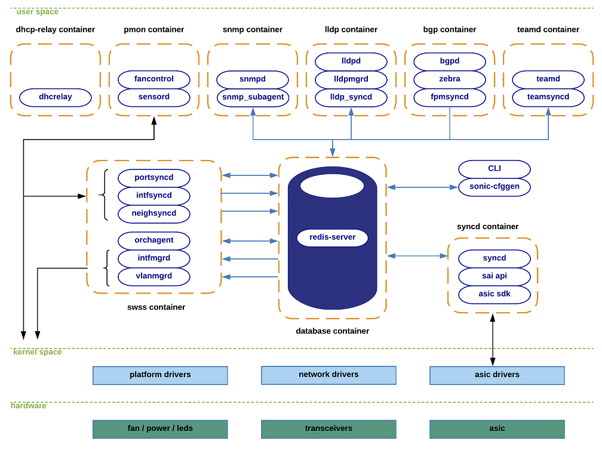

# 核心组件简介

我们也许会觉得交换机是一个很简单的网络设备，但是实际上交换机上的组件非常的多，而且由于SONiC中Redis的解耦，我们很难简单的对代码进行跟踪来理解服务之间的关系，这就需要我们先建立一个比较抽象的整体模型，然后再去深入的学习每个组件的细节。所以在深入其他部分之前，我们这里先对每个组件都做一个点到为止的介绍，帮助大家建立一个大概的整体模型。

```admonish info
在阅读本章之前，有两个名词会经常在本章和SONiC的官方文档中出现：ASIC（Application-Specific Integrated Circuit）和ASIC状态（State）。它们指的是交换机中用来进行包处理的Pipeline的状态，比如，ACL，转发方式等等，这个和其他交换机的硬件状态，比如，端口状态（端口速度，接口类型），IP信息等等硬件状态是非常不同的。

如果大家有兴趣了解更深入的细节，可以先移步阅读两个相关资料：[SAI (Switch Abstraction Interface) API][SAIAPI]和一篇RMT（Reprogrammable Match Table）的相关论文：[Forwarding Metamorphosis: Fast Programmable Match-Action Processing in Hardware for SDN][PISA]。

这些都会对我们阅读SONiC的文档有很大的帮助。
```

另外为了方便我们的理解和阅读，我们也把SONiC架构图在这里放在这一章的开头，作为引用：



_(Source: [SONiC Wiki - Architecture][SONiCArch])_

# 参考资料

1. [SONiC Architecture][SONiCArch]
2. [SAI API][SAIAPI]
3. [Forwarding Metamorphosis: Fast Programmable Match-Action Processing in Hardware for SDN][PISA]

[SONiCArch]: https://github.com/sonic-net/SONiC/wiki/Architecture
[PISA]: http://yuba.stanford.edu/~grg/docs/sdn-chip-sigcomm-2013.pdf
[SAIAPI]: https://github.com/opencomputeproject/SAI/wiki/SAI-APIs