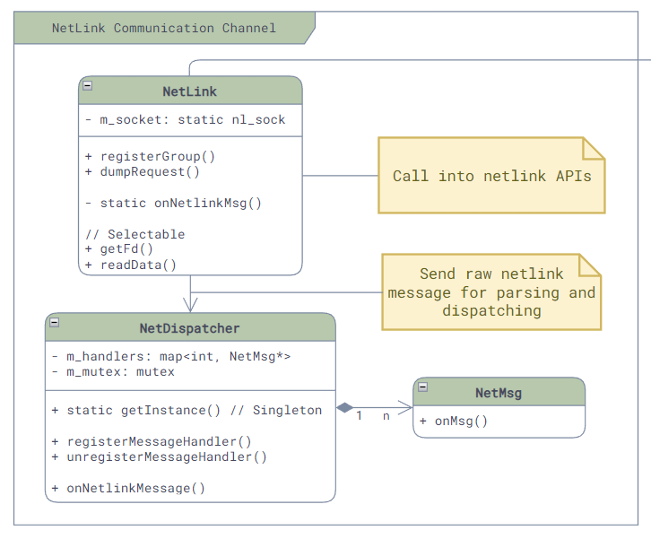

# Netlink

Netlink是Linux内核中用于内核与用户空间进程之间的一种基于消息的通信机制。它通过套接字接口和自定义的协议族来实现，可以用来传递各种类型的内核消息，包括网络设备状态、路由表更新、防火墙规则变化、系统资源使用情况等等。而SONiC的`*sync`服务就大量使用了Netlink的机制来监听系统中网络设备的变化，并将最新的状态同步到Redis中，并通知其他服务进行相应的修改。

Netlink的实现主要在这几个文件中：[common/netmsg.*](https://github.com/sonic-net/sonic-swss-common/blob/master/common/netmsg.h)、[common/netlink.*](https://github.com/sonic-net/sonic-swss-common/blob/master/common/netlink.h) 和 [common/netdispatcher.*](https://github.com/sonic-net/sonic-swss-common/blob/master/common/netdispatcher.h)，具体类图如下：



其中：

- **Netlink**：封装了Netlink的套接字接口，提供了Netlink消息的接口和接收消息的回调。
- **NetDispatcher**：它是一个单例，提供了Handler注册的接口。当Netlink类接收到原始的消息后，就会调用NetDispatcher将其解析成nl_onject，并根据消息的类型调用相应的Handler。
- **NetMsg**：Netlink消息Handler的基类，仅提供了onMsg的接口，其中没有实现。

举一个例子，当`portsyncd`启动的时候，它会创建一个Netlink对象，用来监听Link相关的状态变化，并且会实现NetMsg的接口，对Link相关的消息进行处理。具体的实现如下：

```cpp
// File: sonic-swss - portsyncd/portsyncd.cpp
int main(int argc, char **argv)
{
    // ...

    // Create Netlink object to listen to link messages
    NetLink netlink;
    netlink.registerGroup(RTNLGRP_LINK);

    // Here SONiC request a fulldump of current state, so that it can get the current state of all links
    netlink.dumpRequest(RTM_GETLINK);      
    cout << "Listen to link messages..." << endl;
    // ...

    // Register handler for link messages
    LinkSync sync(&appl_db, &state_db);
    NetDispatcher::getInstance().registerMessageHandler(RTM_NEWLINK, &sync);
    NetDispatcher::getInstance().registerMessageHandler(RTM_DELLINK, &sync);

    // ...
}
```

上面的LinkSync，就是一个NetMsg的实现，它实现了onMsg接口，用来处理Link相关的消息：

```cpp
// File: sonic-swss - portsyncd/linksync.h
class LinkSync : public NetMsg
{
public:
    LinkSync(DBConnector *appl_db, DBConnector *state_db);

    // NetMsg interface
    virtual void onMsg(int nlmsg_type, struct nl_object *obj);

    // ...
};

// File: sonic-swss - portsyncd/linksync.cpp
void LinkSync::onMsg(int nlmsg_type, struct nl_object *obj)
{
    // ...

    // Write link state to Redis DB
    FieldValueTuple fv("oper_status", oper ? "up" : "down");
    vector<FieldValueTuple> fvs;
    fvs.push_back(fv);
    m_stateMgmtPortTable.set(key, fvs);
    // ...
}
```

# 参考资料

1. [Github repo: sonic-swss-common][SONiCSWSSCommon]

[SONiCSWSSCommon]: https://github.com/sonic-net/sonic-swss-common