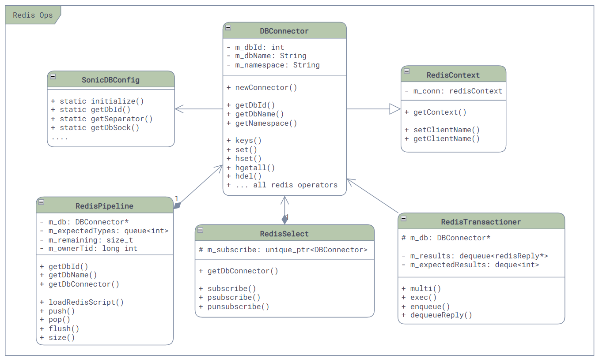
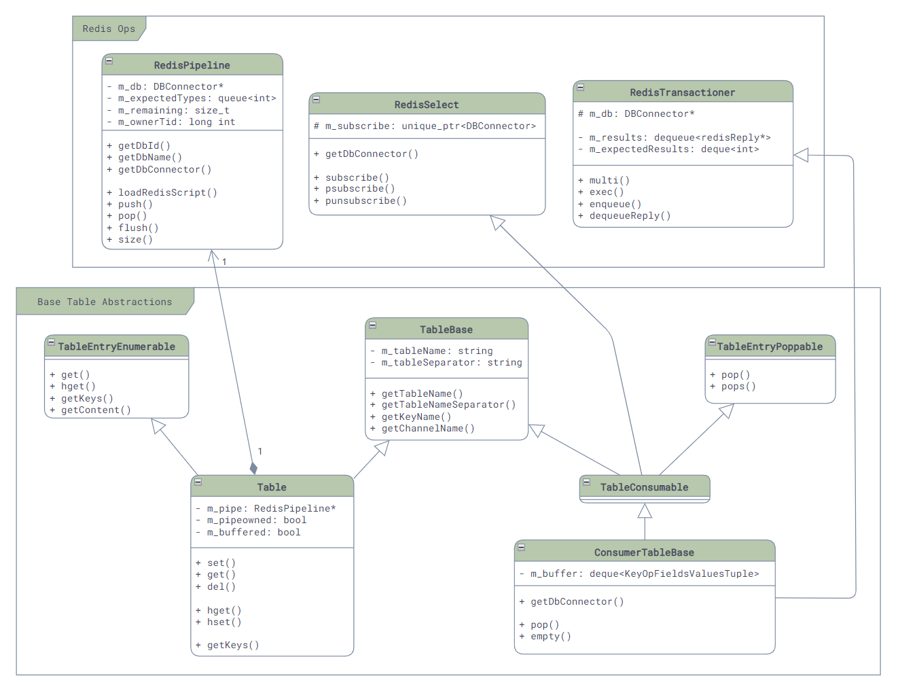

# Redis封装

## Redis数据库操作层

第一层，也是最底层，是Redis的数据库操作层，封装了各种基本命令，比如，DB的连接，命令的执行，事件通知的回调接口等等。具体的类图如下：

其中：

- **[RedisContext](https://github.com/sonic-net/sonic-swss-common/blob/master/common/dbconnector.h)**：封装并保持着与Redis的连接，当其销毁时会将其连接关闭。
- **[DBConnector](https://github.com/sonic-net/sonic-swss-common/blob/master/common/dbconnector.h)**：封装了所有的底层使用到的Redis的命令，比如`SET`、`GET`、`DEL`等等。
- **[RedisTransactioner](https://github.com/sonic-net/sonic-swss-common/blob/master/common/redistran.h)**：封装了Redis的事务操作，用于在一个事务中执行多个命令，比如`MULTI`、`EXEC`等等。
- **[RedisPipeline](https://github.com/sonic-net/sonic-swss-common/blob/master/common/redispipeline.h)**：封装了hiredis的redisAppendFormattedCommand API，提供了一个类似队列的异步的执行Redis命令的接口（虽然大部分使用方法依然是同步的）。它也是少有的对`SCRIPT LOAD`命令进行了封装的类，用于在Redis中加载Lua脚本实现存储过程。SONiC中绝大部分需要执行Lua脚本的类，都会使用这个类来进行加载和调用。
- **[RedisSelect](https://github.com/sonic-net/sonic-swss-common/blob/master/common/redisselect.h)**：它实现了Selectable的接口，用来支持基于epoll的事件通知机制（Event Polling）。主要是在我们收到了Redis的回复，用来触发epoll进行回调（我们最后会更详细的介绍）。
- **[SonicDBConfig](https://github.com/sonic-net/sonic-swss-common/blob/master/common/dbconnector.h)**：这个类是一个“静态类”，它主要实现了SONiC DB的配置文件的读取和解析。其他的数据库操作类，如果需要任何的配置信息，都会通过这个类来获取。

## 表（Table）抽象层

在Redis数据库操作层之上，便是SONiC自己利用Redis中间的Key建立的表（Table）的抽象了，因为每一个Redis的Key的格式都是`<table-name><separator><key-name>`，所以SONiC在访问数据库时需要对其进行一次转换（没有印象的小伙伴可以移步[我之前的博客了解更多的信息](/posts/sonic-2-key-components/#数据库)）。

相关类的主要类图如下：

其中关键的类有三个：

- **[TableBase](https://github.com/sonic-net/sonic-swss-common/blob/master/common/table.h)**：这个类是所有表的基类，它主要封装了表的基本信息，如表的名字，Redis Key的打包，每个表发生修改时用于通信的Channel的名字，等等。
- **[Table](https://github.com/sonic-net/sonic-swss-common/blob/master/common/table.h)**：这个类就是对于每个表增删改查的封装了，里面包含了表的名称和分隔符，这样就可以在调用时构造最终的key了。
- **[ConsumerTableBase](https://github.com/sonic-net/sonic-swss-common/blob/master/common/consumertablebase.h)**：这个类是各种SubscriptionTable的基类，里面主要是封装了一个简单的队列和其pop操作（对，只有pop，没有push），用来给上层调用。

# 参考资料

1. [SONiC Architecture][SONiCArch]
2. [Github repo: sonic-swss][SONiCSWSS]
3. [Github repo: sonic-swss-common][SONiCSWSSCommon]

[SONiCArch]: https://github.com/sonic-net/SONiC/wiki/Architecture
[SONiCSWSS]: https://github.com/sonic-net/sonic-swss
[SONiCSWSSCommon]: https://github.com/sonic-net/sonic-swss-common