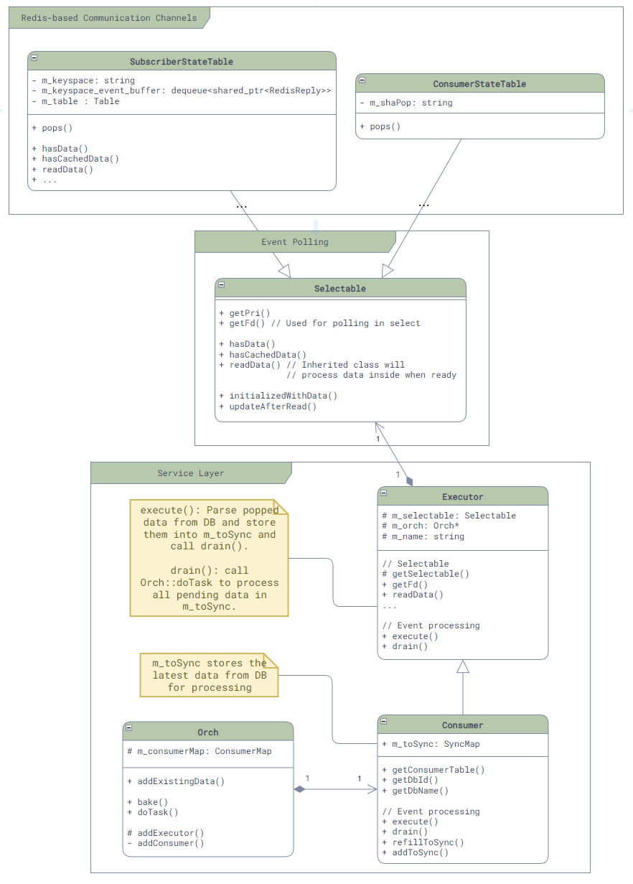

# 服务层 - Orch

最后，为了方便各个服务使用，SONiC还在通信层上进行了更进一步的封装，为各个服务提供了一个基类：[Orch](https://github.com/sonic-net/sonic-swss/blob/master/src/orchagent/orch.hcommon/consumertatetable.h)。

由于有了上面这些封装，Orch中关于消息通信的封装就相对简单了，主要的类图如下：



```admonish note
注意：由于这一层是服务层，所以其代码是在`sonic-swss`的仓库中，而不是`sonic-swss`。这个类中除了消息通信的封装以外，还提供了很多和服务实现相关的公共函数，比如，日志文件等等。
```

可以看到，Orch主要是封装了`SubscriberStateTable`和`ConsumerStateTable`来简化和统一消息的订阅，核心代码非常简单，就是根据不同的数据库类型来创建不同的Consumer，如下：

```cpp
void Orch::addConsumer(DBConnector *db, string tableName, int pri)
{
    if (db->getDbId() == CONFIG_DB || db->getDbId() == STATE_DB || db->getDbId() == CHASSIS_APP_DB) {
        addExecutor(
            new Consumer(
                new SubscriberStateTable(db, tableName, TableConsumable::DEFAULT_POP_BATCH_SIZE, pri),
                this,
                tableName));
    } else {
        addExecutor(
            new Consumer(
                new ConsumerStateTable(db, tableName, gBatchSize, pri),
                this,
                tableName));
    }
}
```

# 参考资料

1. [SONiC Architecture][SONiCArch]
2. [Github repo: sonic-swss][SONiCSWSS]
3. [Github repo: sonic-swss-common][SONiCSWSSCommon]

[SONiCArch]: https://github.com/sonic-net/SONiC/wiki/Architecture
[SONiCSWSS]: https://github.com/sonic-net/sonic-swss
[SONiCSWSSCommon]: https://github.com/sonic-net/sonic-swss-common