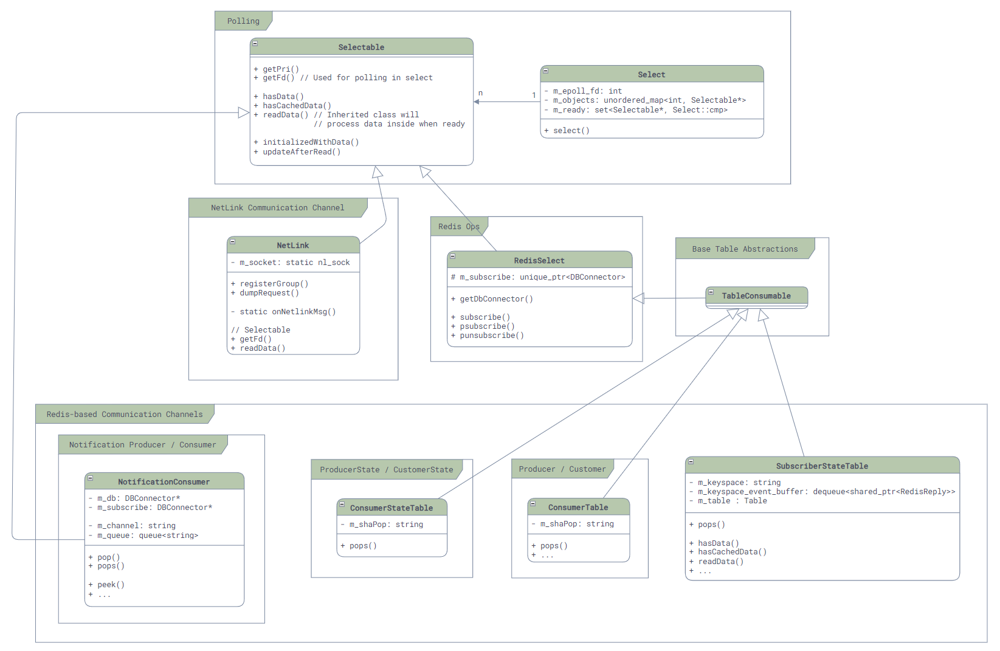

# 事件分发和错误处理

## 基于epoll的事件分发机制

和很多的Linux服务一样，SONiC底层使用了epoll作为事件分发机制：

- 所有需要支持事件分发的类都需要继承`Selectable`类，并实现两个最核心的函数：`int getFd();`（用于返回epoll能用来监听事件的fd）和`uint64_t readData()`（用于在监听到事件到来之后进行读取）。而对于一般服务而言，这个fd就是redis通信使用的fd，所以`getFd()`函数的调用，都会被最终转发到Redis的库中。
- 所有需要参与事件分发的对象，都需要注册到`Select`类中，这个类会将所有的`Selectable`对象的fd注册到epoll中，并在事件到来时调用`Selectable`的`readData()`函数。

其类图如下：



在Select类中，我们可以很容易的找到其最核心的代码，实现也非常的简单：

```cpp
int Select::poll_descriptors(Selectable **c, unsigned int timeout, bool interrupt_on_signal = false)
{
    int sz_selectables = static_cast<int>(m_objects.size());
    std::vector<struct epoll_event> events(sz_selectables);
    int ret;

    while(true) {
        ret = ::epoll_wait(m_epoll_fd, events.data(), sz_selectables, timeout);
        // ...
    }
    // ...

    for (int i = 0; i < ret; ++i)
    {
        int fd = events[i].data.fd;
        Selectable* sel = m_objects[fd];

        sel->readData();
        // error handling here ...

        m_ready.insert(sel);
    }

    while (!m_ready.empty())
    {
        auto sel = *m_ready.begin();
        m_ready.erase(sel);
        
        // After update callback ...
        return Select::OBJECT;
    }

    return Select::TIMEOUT;
}
```

然而，问题来了…… 回调呢？我们上面提过，`readData()`只是把消息读出来放在一个待处理队列中，并不会真正的处理消息，真正的消息处理需要调用`pops()`函数，将消息拿出来处理，所以什么地方会调用每一个上层封装的消息处理呢？

这里我们还是找到我们的老朋友`portmgrd`的`main`函数，从下面简化的代码中，我们可以看到和一般的Event Loop实现不同，SONiC中，最后的事件处理不是通过回调来实现的，而是需要最外层的Event Loop来主动调用完成：

```cpp
int main(int argc, char **argv)
{
    // ...

    // Create PortMgr, which implements Orch interface.
    PortMgr portmgr(&cfgDb, &appDb, &stateDb, cfg_port_tables);
    vector<Orch *> cfgOrchList = {&portmgr};

    // Create Select object for event loop and add PortMgr to it.
    swss::Select s;
    for (Orch *o : cfgOrchList) {
        s.addSelectables(o->getSelectables());
    }

    // Event loop
    while (true)
    {
        Selectable *sel;
        int ret;

        // When anyone of the selectables gets signaled, select() will call
        // into readData() and fetch all events, then return.
        ret = s.select(&sel, SELECT_TIMEOUT);
        // ...

        // Then, we call into execute() explicitly to process all events.
        auto *c = (Executor *)sel;
        c->execute();
    }
    return -1;
}
```

## 错误处理

关于Event Loop我们还有一个问题，那就是错误处理，比如，如果Redis的命令执行出错了，连接断开了，故障了等等的情况下，我们的服务会发生什么呢？

从代码上来看，SONiC中的错误处理是非常简单的，就是直接抛出异常（比如，获取命令执行结果的代码，如下），然后在Event Loop中捕获异常，打印日志，接着继续执行。

```cpp
RedisReply::RedisReply(RedisContext *ctx, const RedisCommand& command)
{
    int rc = redisAppendFormattedCommand(ctx->getContext(), command.c_str(), command.length());
    if (rc != REDIS_OK)
    {
        // The only reason of error is REDIS_ERR_OOM (Out of memory)
        // ref: https://github.com/redis/hiredis/blob/master/hiredis.c
        throw bad_alloc();
    }

    rc = redisGetReply(ctx->getContext(), (void**)&m_reply);
    if (rc != REDIS_OK)
    {
        throw RedisError("Failed to redisGetReply with " + string(command.c_str()), ctx->getContext());
    }
    guard([&]{checkReply();}, command.c_str());
}
```

关于异常和错误的种类及其原因，在代码里面并没有看到用于统计和Telemetry的代码，所以监控上说是比较薄弱的。另外还需要考虑数据出错的场景，比如数据库写到一半突然断开导致的脏数据，不过简单的重启相关的`*syncd`和`*mgrd`服务可能可以解决此类问题，因为启动时会进行全量同步。

# 参考资料

1. [SONiC Architecture][SONiCArch]
2. [Github repo: sonic-swss][SONiCSWSS]
3. [Github repo: sonic-swss-common][SONiCSWSSCommon]

[SONiCArch]: https://github.com/sonic-net/SONiC/wiki/Architecture
[SONiCSWSS]: https://github.com/sonic-net/sonic-swss
[SONiCSWSSCommon]: https://github.com/sonic-net/sonic-swss-common