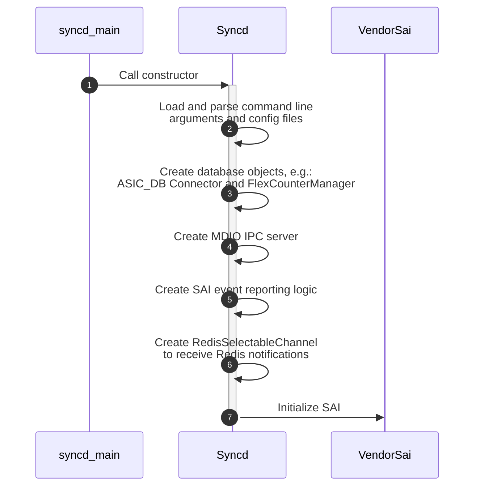
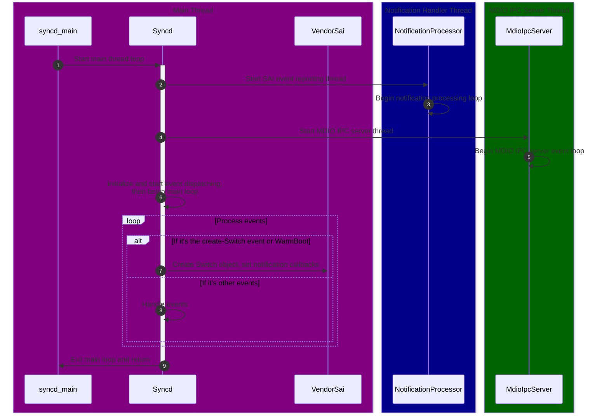
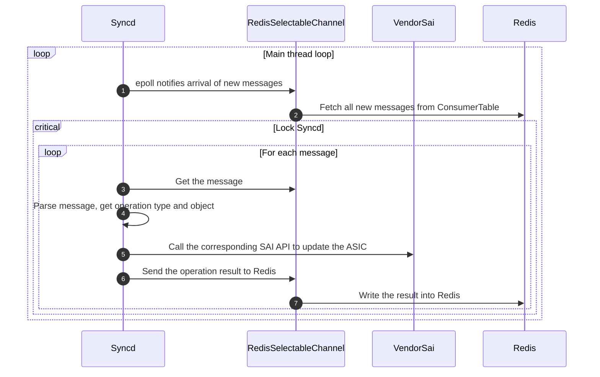
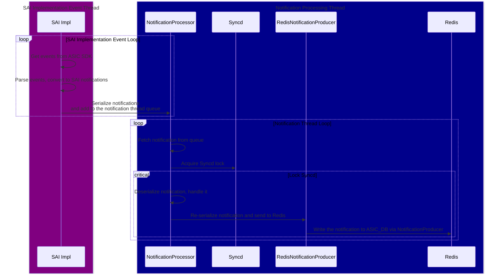

# Syncd and SAI

[Syncd Container](./2-3-key-containers.html#asic-management-container-syncd) is the container in SONiC dedicated to managing the ASIC. The key process `syncd` is responsible for communicating with the Redis database, loading SAI implementation, and interacting with it to handle ASIC initialization, configuration, status reporting, and so on.

Since many SONiC workflows ultimately need to interact with the ASIC through Syncd and SAI, this part becomes common to all those workflows. Therefore, before diving into other workflows, let's take a look at how Syncd and SAI work first.

## Syncd Startup Flow

The entry point of the `syncd` process is the `syncd_main` function in `syncd_main.cpp`. The startup flow can be roughly divided into two parts.

The first part creates and initializes various objects:



The second part starts the main loop and handles initialization events:



Now, let's dive into the code to see how Syncd and SAI are implemented.

### The syncd_main Function

The `syncd_main` function itself is straightforward: it creates a `Syncd` object and then calls its `run` method:

```cpp
// File: src/sonic-sairedis/syncd/syncd_main.cpp
int syncd_main(int argc, char **argv)
{
    auto vendorSai = std::make_shared<VendorSai>();
    auto syncd = std::make_shared<Syncd>(vendorSai, commandLineOptions, isWarmStart);
    syncd->run();
    return EXIT_SUCCESS;
}
```

The Syncd constructor initializes each feature in Syncd, while the run method starts the Syncd main loop.

### The Syncd Constructor

The `Syncd` constructor creates or initializes the key components in `Syncd`, such as database connection objects, statistics management, and ASIC notification handler. The key code looks like below:

```cpp
// File: src/sonic-sairedis/syncd/Syncd.cpp
Syncd::Syncd(
        _In_ std::shared_ptr<sairedis::SaiInterface> vendorSai,
        _In_ std::shared_ptr<CommandLineOptions> cmd,
        _In_ bool isWarmStart):
    m_vendorSai(vendorSai),
    ...
{
    ...

    // Load context config
    auto ccc = sairedis::ContextConfigContainer::loadFromFile(m_commandLineOptions->m_contextConfig.c_str());
    m_contextConfig = ccc->get(m_commandLineOptions->m_globalContext);
    ...

    // Create FlexCounter manager
    m_manager = std::make_shared<FlexCounterManager>(m_vendorSai, m_contextConfig->m_dbCounters);

    // Create DB related objects
    m_dbAsic = std::make_shared<swss::DBConnector>(m_contextConfig->m_dbAsic, 0);
    m_mdioIpcServer = std::make_shared<MdioIpcServer>(m_vendorSai, m_commandLineOptions->m_globalContext);
    m_selectableChannel = std::make_shared<sairedis::RedisSelectableChannel>(m_dbAsic, ASIC_STATE_TABLE, REDIS_TABLE_GETRESPONSE, TEMP_PREFIX, modifyRedis);

    // Create notification processor and handler
    m_notifications = std::make_shared<RedisNotificationProducer>(m_contextConfig->m_dbAsic);
    m_client = std::make_shared<RedisClient>(m_dbAsic);
    m_processor = std::make_shared<NotificationProcessor>(m_notifications, m_client, std::bind(&Syncd::syncProcessNotification, this, _1));

    m_handler = std::make_shared<NotificationHandler>(m_processor);
    m_sn.onFdbEvent = std::bind(&NotificationHandler::onFdbEvent, m_handler.get(), _1, _2);
    m_sn.onNatEvent = std::bind(&NotificationHandler::onNatEvent, m_handler.get(), _1, _2);
    // Init many other event handlers here
    m_handler->setSwitchNotifications(m_sn.getSwitchNotifications());
    ...

    // Initialize SAI
    sai_status_t status = vendorSai->initialize(0, &m_test_services);
    ...
}
```

### SAI Initialization and VendorSai

The last and most important step in `Syncd` initialization is to initialize SAI. [In the core component introduction to SAI](./2-4-sai-intro.html), we briefly described how SAI is initialized and implemented, and how it provides support for different platforms in SONiC. And here, we will focus more on how Syncd wraps SAI and uses it.

`Syncd` uses `VendorSai` to wrap all SAI APIs to simplify upper-level calls. The initialization looks like below, essentially just calling the sai initialize and api query functions, and handling errors:

```cpp
// File: src/sonic-sairedis/syncd/VendorSai.cpp
sai_status_t VendorSai::initialize(
        _In_ uint64_t flags,
        _In_ const sai_service_method_table_t *service_method_table)
{
    ...
    
    // Initialize SAI
    memcpy(&m_service_method_table, service_method_table, sizeof(m_service_method_table));
    auto status = sai_api_initialize(flags, service_method_table);

    // If SAI is initialized successfully, query all SAI API methods.
    // sai_metadata_api_query will also update all extern global sai_*_api variables, so we can also use
    // sai_metadata_get_object_type_info to get methods for a specific SAI object type.
    if (status == SAI_STATUS_SUCCESS) {
        memset(&m_apis, 0, sizeof(m_apis));
        int failed = sai_metadata_apis_query(sai_api_query, &m_apis);
        ...
    }
    ...

    return status;
}
```

Once all the SAI APIs have been acquired, we can call into the SAI implementation using the `VendorSai` object.

Currently, `VendorSai` internally has two different ways to call the SAI APIs:

1. Using `sai_object_type_info_t` from SAI metadata, which essentially acts like a virtual table for all SAI Objects:

   ```cpp
   // File: src/sonic-sairedis/syncd/VendorSai.cpp
   sai_status_t VendorSai::set(
           _In_ sai_object_type_t objectType,
           _In_ sai_object_id_t objectId,
           _In_ const sai_attribute_t *attr)
   {
       ...
   
       auto info = sai_metadata_get_object_type_info(objectType);
       sai_object_meta_key_t mk = { .objecttype = objectType, .objectkey = { .key = { .object_id = objectId } } };
       return info->set(&mk, attr);
   }
   ```

2. Using `m_apis` stored in the `VendorSai` object. This approach needs us to check the object type and then call the corresponding APIs, so the code becomes more verbose:

   ```cpp
   sai_status_t VendorSai::getStatsExt(
           _In_ sai_object_type_t object_type,
           _In_ sai_object_id_t object_id,
           _In_ uint32_t number_of_counters,
           _In_ const sai_stat_id_t *counter_ids,
           _In_ sai_stats_mode_t mode,
           _Out_ uint64_t *counters)
   {
       sai_status_t (*ptr)(
               _In_ sai_object_id_t port_id,
               _In_ uint32_t number_of_counters,
               _In_ const sai_stat_id_t *counter_ids,
               _In_ sai_stats_mode_t mode,
               _Out_ uint64_t *counters);
   
       switch ((int)object_type)
       {
           case SAI_OBJECT_TYPE_PORT:
               ptr = m_apis.port_api->get_port_stats_ext;
               break;
           case SAI_OBJECT_TYPE_ROUTER_INTERFACE:
               ptr = m_apis.router_interface_api->get_router_interface_stats_ext;
               break;
           case SAI_OBJECT_TYPE_POLICER:
               ptr = m_apis.policer_api->get_policer_stats_ext;
               break;
           ...
   
           default:
               SWSS_LOG_ERROR("not implemented, FIXME");
               return SAI_STATUS_FAILURE;
       }
   
       return ptr(object_id, number_of_counters, counter_ids, mode, counters);
   }
   ```

The first approach is more succinct.

### Main Event Loop

`Syncd`'s main event loop follows SONiC's standard [event dispatching](./4-5-event-polling-and-error-handling.html) pattern. On startup, Syncd registers all Selectable objects handling events with a Select object that waits for events. The main loop calls "select" to wait for events:

```c
// File: src/sonic-sairedis/syncd/Syncd.cpp
void Syncd::run()
{
    volatile bool runMainLoop = true;
    std::shared_ptr<swss::Select> s = std::make_shared<swss::Select>();
    onSyncdStart(m_commandLineOptions->m_startType == SAI_START_TYPE_WARM_BOOT);

    // Start notification processing thread
    m_processor->startNotificationsProcessingThread();

    // Start MDIO threads
    for (auto& sw: m_switches) { m_mdioIpcServer->setSwitchId(sw.second->getRid()); }
    m_mdioIpcServer->startMdioThread();

    // Registering selectable for event polling
    s->addSelectable(m_selectableChannel.get());
    s->addSelectable(m_restartQuery.get());
    s->addSelectable(m_flexCounter.get());
    s->addSelectable(m_flexCounterGroup.get());

    // Main event loop
    while (runMainLoop)
    {
        swss::Selectable *sel = NULL;
        int result = s->select(&sel);

        ...
        if (sel == m_restartQuery.get()) {
            // Handling switch restart event and restart switch here.
        } else if (sel == m_flexCounter.get()) {
            processFlexCounterEvent(*(swss::ConsumerTable*)sel);
        } else if (sel == m_flexCounterGroup.get()) {
            processFlexCounterGroupEvent(*(swss::ConsumerTable*)sel);
        } else if (sel == m_selectableChannel.get()) {
            // Handle redis updates here.
            processEvent(*m_selectableChannel.get());
        } else {
            SWSS_LOG_ERROR("select failed: %d", result);
        }
        ...
    }
    ...
}
```

Here, `m_selectableChannel` handles Redis database events. It interacts with Redis [ProducerTable / ConsumerTable](./4-2-4-producer-consumer-table.html). Hence, all operations from `orchagent` will be stored in Redis lists, waiting for `Syncd` to consume.

```cpp
// File: src/sonic-sairedis/meta/RedisSelectableChannel.h
class RedisSelectableChannel: public SelectableChannel
{
    public:
        RedisSelectableChannel(
                _In_ std::shared_ptr<swss::DBConnector> dbAsic,
                _In_ const std::string& asicStateTable,
                _In_ const std::string& getResponseTable,
                _In_ const std::string& tempPrefix,
                _In_ bool modifyRedis);

    public: // SelectableChannel overrides
        virtual bool empty() override;
        ...

    public: // Selectable overrides
        virtual int getFd() override;
        virtual uint64_t readData() override;
        ...

    private:
        std::shared_ptr<swss::DBConnector> m_dbAsic;
        std::shared_ptr<swss::ConsumerTable> m_asicState;
        std::shared_ptr<swss::ProducerTable> m_getResponse;
        ...
};
```

During the main loop startup, `Syncd` also launches two threads:  

- A notification processing thread for receiving ASIC-reported notifications: `m_processor->startNotificationsProcessingThread()`  
- A thread for handling MDIO communication: `m_mdioIpcServer->startMdioThread()`  

We'll discuss their details more thoroughly when introducing related workflows.

### Initialize SAI Switch and Notifications

Once the main event loop is started, `Syncd` will call into SAI to create the Switch object. There are two main entry points: either a create switch request from ASIC_DB (called by swss) or `Syncd` directlly calls it for the Warm Boot process. Either way, the internal flow is similar.

A crucial step here is initializing the notification callbacks in the SAI implementation, such as FDB events. These callback functions are passed to SAI as Switch attributes in `create_switch`. The SAI implementation stores them so it can call back into `Syncd` whenever these events occur:

```cpp
// File: src/sonic-sairedis/syncd/Syncd.cpp
sai_status_t Syncd::processQuadEvent(
        _In_ sai_common_api_t api,
        _In_ const swss::KeyOpFieldsValuesTuple &kco)
{
    // Parse event into SAI object
    sai_object_meta_key_t metaKey;
    ...

    SaiAttributeList list(metaKey.objecttype, values, false);
    sai_attribute_t *attr_list = list.get_attr_list();
    uint32_t attr_count = list.get_attr_count();

    // Update notifications pointers in attribute list
    if (metaKey.objecttype == SAI_OBJECT_TYPE_SWITCH && (api == SAI_COMMON_API_CREATE || api == SAI_COMMON_API_SET))
    {
        m_handler->updateNotificationsPointers(attr_count, attr_list);
    }

    if (isInitViewMode())
    {
        // ProcessQuadEventInInitViewMode will eventually call into VendorSai, which calls create_swtich function in SAI.
        sai_status_t status = processQuadEventInInitViewMode(metaKey.objecttype, strObjectId, api, attr_count, attr_list);
        syncUpdateRedisQuadEvent(status, api, kco);
        return status;
    }
    ...
}

// File: src/sonic-sairedis/syncd/NotificationHandler.cpp
void NotificationHandler::updateNotificationsPointers(_In_ uint32_t attr_count, _In_ sai_attribute_t *attr_list) const
{
    for (uint32_t index = 0; index < attr_count; ++index) {
        ...

        sai_attribute_t &attr = attr_list[index];
        switch (attr.id) {
            ...

            case SAI_SWITCH_ATTR_SHUTDOWN_REQUEST_NOTIFY:
                attr.value.ptr = (void*)m_switchNotifications.on_switch_shutdown_request;
                break;

            case SAI_SWITCH_ATTR_FDB_EVENT_NOTIFY:
                attr.value.ptr = (void*)m_switchNotifications.on_fdb_event;
                break;
            ...
        }
        ...
    }
}

// File: src/sonic-sairedis/syncd/Syncd.cpp
// Call stack: processQuadEvent
//          -> processQuadEventInInitViewMode
//          -> processQuadInInitViewModeCreate
//          -> onSwitchCreateInInitViewMode
void Syncd::onSwitchCreateInInitViewMode(_In_ sai_object_id_t switchVid, _In_ uint32_t attr_count, _In_ const sai_attribute_t *attr_list)
{
    if (m_switches.find(switchVid) == m_switches.end()) {
        sai_object_id_t switchRid;
        sai_status_t status;
        status = m_vendorSai->create(SAI_OBJECT_TYPE_SWITCH, &switchRid, 0, attr_count, attr_list);
        ...

        m_switches[switchVid] = std::make_shared<SaiSwitch>(switchVid, switchRid, m_client, m_translator, m_vendorSai);
        m_mdioIpcServer->setSwitchId(switchRid);
        ...
    }
    ...
}
```

From the open-sourced Mellanox's implementation, we can see how the SAI switch is created and the notification callbacks are set:

```cpp
// File: https://github.com/Mellanox/SAI-Implementation/blob/master/mlnx_sai/src/mlnx_sai_switch.c
static sai_status_t mlnx_create_switch(_Out_ sai_object_id_t     * switch_id,
                                       _In_ uint32_t               attr_count,
                                       _In_ const sai_attribute_t *attr_list)
{
    ...

    status = find_attrib_in_list(attr_count, attr_list, SAI_SWITCH_ATTR_SWITCH_STATE_CHANGE_NOTIFY, &attr_val, &attr_idx);
    if (!SAI_ERR(status)) {
        g_notification_callbacks.on_switch_state_change = (sai_switch_state_change_notification_fn)attr_val->ptr;
    }

    status = find_attrib_in_list(attr_count, attr_list, SAI_SWITCH_ATTR_SHUTDOWN_REQUEST_NOTIFY, &attr_val, &attr_idx);
    if (!SAI_ERR(status)) {
        g_notification_callbacks.on_switch_shutdown_request =
            (sai_switch_shutdown_request_notification_fn)attr_val->ptr;
    }

    status = find_attrib_in_list(attr_count, attr_list, SAI_SWITCH_ATTR_FDB_EVENT_NOTIFY, &attr_val, &attr_idx);
    if (!SAI_ERR(status)) {
        g_notification_callbacks.on_fdb_event = (sai_fdb_event_notification_fn)attr_val->ptr;
    }

    status = find_attrib_in_list(attr_count, attr_list, SAI_SWITCH_ATTR_PORT_STATE_CHANGE_NOTIFY, &attr_val, &attr_idx);
    if (!SAI_ERR(status)) {
        g_notification_callbacks.on_port_state_change = (sai_port_state_change_notification_fn)attr_val->ptr;
    }

    status = find_attrib_in_list(attr_count, attr_list, SAI_SWITCH_ATTR_PACKET_EVENT_NOTIFY, &attr_val, &attr_idx);
    if (!SAI_ERR(status)) {
        g_notification_callbacks.on_packet_event = (sai_packet_event_notification_fn)attr_val->ptr;
    }
    ...
}
```

## ASIC Programming Workflow

ASIC programming workflow is the most important workflow in `Syncd`. When `orchagent` discovers any configuration changes, it sends ASIC programming request via `ASIC_DB`, which triggers this workflow and uses SAI to update the ASIC. After understanding Syncd's main event loop and the communication channels, the workflow will become easier to follow.

All steps happen sequentially on the main thread:



First, `orchagent` sends operations through Redis, which will be received by the `RedisSelectableChannel.` When the main event loop processes `m_selectableChannel`, it calls `processEvent` to process it, just like what we have discussed in the main event loop section.

Then, `processEvent` calls the relevant SAI API to update the ASIC. The logic is a giant switch-case statement that dispatches the operations:

```cpp
// File: src/sonic-sairedis/syncd/Syncd.cpp
void Syncd::processEvent(_In_ sairedis::SelectableChannel& consumer)
{
    // Loop all operations in the queue
    std::lock_guard<std::mutex> lock(m_mutex);
    do {
        swss::KeyOpFieldsValuesTuple kco;
        consumer.pop(kco, isInitViewMode());
        processSingleEvent(kco);
    } while (!consumer.empty());
}

sai_status_t Syncd::processSingleEvent(_In_ const swss::KeyOpFieldsValuesTuple &kco)
{
    auto& op = kfvOp(kco);
    ...

    if (op == REDIS_ASIC_STATE_COMMAND_CREATE)
        return processQuadEvent(SAI_COMMON_API_CREATE, kco);

    if (op == REDIS_ASIC_STATE_COMMAND_REMOVE)
        return processQuadEvent(SAI_COMMON_API_REMOVE, kco);
    
    ...
}

sai_status_t Syncd::processQuadEvent(
        _In_ sai_common_api_t api,
        _In_ const swss::KeyOpFieldsValuesTuple &kco)
{
    // Parse operation
    const std::string& key = kfvKey(kco);
    const std::string& strObjectId = key.substr(key.find(":") + 1);

    sai_object_meta_key_t metaKey;
    sai_deserialize_object_meta_key(key, metaKey);

    auto& values = kfvFieldsValues(kco);
    SaiAttributeList list(metaKey.objecttype, values, false);
    sai_attribute_t *attr_list = list.get_attr_list();
    uint32_t attr_count = list.get_attr_count();
    ...

    auto info = sai_metadata_get_object_type_info(metaKey.objecttype);

    // Process the operation
    sai_status_t status;
    if (info->isnonobjectid) {
        status = processEntry(metaKey, api, attr_count, attr_list);
    } else {
        status = processOid(metaKey.objecttype, strObjectId, api, attr_count, attr_list);
    }

    // Send response
    if (api == SAI_COMMON_API_GET) {
        sai_object_id_t switchVid = VidManager::switchIdQuery(metaKey.objectkey.key.object_id);
        sendGetResponse(metaKey.objecttype, strObjectId, switchVid, status, attr_count, attr_list);
        ...
    } else {
        sendApiResponse(api, status);
    }

    syncUpdateRedisQuadEvent(status, api, kco);
    return status;
}

sai_status_t Syncd::processEntry(_In_ sai_object_meta_key_t metaKey, _In_ sai_common_api_t api,
                                 _In_ uint32_t attr_count, _In_ sai_attribute_t *attr_list)
{
    ...

    switch (api)
    {
        case SAI_COMMON_API_CREATE:
            return m_vendorSai->create(metaKey, SAI_NULL_OBJECT_ID, attr_count, attr_list);

        case SAI_COMMON_API_REMOVE:
            return m_vendorSai->remove(metaKey);
        ...

        default:
            SWSS_LOG_THROW("api %s not supported", sai_serialize_common_api(api).c_str());
    }
}
```

## ASIC State Change Notification Workflow

On the other hand, when the ASIC state is changed or needs to report certain status, it notifies us through SAI. `Syncd` listens for these notifications, then reports them back to `orchagent` through our communication channel on top of `ASIC_DB`.

The workflow shows as below:



Here, let's look into a real implementation. For better understanding, we still use Mellanox's open-sourced SAI implementation as an example.

First of all, SAI implementation needs to be able to receive notification from ASIC. This is done by calling into the ASIC SDK. In Mellanox's SAI, it sets up an event thread to hook into ASIC, then use `select` to handle the events from ASIC SDK:

```cpp
// File: https://github.com/Mellanox/SAI-Implementation/blob/master/mlnx_sai/src/mlnx_sai_switch.c
static void event_thread_func(void *context)
{
#define MAX_PACKET_SIZE MAX(g_resource_limits.port_mtu_max, SX_HOST_EVENT_BUFFER_SIZE_MAX)

    sx_status_t                         status;
    sx_api_handle_t                     api_handle;
    sx_user_channel_t                   port_channel, callback_channel;
    fd_set                              descr_set;
    int                                 ret_val;
    sai_object_id_t                     switch_id = (sai_object_id_t)context;
    sai_port_oper_status_notification_t port_data;
    sai_fdb_event_notification_data_t  *fdb_events = NULL;
    sai_attribute_t                    *attr_list = NULL;
    ...

    // Init SDK API
    if (SX_STATUS_SUCCESS != (status = sx_api_open(sai_log_cb, &api_handle))) {
        if (g_notification_callbacks.on_switch_shutdown_request) {
            g_notification_callbacks.on_switch_shutdown_request(switch_id);
        }
        return;
    }

    if (SX_STATUS_SUCCESS != (status = sx_api_host_ifc_open(api_handle, &port_channel.channel.fd))) {
        goto out;
    }
    ...

    // Register for port and channel notifications
    port_channel.type = SX_USER_CHANNEL_TYPE_FD;
    if (SX_STATUS_SUCCESS != (status = sx_api_host_ifc_trap_id_register_set(api_handle, SX_ACCESS_CMD_REGISTER, DEFAULT_ETH_SWID, SX_TRAP_ID_PUDE, &port_channel))) {
        goto out;
    }
    ...
    for (uint32_t ii = 0; ii < (sizeof(mlnx_trap_ids) / sizeof(*mlnx_trap_ids)); ii++) {
        status = sx_api_host_ifc_trap_id_register_set(api_handle, SX_ACCESS_CMD_REGISTER, DEFAULT_ETH_SWID, mlnx_trap_ids[ii], &callback_channel);
    }

    while (!event_thread_asked_to_stop) {
        FD_ZERO(&descr_set);
        FD_SET(port_channel.channel.fd.fd, &descr_set);
        FD_SET(callback_channel.channel.fd.fd, &descr_set);
        ...

        ret_val = select(FD_SETSIZE, &descr_set, NULL, NULL, &timeout);
        if (ret_val > 0) {
            // Port state change event
            if (FD_ISSET(port_channel.channel.fd.fd, &descr_set)) {
                // Parse port state event here ...
                if (g_notification_callbacks.on_port_state_change) {
                    g_notification_callbacks.on_port_state_change(1, &port_data);
                }
            }

            if (FD_ISSET(callback_channel.channel.fd.fd, &descr_set)) {
                // Receive notification event.
                packet_size = MAX_PACKET_SIZE;
                if (SX_STATUS_SUCCESS != (status = sx_lib_host_ifc_recv(&callback_channel.channel.fd, p_packet, &packet_size, receive_info))) {
                    goto out;
                }

                // BFD packet event
                if (SX_TRAP_ID_BFD_PACKET_EVENT == receive_info->trap_id) {
                    const struct bfd_packet_event *event = (const struct bfd_packet_event*)p_packet;
                    // Parse and check event valid here ...
                    status = mlnx_switch_bfd_packet_handle(event);
                    continue;
                }

                // Same way to handle BFD timeout event, Bulk counter ready event. Emiited.

                // FDB event and packet event handling
                if (receive_info->trap_id == SX_TRAP_ID_FDB_EVENT) {
                    trap_name = "FDB event";
                } else if (SAI_STATUS_SUCCESS != (status = mlnx_translate_sdk_trap_to_sai(receive_info->trap_id, &trap_name, &trap_oid))) {
                    continue;
                }

                if (SX_TRAP_ID_FDB_EVENT == receive_info->trap_id) {
                    // Parse FDB events here ...

                    if (g_notification_callbacks.on_fdb_event) {
                        g_notification_callbacks.on_fdb_event(event_count, fdb_events);
                    }

                    continue;
                }

                // Packet event handling
                status = mlnx_get_hostif_packet_data(receive_info, &attrs_num, callback_data);
                if (g_notification_callbacks.on_packet_event) {
                    g_notification_callbacks.on_packet_event(switch_id, packet_size, p_packet, attrs_num, callback_data);
                }
            }
        }
    }

out:
    ...
}
```

Using FDB event as an example:

1. When ASIC sends the FDB events, it will be received by the event loop above. 
2. The callback `g_notification_callbacks.on_fdb_event` stored in SAI implementation will be called to handle this event.
3. It then calls `NotificationHandler::onFdbEvent` in Syncd to serialize the event and put it into the notification queue:

```cpp
// File: src/sonic-sairedis/syncd/NotificationHandler.cpp
void NotificationHandler::onFdbEvent(_In_ uint32_t count, _In_ const sai_fdb_event_notification_data_t *data)
{
    std::string s = sai_serialize_fdb_event_ntf(count, data);
    enqueueNotification(SAI_SWITCH_NOTIFICATION_NAME_FDB_EVENT, s);
}
```

Then the notification thread is signaled to pick up this event from the queue, then process it under the syncd lock:

```cpp
// File: src/sonic-sairedis/syncd/NotificationProcessor.cpp
void NotificationProcessor::ntf_process_function()
{
    std::mutex ntf_mutex;
    std::unique_lock<std::mutex> ulock(ntf_mutex);

    while (m_runThread) {
        // When notification arrives, it will signal this condition variable.
        m_cv.wait(ulock);

        // Process notifications in the queue.
        swss::KeyOpFieldsValuesTuple item;
        while (m_notificationQueue->tryDequeue(item)) {
            processNotification(item);
        }
    }
}

// File: src/sonic-sairedis/syncd/Syncd.cpp
// Call from NotificationProcessor::processNotification
void Syncd::syncProcessNotification(_In_ const swss::KeyOpFieldsValuesTuple& item)
{
    std::lock_guard<std::mutex> lock(m_mutex);
    m_processor->syncProcessNotification(item);
}
```

Now, it goes into the event dispatching and handling logic. `syncProcessNotification` function is essentially a series of `if-else` statements, which calls the corresponding handling function based on the event type:

```cpp
// File: src/sonic-sairedis/syncd/NotificationProcessor.cpp
void NotificationProcessor::syncProcessNotification( _In_ const swss::KeyOpFieldsValuesTuple& item)
{
    std::string notification = kfvKey(item);
    std::string data = kfvOp(item);

    if (notification == SAI_SWITCH_NOTIFICATION_NAME_SWITCH_STATE_CHANGE) {
        handle_switch_state_change(data);
    } else if (notification == SAI_SWITCH_NOTIFICATION_NAME_FDB_EVENT) {
        handle_fdb_event(data);
    } else if ...
    } else {
        SWSS_LOG_ERROR("unknown notification: %s", notification.c_str());
    }
}
```

For each event, the handling function deserializes the event and processes it, such as `handle_fdb_event` and `process_on_fdb_event`:

```cpp
// File: src/sonic-sairedis/syncd/NotificationProcessor.cpp
void NotificationProcessor::handle_fdb_event(_In_ const std::string &data)
{
    uint32_t count;
    sai_fdb_event_notification_data_t *fdbevent = NULL;
    sai_deserialize_fdb_event_ntf(data, count, &fdbevent);

    process_on_fdb_event(count, fdbevent);

    sai_deserialize_free_fdb_event_ntf(count, fdbevent);
}

void NotificationProcessor::process_on_fdb_event( _In_ uint32_t count, _In_ sai_fdb_event_notification_data_t *data)
{
    for (uint32_t i = 0; i < count; i++) {
        sai_fdb_event_notification_data_t *fdb = &data[i];
        // Check FDB event notification data here

        fdb->fdb_entry.switch_id = m_translator->translateRidToVid(fdb->fdb_entry.switch_id, SAI_NULL_OBJECT_ID);
        fdb->fdb_entry.bv_id = m_translator->translateRidToVid(fdb->fdb_entry.bv_id, fdb->fdb_entry.switch_id, true);
        m_translator->translateRidToVid(SAI_OBJECT_TYPE_FDB_ENTRY, fdb->fdb_entry.switch_id, fdb->attr_count, fdb->attr, true);

        ...
    }

    // Send notification
    std::string s = sai_serialize_fdb_event_ntf(count, data);
    sendNotification(SAI_SWITCH_NOTIFICATION_NAME_FDB_EVENT, s);
}
```

Finally, it's written to ASIC_DB via [NotificationProducer](./4-2-3-notification-producer-consumer.md) to notify `orchagent`:

```cpp
// File: src/sonic-sairedis/syncd/NotificationProcessor.cpp
void NotificationProcessor::sendNotification(_In_ const std::string& op, _In_ const std::string& data)
{
    std::vector<swss::FieldValueTuple> entry;
    sendNotification(op, data, entry);
}

void NotificationProcessor::sendNotification(_In_ const std::string& op, _In_ const std::string& data, _In_ std::vector<swss::FieldValueTuple> entry)
{
    m_notifications->send(op, data, entry);
}

// File: src/sonic-sairedis/syncd/RedisNotificationProducer.cpp
void RedisNotificationProducer::send(_In_ const std::string& op, _In_ const std::string& data, _In_ const std::vector<swss::FieldValueTuple>& values)
{
    std::vector<swss::FieldValueTuple> vals = values;

    // The m_notificationProducer is created in the ctor of RedisNotificationProducer as below:
    // m_notificationProducer = std::make_shared<swss::NotificationProducer>(m_db.get(), REDIS_TABLE_NOTIFICATIONS_PER_DB(dbName));
    m_notificationProducer->send(op, data, vals);
}
```

That's it! This is basically how things work in high level in `Syncd`!

# References

1. [SONiC Architecture][SONiCArch]
2. [Github repo: sonic-sairedis][SONiCSAIRedis]
3. [Github repo: Nvidia (Mellanox) SAI implementation][MnlxSAI]

[SONiCArch]: https://github.com/sonic-net/SONiC/wiki/Architecture
[SONiCSAIRedis]: https://github.com/sonic-net/sonic-sairedis/
[MnlxSAI]: https://github.com/Mellanox/SAI-Implementation/tree/master