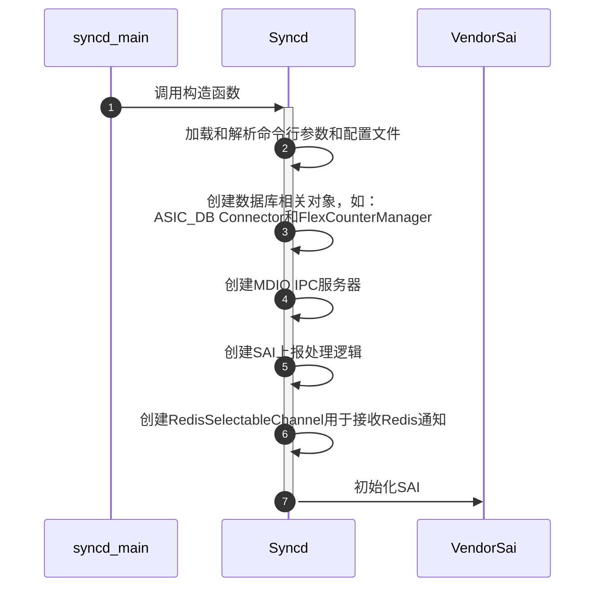
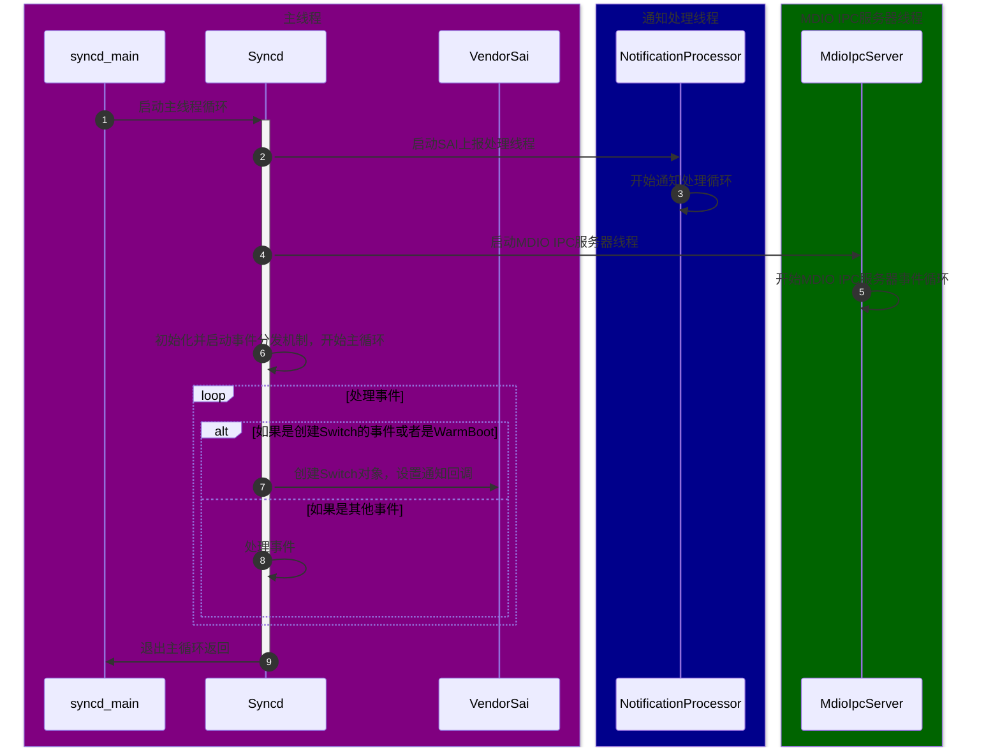
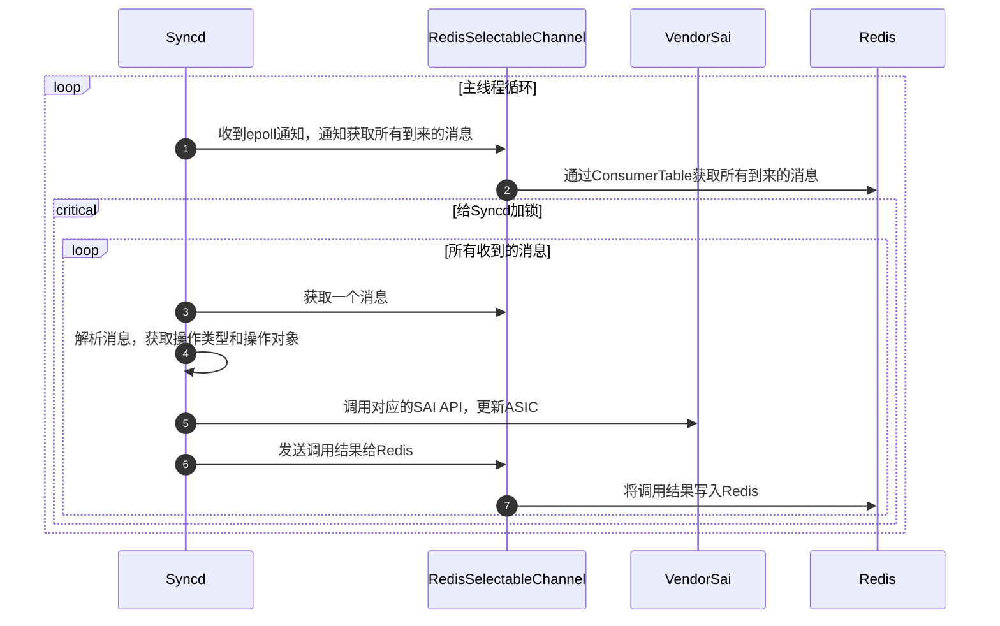
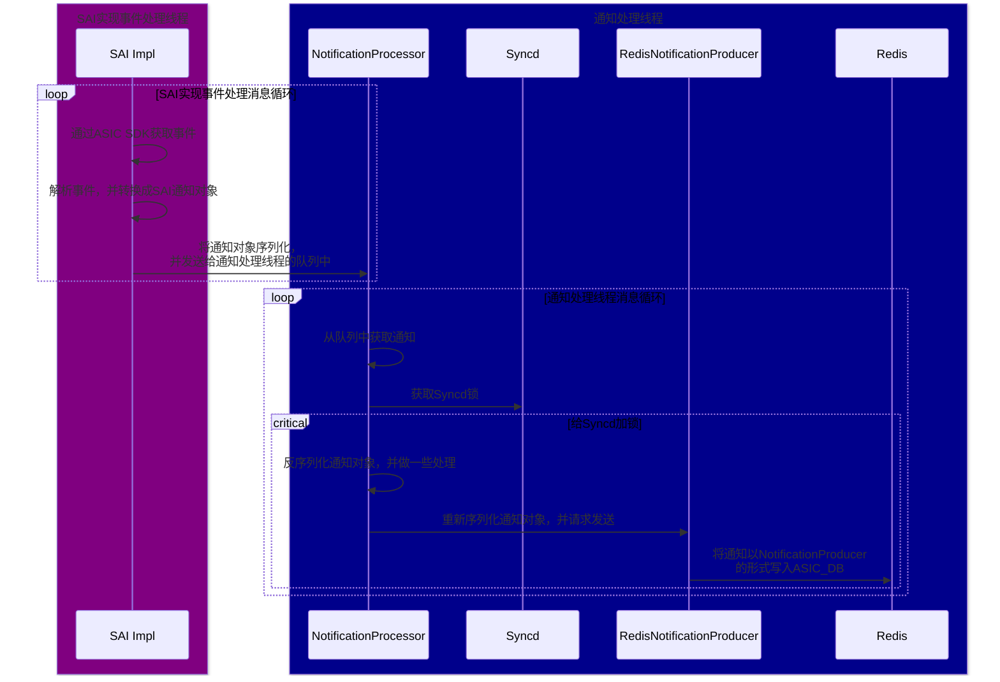

# Syncd和SAI

[Syncd容器](./2-3-key-containers.html#asic管理容器syncd)是SONiC中专门负责管理ASIC的容器，其中核心进程`syncd`负责与Redis数据库沟通，加载SAI并与其交互，以完成ASIC的初始化，配置和状态上报的处理等等。

由于SONiC中大量的工作流最后都需要通过Syncd和SAI来和ASIC进行交互，所以这一部分也就成为了这些工作流的公共部分，所以，在展开其他工作流之前，我们先来看一下Syncd和SAI是如何工作的。

## Syncd启动流程

`syncd`进程的入口在`syncd_main.cpp`中的`syncd_main`函数，其启动的整体流程大致分为两部分。

第一部分是创建各个对象，并进行初始化：



第二个部分是启动主循环，并且处理初始化事件：



然后我们再从代码的角度来更加仔细的看一下这个流程。

### syncd_main函数

`syncd_main`函数本身非常简单，主要逻辑就是创建Syncd对象，然后调用其`run`方法：

```cpp
// File: src/sonic-sairedis/syncd/syncd_main.cpp
int syncd_main(int argc, char **argv)
{
    auto vendorSai = std::make_shared<VendorSai>();
    auto syncd = std::make_shared<Syncd>(vendorSai, commandLineOptions, isWarmStart);
    syncd->run();
    return EXIT_SUCCESS;
}
```

其中，`Syncd`对象的构造函数负责初始化`Syncd`中的各个功能，而`run`方法则负责启动Syncd的主循环。

### Syncd构造函数

`Syncd`对象的构造函数负责创建或初始化`Syncd`中的各个功能，比如用于连接数据库的对象，统计管理，和ASIC通知的处理逻辑等等，其主要代码如下：

```cpp
// File: src/sonic-sairedis/syncd/Syncd.cpp
Syncd::Syncd(
        _In_ std::shared_ptr<sairedis::SaiInterface> vendorSai,
        _In_ std::shared_ptr<CommandLineOptions> cmd,
        _In_ bool isWarmStart):
    m_vendorSai(vendorSai),
    ...
{
    ...

    // Load context config
    auto ccc = sairedis::ContextConfigContainer::loadFromFile(m_commandLineOptions->m_contextConfig.c_str());
    m_contextConfig = ccc->get(m_commandLineOptions->m_globalContext);
    ...

    // Create FlexCounter manager
    m_manager = std::make_shared<FlexCounterManager>(m_vendorSai, m_contextConfig->m_dbCounters);

    // Create DB related objects
    m_dbAsic = std::make_shared<swss::DBConnector>(m_contextConfig->m_dbAsic, 0);
    m_mdioIpcServer = std::make_shared<MdioIpcServer>(m_vendorSai, m_commandLineOptions->m_globalContext);
    m_selectableChannel = std::make_shared<sairedis::RedisSelectableChannel>(m_dbAsic, ASIC_STATE_TABLE, REDIS_TABLE_GETRESPONSE, TEMP_PREFIX, modifyRedis);

    // Create notification processor and handler
    m_notifications = std::make_shared<RedisNotificationProducer>(m_contextConfig->m_dbAsic);
    m_client = std::make_shared<RedisClient>(m_dbAsic);
    m_processor = std::make_shared<NotificationProcessor>(m_notifications, m_client, std::bind(&Syncd::syncProcessNotification, this, _1));

    m_handler = std::make_shared<NotificationHandler>(m_processor);
    m_sn.onFdbEvent = std::bind(&NotificationHandler::onFdbEvent, m_handler.get(), _1, _2);
    m_sn.onNatEvent = std::bind(&NotificationHandler::onNatEvent, m_handler.get(), _1, _2);
    // Init many other event handlers here
    m_handler->setSwitchNotifications(m_sn.getSwitchNotifications());
    ...

    // Initialize SAI
    sai_status_t status = vendorSai->initialize(0, &m_test_services);
    ...
}
```

### SAI的初始化与VendorSai

`Syncd`初始化的最后也是最重要的一步，就是对SAI进行初始化。[在核心组件的SAI介绍中，我们简单的展示了SAI的初始化，实现，以及它是如何为SONiC提供不同平台的支持](./2-4-sai-intro.html)，所以这里我们主要来看看`Syncd`是如何对SAI进行封装和调用的。

`Syncd`使用`VendorSai`来对SAI的所有API进行封装，方便上层调用。其初始化过程也非常直接，基本就是对上面两个函数的直接调用和错误处理，如下：

```cpp
// File: src/sonic-sairedis/syncd/VendorSai.cpp
sai_status_t VendorSai::initialize(
        _In_ uint64_t flags,
        _In_ const sai_service_method_table_t *service_method_table)
{
    ...
    
    // Initialize SAI
    memcpy(&m_service_method_table, service_method_table, sizeof(m_service_method_table));
    auto status = sai_api_initialize(flags, service_method_table);

    // If SAI is initialized successfully, query all SAI API methods.
    // sai_metadata_api_query will also update all extern global sai_*_api variables, so we can also use
    // sai_metadata_get_object_type_info to get methods for a specific SAI object type.
    if (status == SAI_STATUS_SUCCESS) {
        memset(&m_apis, 0, sizeof(m_apis));
        int failed = sai_metadata_apis_query(sai_api_query, &m_apis);
        ...
    }
    ...

    return status;
}
```

当获取好所有的SAI API之后，我们就可以通过`VendorSai`对象来调用SAI的API了。当前调用SAI的API方式主要有两种。

第一种是通过`sai_object_type_into_t`来调用，它类似于为所有的SAI Object实现了一个虚表，如下：

```cpp
// File: src/sonic-sairedis/syncd/VendorSai.cpp
sai_status_t VendorSai::set(
        _In_ sai_object_type_t objectType,
        _In_ sai_object_id_t objectId,
        _In_ const sai_attribute_t *attr)
{
    ...

    auto info = sai_metadata_get_object_type_info(objectType);
    sai_object_meta_key_t mk = { .objecttype = objectType, .objectkey = { .key = { .object_id = objectId } } };
    return info->set(&mk, attr);
}
```

另外一种是通过保存在`VendorSai`对象中的`m_apis`来调用，这种方式更加直接，但是调用前需要先根据SAI Object的类型来调用不同的API。

```cpp
sai_status_t VendorSai::getStatsExt(
        _In_ sai_object_type_t object_type,
        _In_ sai_object_id_t object_id,
        _In_ uint32_t number_of_counters,
        _In_ const sai_stat_id_t *counter_ids,
        _In_ sai_stats_mode_t mode,
        _Out_ uint64_t *counters)
{
    sai_status_t (*ptr)(
            _In_ sai_object_id_t port_id,
            _In_ uint32_t number_of_counters,
            _In_ const sai_stat_id_t *counter_ids,
            _In_ sai_stats_mode_t mode,
            _Out_ uint64_t *counters);

    switch ((int)object_type)
    {
        case SAI_OBJECT_TYPE_PORT:
            ptr = m_apis.port_api->get_port_stats_ext;
            break;
        case SAI_OBJECT_TYPE_ROUTER_INTERFACE:
            ptr = m_apis.router_interface_api->get_router_interface_stats_ext;
            break;
        case SAI_OBJECT_TYPE_POLICER:
            ptr = m_apis.policer_api->get_policer_stats_ext;
            break;
        ...

        default:
            SWSS_LOG_ERROR("not implemented, FIXME");
            return SAI_STATUS_FAILURE;
    }

    return ptr(object_id, number_of_counters, counter_ids, mode, counters);
}
```

可以明显看出，第一种调用方式代码要精炼和直观许多。

### Syncd主循环

`Syncd`的主循环也是使用的SONiC中标准的[事件分发](./4-3-event-polling-and-error-handling.html)机制：在启动时，`Syncd`会将所有用于事件处理的`Selectable`对象注册到用于获取事件的`Select`对象中，然后在主循环中调用`Select`的`select`方法，等待事件的发生。核心代码如下：

```c
// File: src/sonic-sairedis/syncd/Syncd.cpp
void Syncd::run()
{
    volatile bool runMainLoop = true;
    std::shared_ptr<swss::Select> s = std::make_shared<swss::Select>();
    onSyncdStart(m_commandLineOptions->m_startType == SAI_START_TYPE_WARM_BOOT);

    // Start notification processing thread
    m_processor->startNotificationsProcessingThread();

    // Start MDIO threads
    for (auto& sw: m_switches) { m_mdioIpcServer->setSwitchId(sw.second->getRid()); }
    m_mdioIpcServer->startMdioThread();

    // Registering selectable for event polling
    s->addSelectable(m_selectableChannel.get());
    s->addSelectable(m_restartQuery.get());
    s->addSelectable(m_flexCounter.get());
    s->addSelectable(m_flexCounterGroup.get());

    // Main event loop
    while (runMainLoop)
    {
        swss::Selectable *sel = NULL;
        int result = s->select(&sel);

        ...
        if (sel == m_restartQuery.get()) {
            // Handling switch restart event and restart switch here.
        } else if (sel == m_flexCounter.get()) {
            processFlexCounterEvent(*(swss::ConsumerTable*)sel);
        } else if (sel == m_flexCounterGroup.get()) {
            processFlexCounterGroupEvent(*(swss::ConsumerTable*)sel);
        } else if (sel == m_selectableChannel.get()) {
            // Handle redis updates here.
            processEvent(*m_selectableChannel.get());
        } else {
            SWSS_LOG_ERROR("select failed: %d", result);
        }
        ...
    }
    ...
}
```

其中，`m_selectableChannel`就是主要负责处理Redis数据库中的事件的对象。它使用[ProducerTable / ConsumerTable](./4-2-2-redis-messaging-layer.md#producertable--consumertable)的方式与Redis数据库进行交互，所以，所有`orchagent`发送过来的操作都会以三元组的形式保存在Redis中的list中，等待`Syncd`的处理。其核心定义如下：

```cpp
// File: src/sonic-sairedis/meta/RedisSelectableChannel.h
class RedisSelectableChannel: public SelectableChannel
{
    public:
        RedisSelectableChannel(
                _In_ std::shared_ptr<swss::DBConnector> dbAsic,
                _In_ const std::string& asicStateTable,
                _In_ const std::string& getResponseTable,
                _In_ const std::string& tempPrefix,
                _In_ bool modifyRedis);

    public: // SelectableChannel overrides
        virtual bool empty() override;
        ...

    public: // Selectable overrides
        virtual int getFd() override;
        virtual uint64_t readData() override;
        ...

    private:
        std::shared_ptr<swss::DBConnector> m_dbAsic;
        std::shared_ptr<swss::ConsumerTable> m_asicState;
        std::shared_ptr<swss::ProducerTable> m_getResponse;
        ...
};
```

另外，在主循环启动时，`Syncd`还会额外启动两个线程：

- 用于接收ASIC上报通知的通知处理线程：`m_processor->startNotificationsProcessingThread();`
- 用于处理MDIO通信的MDIO IPC处理线程：`m_mdioIpcServer->startMdioThread();`

它们的细节我们在初始化的部分不做过多展开，等后面介绍相关工作流时再来详细介绍。

### 创建Switch对象，初始化通知机制

在主循环启动后，`Syncd`就会开始调用SAI的API来创建Switch对象，这里的入口有两个，一个是ASIC_DB收到创建Switch的通知，另外一个是Warm Boot时，`Syncd`来主动调用，但是创建Switch这一步的内部流程都类似。

在这一步中间，有一个很重要的步骤，就是初始化SAI内部实现中的通知回调，将我们之前已经创建好的通知处理逻辑传递给SAI的实现，比如FDB的事件等等。这些回调函数会被当做Switch的属性（Attributes）通过参数的形式传给SAI的`create_switch`方法，SAI的实现会将其保存起来，这样就可以在事件发生时调用回调函数，来通知`Syncd`了。这里的核心代码如下：

```cpp
// File: src/sonic-sairedis/syncd/Syncd.cpp
sai_status_t Syncd::processQuadEvent(
        _In_ sai_common_api_t api,
        _In_ const swss::KeyOpFieldsValuesTuple &kco)
{
    // Parse event into SAI object
    sai_object_meta_key_t metaKey;
    ...

    SaiAttributeList list(metaKey.objecttype, values, false);
    sai_attribute_t *attr_list = list.get_attr_list();
    uint32_t attr_count = list.get_attr_count();

    // Update notifications pointers in attribute list
    if (metaKey.objecttype == SAI_OBJECT_TYPE_SWITCH && (api == SAI_COMMON_API_CREATE || api == SAI_COMMON_API_SET))
    {
        m_handler->updateNotificationsPointers(attr_count, attr_list);
    }

    if (isInitViewMode())
    {
        // ProcessQuadEventInInitViewMode will eventually call into VendorSai, which calls create_swtich function in SAI.
        sai_status_t status = processQuadEventInInitViewMode(metaKey.objecttype, strObjectId, api, attr_count, attr_list);
        syncUpdateRedisQuadEvent(status, api, kco);
        return status;
    }
    ...
}

// File: src/sonic-sairedis/syncd/NotificationHandler.cpp
void NotificationHandler::updateNotificationsPointers(_In_ uint32_t attr_count, _In_ sai_attribute_t *attr_list) const
{
    for (uint32_t index = 0; index < attr_count; ++index) {
        ...

        sai_attribute_t &attr = attr_list[index];
        switch (attr.id) {
            ...

            case SAI_SWITCH_ATTR_SHUTDOWN_REQUEST_NOTIFY:
                attr.value.ptr = (void*)m_switchNotifications.on_switch_shutdown_request;
                break;

            case SAI_SWITCH_ATTR_FDB_EVENT_NOTIFY:
                attr.value.ptr = (void*)m_switchNotifications.on_fdb_event;
                break;
            ...
        }
        ...
    }
}

// File: src/sonic-sairedis/syncd/Syncd.cpp
// Call stack: processQuadEvent
//          -> processQuadEventInInitViewMode
//          -> processQuadInInitViewModeCreate
//          -> onSwitchCreateInInitViewMode
void Syncd::onSwitchCreateInInitViewMode(_In_ sai_object_id_t switchVid, _In_ uint32_t attr_count, _In_ const sai_attribute_t *attr_list)
{
    if (m_switches.find(switchVid) == m_switches.end()) {
        sai_object_id_t switchRid;
        sai_status_t status;
        status = m_vendorSai->create(SAI_OBJECT_TYPE_SWITCH, &switchRid, 0, attr_count, attr_list);
        ...

        m_switches[switchVid] = std::make_shared<SaiSwitch>(switchVid, switchRid, m_client, m_translator, m_vendorSai);
        m_mdioIpcServer->setSwitchId(switchRid);
        ...
    }
    ...
}
```

从Mellanox的SAI实现，我们可以看到其具体的保存的方法：

```cpp
static sai_status_t mlnx_create_switch(_Out_ sai_object_id_t     * switch_id,
                                       _In_ uint32_t               attr_count,
                                       _In_ const sai_attribute_t *attr_list)
{
    ...

    status = find_attrib_in_list(attr_count, attr_list, SAI_SWITCH_ATTR_SWITCH_STATE_CHANGE_NOTIFY, &attr_val, &attr_idx);
    if (!SAI_ERR(status)) {
        g_notification_callbacks.on_switch_state_change = (sai_switch_state_change_notification_fn)attr_val->ptr;
    }

    status = find_attrib_in_list(attr_count, attr_list, SAI_SWITCH_ATTR_SHUTDOWN_REQUEST_NOTIFY, &attr_val, &attr_idx);
    if (!SAI_ERR(status)) {
        g_notification_callbacks.on_switch_shutdown_request =
            (sai_switch_shutdown_request_notification_fn)attr_val->ptr;
    }

    status = find_attrib_in_list(attr_count, attr_list, SAI_SWITCH_ATTR_FDB_EVENT_NOTIFY, &attr_val, &attr_idx);
    if (!SAI_ERR(status)) {
        g_notification_callbacks.on_fdb_event = (sai_fdb_event_notification_fn)attr_val->ptr;
    }

    status = find_attrib_in_list(attr_count, attr_list, SAI_SWITCH_ATTR_PORT_STATE_CHANGE_NOTIFY, &attr_val, &attr_idx);
    if (!SAI_ERR(status)) {
        g_notification_callbacks.on_port_state_change = (sai_port_state_change_notification_fn)attr_val->ptr;
    }

    status = find_attrib_in_list(attr_count, attr_list, SAI_SWITCH_ATTR_PACKET_EVENT_NOTIFY, &attr_val, &attr_idx);
    if (!SAI_ERR(status)) {
        g_notification_callbacks.on_packet_event = (sai_packet_event_notification_fn)attr_val->ptr;
    }
    ...
}
```

## ASIC状态更新

ASIC状态更新是`Syncd`中最重要的工作流之一，当`orchagent`发现任何变化并开始修改ASIC_DB时，就会触发该工作流，通过SAI来对ASIC进行更新。在了解了`Syncd`的主循环之后，理解ASIC状态更新的工作流就很简单了。

所有的步骤都发生在主线程一个线程中，顺序执行，总结成时序图如下：



首先，`orchagent`通过Redis发送过来的操作会被`RedisSelectableChannel`对象接收，然后在主循环中被处理。当`Syncd`处理到`m_selectableChannel`时，就会调用`processEvent`方法来处理该操作。这几步的核心代码我们上面介绍主循环时已经介绍过了，这里就不再赘述。

然后，`processEvent`会根据其中的操作类型，调用对应的SAI的API来对ASIC进行更新。其逻辑是一个巨大的switch-case语句，如下：

```cpp
// File: src/sonic-sairedis/syncd/Syncd.cpp
void Syncd::processEvent(_In_ sairedis::SelectableChannel& consumer)
{
    // Loop all operations in the queue
    std::lock_guard<std::mutex> lock(m_mutex);
    do {
        swss::KeyOpFieldsValuesTuple kco;
        consumer.pop(kco, isInitViewMode());
        processSingleEvent(kco);
    } while (!consumer.empty());
}

sai_status_t Syncd::processSingleEvent(_In_ const swss::KeyOpFieldsValuesTuple &kco)
{
    auto& op = kfvOp(kco);
    ...

    if (op == REDIS_ASIC_STATE_COMMAND_CREATE)
        return processQuadEvent(SAI_COMMON_API_CREATE, kco);

    if (op == REDIS_ASIC_STATE_COMMAND_REMOVE)
        return processQuadEvent(SAI_COMMON_API_REMOVE, kco);
    
    ...
}

sai_status_t Syncd::processQuadEvent(
        _In_ sai_common_api_t api,
        _In_ const swss::KeyOpFieldsValuesTuple &kco)
{
    // Parse operation
    const std::string& key = kfvKey(kco);
    const std::string& strObjectId = key.substr(key.find(":") + 1);

    sai_object_meta_key_t metaKey;
    sai_deserialize_object_meta_key(key, metaKey);

    auto& values = kfvFieldsValues(kco);
    SaiAttributeList list(metaKey.objecttype, values, false);
    sai_attribute_t *attr_list = list.get_attr_list();
    uint32_t attr_count = list.get_attr_count();
    ...

    auto info = sai_metadata_get_object_type_info(metaKey.objecttype);

    // Process the operation
    sai_status_t status;
    if (info->isnonobjectid) {
        status = processEntry(metaKey, api, attr_count, attr_list);
    } else {
        status = processOid(metaKey.objecttype, strObjectId, api, attr_count, attr_list);
    }

    // Send response
    if (api == SAI_COMMON_API_GET) {
        sai_object_id_t switchVid = VidManager::switchIdQuery(metaKey.objectkey.key.object_id);
        sendGetResponse(metaKey.objecttype, strObjectId, switchVid, status, attr_count, attr_list);
        ...
    } else {
        sendApiResponse(api, status);
    }

    syncUpdateRedisQuadEvent(status, api, kco);
    return status;
}

sai_status_t Syncd::processEntry(_In_ sai_object_meta_key_t metaKey, _In_ sai_common_api_t api,
                                 _In_ uint32_t attr_count, _In_ sai_attribute_t *attr_list)
{
    ...

    switch (api)
    {
        case SAI_COMMON_API_CREATE:
            return m_vendorSai->create(metaKey, SAI_NULL_OBJECT_ID, attr_count, attr_list);

        case SAI_COMMON_API_REMOVE:
            return m_vendorSai->remove(metaKey);
        ...

        default:
            SWSS_LOG_THROW("api %s not supported", sai_serialize_common_api(api).c_str());
    }
}
```

## ASIC状态变更上报

反过来，当ASIC状态发生任何变化，或者需要上报数据，它也会通过SAI来通知我们，此时Syncd会监听这些通知，然后通过ASIC_DB上报给orchagent。其主要工作流如下：



这里我们也来看一下具体的实现。为了更加深入的理解，我们还是借助开源的Mellanox的SAI实现来进行分析。

最开始，SAI的实现需要接受到ASIC的通知，这一步是通过ASIC的SDK来实现的，Mellanox的SAI会创建一个事件处理线程（event_thread），然后使用`select`函数来获取并处理ASIC发送过来的通知，核心代码如下：

```cpp
// File: platform/mellanox/mlnx-sai/SAI-Implementation/mlnx_sai/src/mlnx_sai_switch.c
static void event_thread_func(void *context)
{
#define MAX_PACKET_SIZE MAX(g_resource_limits.port_mtu_max, SX_HOST_EVENT_BUFFER_SIZE_MAX)

    sx_status_t                         status;
    sx_api_handle_t                     api_handle;
    sx_user_channel_t                   port_channel, callback_channel;
    fd_set                              descr_set;
    int                                 ret_val;
    sai_object_id_t                     switch_id = (sai_object_id_t)context;
    sai_port_oper_status_notification_t port_data;
    sai_fdb_event_notification_data_t  *fdb_events = NULL;
    sai_attribute_t                    *attr_list = NULL;
    ...

    // Init SDK API
    if (SX_STATUS_SUCCESS != (status = sx_api_open(sai_log_cb, &api_handle))) {
        if (g_notification_callbacks.on_switch_shutdown_request) {
            g_notification_callbacks.on_switch_shutdown_request(switch_id);
        }
        return;
    }

    if (SX_STATUS_SUCCESS != (status = sx_api_host_ifc_open(api_handle, &port_channel.channel.fd))) {
        goto out;
    }
    ...

    // Register for port and channel notifications
    port_channel.type = SX_USER_CHANNEL_TYPE_FD;
    if (SX_STATUS_SUCCESS != (status = sx_api_host_ifc_trap_id_register_set(api_handle, SX_ACCESS_CMD_REGISTER, DEFAULT_ETH_SWID, SX_TRAP_ID_PUDE, &port_channel))) {
        goto out;
    }
    ...
    for (uint32_t ii = 0; ii < (sizeof(mlnx_trap_ids) / sizeof(*mlnx_trap_ids)); ii++) {
        status = sx_api_host_ifc_trap_id_register_set(api_handle, SX_ACCESS_CMD_REGISTER, DEFAULT_ETH_SWID, mlnx_trap_ids[ii], &callback_channel);
    }

    while (!event_thread_asked_to_stop) {
        FD_ZERO(&descr_set);
        FD_SET(port_channel.channel.fd.fd, &descr_set);
        FD_SET(callback_channel.channel.fd.fd, &descr_set);
        ...

        ret_val = select(FD_SETSIZE, &descr_set, NULL, NULL, &timeout);
        if (ret_val > 0) {
            // Port state change event
            if (FD_ISSET(port_channel.channel.fd.fd, &descr_set)) {
                // Parse port state event here ...
                if (g_notification_callbacks.on_port_state_change) {
                    g_notification_callbacks.on_port_state_change(1, &port_data);
                }
            }

            if (FD_ISSET(callback_channel.channel.fd.fd, &descr_set)) {
                // Receive notification event.
                packet_size = MAX_PACKET_SIZE;
                if (SX_STATUS_SUCCESS != (status = sx_lib_host_ifc_recv(&callback_channel.channel.fd, p_packet, &packet_size, receive_info))) {
                    goto out;
                }

                // BFD packet event
                if (SX_TRAP_ID_BFD_PACKET_EVENT == receive_info->trap_id) {
                    const struct bfd_packet_event *event = (const struct bfd_packet_event*)p_packet;
                    // Parse and check event valid here ...
                    status = mlnx_switch_bfd_packet_handle(event);
                    continue;
                }

                // Same way to handle BFD timeout event, Bulk counter ready event. Emiited.

                // FDB event and packet event handling
                if (receive_info->trap_id == SX_TRAP_ID_FDB_EVENT) {
                    trap_name = "FDB event";
                } else if (SAI_STATUS_SUCCESS != (status = mlnx_translate_sdk_trap_to_sai(receive_info->trap_id, &trap_name, &trap_oid))) {
                    continue;
                }

                if (SX_TRAP_ID_FDB_EVENT == receive_info->trap_id) {
                    // Parse FDB events here ...

                    if (g_notification_callbacks.on_fdb_event) {
                        g_notification_callbacks.on_fdb_event(event_count, fdb_events);
                    }

                    continue;
                }

                // Packet event handling
                status = mlnx_get_hostif_packet_data(receive_info, &attrs_num, callback_data);
                if (g_notification_callbacks.on_packet_event) {
                    g_notification_callbacks.on_packet_event(switch_id, packet_size, p_packet, attrs_num, callback_data);
                }
            }
        }
    }

out:
    ...
}
```

接下来，我们用FDB事件来举例，当ASIC收到FDB事件，就会被上面的事件处理循环获取到，并调用`g_notification_callbacks.on_fdb_event`函数来处理。这个函数接下来就会调用到`Syncd`初始化时设置好的`NotificationHandler::onFdbEvent`函数，这个函数会将该事件序列化后，通过消息队列转发给通知处理线程来进行处理：

```cpp
// File: src/sonic-sairedis/syncd/NotificationHandler.cpp
void NotificationHandler::onFdbEvent(_In_ uint32_t count, _In_ const sai_fdb_event_notification_data_t *data)
{
    std::string s = sai_serialize_fdb_event_ntf(count, data);
    enqueueNotification(SAI_SWITCH_NOTIFICATION_NAME_FDB_EVENT, s);
}
```

而此时通知处理线程会被唤醒，从消息队列中取出该事件，然后通过`Syncd`获取到`Syncd`的锁，再开始处理该通知：

```cpp
// File: src/sonic-sairedis/syncd/NotificationProcessor.cpp
void NotificationProcessor::ntf_process_function()
{
    std::mutex ntf_mutex;
    std::unique_lock<std::mutex> ulock(ntf_mutex);

    while (m_runThread) {
        // When notification arrives, it will signal this condition variable.
        m_cv.wait(ulock);

        // Process notifications in the queue.
        swss::KeyOpFieldsValuesTuple item;
        while (m_notificationQueue->tryDequeue(item)) {
            processNotification(item);
        }
    }
}

// File: src/sonic-sairedis/syncd/Syncd.cpp
// Call from NotificationProcessor::processNotification
void Syncd::syncProcessNotification(_In_ const swss::KeyOpFieldsValuesTuple& item)
{
    std::lock_guard<std::mutex> lock(m_mutex);
    m_processor->syncProcessNotification(item);
}
```

接下来就是事件的分发和处理了，`syncProcessNotification`函数是一系列的`if-else`语句，根据事件的类型，调用不同的处理函数来处理该事件：

```cpp
// File: src/sonic-sairedis/syncd/NotificationProcessor.cpp
void NotificationProcessor::syncProcessNotification( _In_ const swss::KeyOpFieldsValuesTuple& item)
{
    std::string notification = kfvKey(item);
    std::string data = kfvOp(item);

    if (notification == SAI_SWITCH_NOTIFICATION_NAME_SWITCH_STATE_CHANGE) {
        handle_switch_state_change(data);
    } else if (notification == SAI_SWITCH_NOTIFICATION_NAME_FDB_EVENT) {
        handle_fdb_event(data);
    } else if ...
    } else {
        SWSS_LOG_ERROR("unknown notification: %s", notification.c_str());
    }
}
```

而每个事件处理函数都类似，他们会对发送过来的事件进行反序列化，然后调用真正的处理逻辑发送通知，比如，fdb事件对应的`handle_fdb_event`函数和`process_on_fdb_event`：

```cpp
// File: src/sonic-sairedis/syncd/NotificationProcessor.cpp
void NotificationProcessor::handle_fdb_event(_In_ const std::string &data)
{
    uint32_t count;
    sai_fdb_event_notification_data_t *fdbevent = NULL;
    sai_deserialize_fdb_event_ntf(data, count, &fdbevent);

    process_on_fdb_event(count, fdbevent);

    sai_deserialize_free_fdb_event_ntf(count, fdbevent);
}

void NotificationProcessor::process_on_fdb_event( _In_ uint32_t count, _In_ sai_fdb_event_notification_data_t *data)
{
    for (uint32_t i = 0; i < count; i++) {
        sai_fdb_event_notification_data_t *fdb = &data[i];
        // Check FDB event notification data here

        fdb->fdb_entry.switch_id = m_translator->translateRidToVid(fdb->fdb_entry.switch_id, SAI_NULL_OBJECT_ID);
        fdb->fdb_entry.bv_id = m_translator->translateRidToVid(fdb->fdb_entry.bv_id, fdb->fdb_entry.switch_id, true);
        m_translator->translateRidToVid(SAI_OBJECT_TYPE_FDB_ENTRY, fdb->fdb_entry.switch_id, fdb->attr_count, fdb->attr, true);

        ...
    }

    // Send notification
    std::string s = sai_serialize_fdb_event_ntf(count, data);
    sendNotification(SAI_SWITCH_NOTIFICATION_NAME_FDB_EVENT, s);
}
```

具体发送事件的逻辑就非常直接了，最终就是通过[NotificationProducer](./4-2-2-redis-messaging-layer.html#notificationproducer--notificationconsumer)来发送通知到ASIC_DB中：

```cpp
// File: src/sonic-sairedis/syncd/NotificationProcessor.cpp
void NotificationProcessor::sendNotification(_In_ const std::string& op, _In_ const std::string& data)
{
    std::vector<swss::FieldValueTuple> entry;
    sendNotification(op, data, entry);
}

void NotificationProcessor::sendNotification(_In_ const std::string& op, _In_ const std::string& data, _In_ std::vector<swss::FieldValueTuple> entry)
{
    m_notifications->send(op, data, entry);
}

// File: src/sonic-sairedis/syncd/RedisNotificationProducer.cpp
void RedisNotificationProducer::send(_In_ const std::string& op, _In_ const std::string& data, _In_ const std::vector<swss::FieldValueTuple>& values)
{
    std::vector<swss::FieldValueTuple> vals = values;

    // The m_notificationProducer is created in the ctor of RedisNotificationProducer as below:
    // m_notificationProducer = std::make_shared<swss::NotificationProducer>(m_db.get(), REDIS_TABLE_NOTIFICATIONS_PER_DB(dbName));
    m_notificationProducer->send(op, data, vals);
}
```

到此，`Syncd`中的通知上报的流程就结束了。

# 参考资料

1. [SONiC Architecture][SONiCArch]
2. [Github repo: sonic-sairedis][SONiCSAIRedis]
3. [Github repo: Nvidia (Mellanox) SAI implementation][MnlxSAI]

[SONiCArch]: https://github.com/sonic-net/SONiC/wiki/Architecture
[SONiCSAIRedis]: https://github.com/sonic-net/sonic-sairedis/
[MnlxSAI]: https://github.com/Mellanox/SAI-Implementation/tree/master