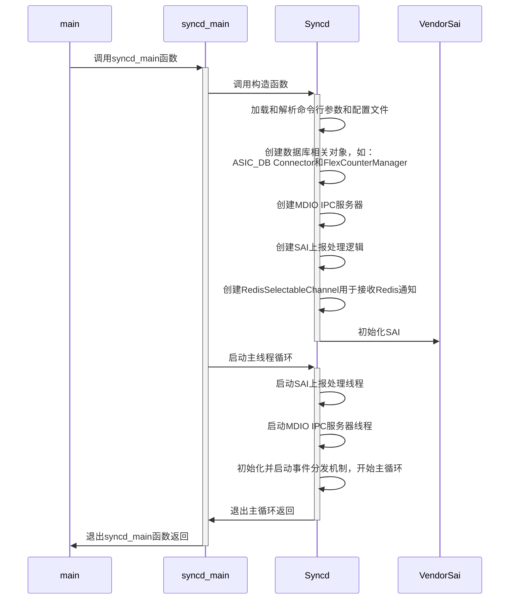
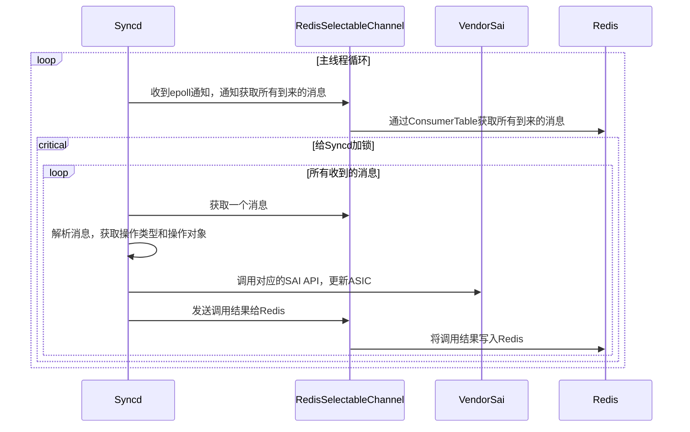

# Syncd工作流

[Syncd容器](./2-3-key-containers.html#asic管理容器syncd)是SONiC中专门负责管理ASIC的容器，其中核心进程`syncd`负责与Redis数据库沟通，加载SAI并与其交互，以完成ASIC的初始化，配置和状态上报的处理等等。

由于SONiC中大量的工作流最后都需要通过Syncd和SAI来和ASIC进行交互，所以这一部分也就成为了这些工作流的公共部分，所以，在展开其他工作流之前，我们先来看一下Syncd和SAI是如何工作的。

## Syncd启动流程

`syncd`进程的入口在`syncd_main.cpp`中的`syncd_main`函数，其启动的整体流程大致如下：



然后我们再从代码的角度来更加仔细的看一下这个流程。

### syncd_main函数

`syncd_main`函数本身非常简单，主要逻辑就是创建Syncd对象，然后调用其`run`方法：

```cpp
// File: src/sonic-sairedis/syncd/syncd_main.cpp
int syncd_main(int argc, char **argv)
{
    auto vendorSai = std::make_shared<VendorSai>();
    auto syncd = std::make_shared<Syncd>(vendorSai, commandLineOptions, isWarmStart);
    syncd->run();
    return EXIT_SUCCESS;
}
```

其中，`Syncd`对象的构造函数负责初始化`Syncd`中的各个功能，而`run`方法则负责启动Syncd的主循环。

### Syncd构造函数

`Syncd`对象的构造函数负责创建或初始化`Syncd`中的各个功能，比如用于连接数据库的对象，统计管理，和ASIC通知的处理逻辑等等，其主要代码如下：

```cpp
// File: src/sonic-sairedis/syncd/Syncd.cpp
Syncd::Syncd(
        _In_ std::shared_ptr<sairedis::SaiInterface> vendorSai,
        _In_ std::shared_ptr<CommandLineOptions> cmd,
        _In_ bool isWarmStart):
    m_vendorSai(vendorSai),
    ...
{
    ...

    // Load context config
    auto ccc = sairedis::ContextConfigContainer::loadFromFile(m_commandLineOptions->m_contextConfig.c_str());
    m_contextConfig = ccc->get(m_commandLineOptions->m_globalContext);
    ...

    // Create FlexCounter manager
    m_manager = std::make_shared<FlexCounterManager>(m_vendorSai, m_contextConfig->m_dbCounters);

    // Create DB related objects
    m_dbAsic = std::make_shared<swss::DBConnector>(m_contextConfig->m_dbAsic, 0);
    m_mdioIpcServer = std::make_shared<MdioIpcServer>(m_vendorSai, m_commandLineOptions->m_globalContext);
    m_selectableChannel = std::make_shared<sairedis::RedisSelectableChannel>(m_dbAsic, ASIC_STATE_TABLE, REDIS_TABLE_GETRESPONSE, TEMP_PREFIX, modifyRedis);

    // Create notification processor and handler
    m_notifications = std::make_shared<RedisNotificationProducer>(m_contextConfig->m_dbAsic);
    m_client = std::make_shared<RedisClient>(m_dbAsic);
    m_processor = std::make_shared<NotificationProcessor>(m_notifications, m_client, std::bind(&Syncd::syncProcessNotification, this, _1));

    m_handler = std::make_shared<NotificationHandler>(m_processor);
    m_sn.onFdbEvent = std::bind(&NotificationHandler::onFdbEvent, m_handler.get(), _1, _2);
    m_sn.onNatEvent = std::bind(&NotificationHandler::onNatEvent, m_handler.get(), _1, _2);
    // Init many other event handlers here
    m_handler->setSwitchNotifications(m_sn.getSwitchNotifications());
    ...

    // Initialize SAI
    sai_status_t status = vendorSai->initialize(0, &m_test_services);
    ...
}
```

### SAI初始化

`Syncd`初始化的最后也是最重要的一步，就是对SAI进行初始化。[在核心组件的SAI介绍中，我们简单的展示了SAI的实现，以及它是如何为SONiC提供不同平台的支持](./2-4-sai-intro.html)，这里我们就来看一下SAI的初始化过程。

#### SAI实现的初始化

初始化SAI的主要函数有两个：

- `sai_api_initialize`：初始化SAI
- `sai_api_query`：传入SAI的API的类型，获取对应的接口列表

虽然大部分厂商的SAI实现是闭源的，但是mellanox却开源了自己的SAI实现，所以这里我们可以借助其更加深入的理解SAI是如何工作的。

比如，`sai_api_initialize`函数其实就是简单的设置设置两个全局变量，然后返回`SAI_STATUS_SUCCESS`：

```cpp
// File: platform/mellanox/mlnx-sai/SAI-Implementation/mlnx_sai/src/mlnx_sai_interfacequery.c
sai_status_t sai_api_initialize(_In_ uint64_t flags, _In_ const sai_service_method_table_t* services)
{
    if (g_initialized) {
        return SAI_STATUS_FAILURE;
    }
    // Validate parameters here (code emitted)

    memcpy(&g_mlnx_services, services, sizeof(g_mlnx_services));
    g_initialized = true;
    return SAI_STATUS_SUCCESS;
}
```

初始化完成后，我们就可以使用`sai_api_query`函数，通过传入API的类型来查询对应的接口列表，而每一个接口列表其实都是一个全局变量：

```cpp
// File: platform/mellanox/mlnx-sai/SAI-Implementation/mlnx_sai/src/mlnx_sai_interfacequery.c
sai_status_t sai_api_query(_In_ sai_api_t sai_api_id, _Out_ void** api_method_table)
{
    if (!g_initialized) {
        return SAI_STATUS_UNINITIALIZED;
    }
    ...

    return sai_api_query_eth(sai_api_id, api_method_table);
}

// File: platform/mellanox/mlnx-sai/SAI-Implementation/mlnx_sai/src/mlnx_sai_interfacequery_eth.c
sai_status_t sai_api_query_eth(_In_ sai_api_t sai_api_id, _Out_ void** api_method_table)
{
    switch (sai_api_id) {
    case SAI_API_BRIDGE:
        *(const sai_bridge_api_t**)api_method_table = &mlnx_bridge_api;
        return SAI_STATUS_SUCCESS;
    case SAI_API_SWITCH:
        *(const sai_switch_api_t**)api_method_table = &mlnx_switch_api;
        return SAI_STATUS_SUCCESS;
    ...
    default:
        if (sai_api_id >= (sai_api_t)SAI_API_EXTENSIONS_RANGE_END) {
            return SAI_STATUS_INVALID_PARAMETER;
        } else {
            return SAI_STATUS_NOT_IMPLEMENTED;
        }
    }
}

// File: platform/mellanox/mlnx-sai/SAI-Implementation/mlnx_sai/src/mlnx_sai_bridge.c
const sai_bridge_api_t mlnx_bridge_api = {
    mlnx_create_bridge,
    mlnx_remove_bridge,
    mlnx_set_bridge_attribute,
    mlnx_get_bridge_attribute,
    ...
};


// File: platform/mellanox/mlnx-sai/SAI-Implementation/mlnx_sai/src/mlnx_sai_switch.c
const sai_switch_api_t mlnx_switch_api = {
    mlnx_create_switch,
    mlnx_remove_switch,
    mlnx_set_switch_attribute,
    mlnx_get_switch_attribute,
    ...
};
```

#### SAI的封装：VendorSai

`Syncd`使用`VendorSai`来对SAI的所有API进行封装，方便上层调用。其初始化过程也非常直接，基本就是对上面两个函数的直接调用和错误处理，如下：

```cpp
// File: src/sonic-sairedis/syncd/VendorSai.cpp
sai_status_t VendorSai::initialize(
        _In_ uint64_t flags,
        _In_ const sai_service_method_table_t *service_method_table)
{
    ...
    
    // Initialize SAI
    memcpy(&m_service_method_table, service_method_table, sizeof(m_service_method_table));
    auto status = sai_api_initialize(flags, service_method_table);

    // If SAI is initialized successfully, query all SAI API methods.
    // sai_metadata_api_query will also update all extern global sai_*_api variables, so we can also use
    // sai_metadata_get_object_type_info to get methods for a specific SAI object type.
    if (status == SAI_STATUS_SUCCESS) {
        memset(&m_apis, 0, sizeof(m_apis));
        int failed = sai_metadata_apis_query(sai_api_query, &m_apis);
        ...
    }
    ...

    return status;
}
```

当获取好所有的SAI API之后，我们就可以通过`VendorSai`对象来调用SAI的API了。当前调用SAI的API方式主要有两种。

第一种是通过`sai_object_type_into_t`来调用，它类似于为所有的SAI Object实现了一个虚表，如下：

```cpp
// File: src/sonic-sairedis/syncd/VendorSai.cpp
sai_status_t VendorSai::set(
        _In_ sai_object_type_t objectType,
        _In_ sai_object_id_t objectId,
        _In_ const sai_attribute_t *attr)
{
    ...

    auto info = sai_metadata_get_object_type_info(objectType);
    sai_object_meta_key_t mk = { .objecttype = objectType, .objectkey = { .key = { .object_id = objectId } } };
    return info->set(&mk, attr);
}
```

另外一种是通过保存在`VendorSai`对象中的`m_apis`来调用，这种方式更加直接，但是调用前需要先根据SAI Object的类型来调用不同的API。

```cpp
sai_status_t VendorSai::getStatsExt(
        _In_ sai_object_type_t object_type,
        _In_ sai_object_id_t object_id,
        _In_ uint32_t number_of_counters,
        _In_ const sai_stat_id_t *counter_ids,
        _In_ sai_stats_mode_t mode,
        _Out_ uint64_t *counters)
{
    sai_status_t (*ptr)(
            _In_ sai_object_id_t port_id,
            _In_ uint32_t number_of_counters,
            _In_ const sai_stat_id_t *counter_ids,
            _In_ sai_stats_mode_t mode,
            _Out_ uint64_t *counters);

    switch ((int)object_type)
    {
        case SAI_OBJECT_TYPE_PORT:
            ptr = m_apis.port_api->get_port_stats_ext;
            break;
        case SAI_OBJECT_TYPE_ROUTER_INTERFACE:
            ptr = m_apis.router_interface_api->get_router_interface_stats_ext;
            break;
        case SAI_OBJECT_TYPE_POLICER:
            ptr = m_apis.policer_api->get_policer_stats_ext;
            break;
        ...

        default:
            SWSS_LOG_ERROR("not implemented, FIXME");
            return SAI_STATUS_FAILURE;
    }

    return ptr(object_id, number_of_counters, counter_ids, mode, counters);
}
```

可以明显看出，第一种调用方式代码要精炼和直观许多。

### Syncd主循环

`Syncd`的主循环也是使用的SONiC中标准的[事件分发](./4-3-event-polling-and-error-handling.html)机制：在启动时，`Syncd`会将所有用于事件处理的`Selectable`对象注册到用于获取事件的`Select`对象中，然后在主循环中调用`Select`的`select`方法，等待事件的发生。核心代码如下：

```c
// File: src/sonic-sairedis/syncd/Syncd.cpp
void Syncd::run()
{
    volatile bool runMainLoop = true;
    std::shared_ptr<swss::Select> s = std::make_shared<swss::Select>();
    onSyncdStart(m_commandLineOptions->m_startType == SAI_START_TYPE_WARM_BOOT);

    // Start notification processing thread
    m_processor->startNotificationsProcessingThread();

    // Start MDIO threads
    for (auto& sw: m_switches) { m_mdioIpcServer->setSwitchId(sw.second->getRid()); }
    m_mdioIpcServer->startMdioThread();

    // Registering selectable for event polling
    s->addSelectable(m_selectableChannel.get());
    s->addSelectable(m_restartQuery.get());
    s->addSelectable(m_flexCounter.get());
    s->addSelectable(m_flexCounterGroup.get());

    // Main event loop
    while (runMainLoop)
    {
        swss::Selectable *sel = NULL;
        int result = s->select(&sel);

        ...
        if (sel == m_restartQuery.get()) {
            // Handling switch restart event and restart switch here.
        } else if (sel == m_flexCounter.get()) {
            processFlexCounterEvent(*(swss::ConsumerTable*)sel);
        } else if (sel == m_flexCounterGroup.get()) {
            processFlexCounterGroupEvent(*(swss::ConsumerTable*)sel);
        } else if (sel == m_selectableChannel.get()) {
            // Handle redis updates here.
            processEvent(*m_selectableChannel.get());
        } else {
            SWSS_LOG_ERROR("select failed: %d", result);
        }
        ...
    }
    ...
}
```

其中，`m_selectableChannel`就是主要负责处理Redis数据库中的事件的对象。它使用[ProducerTable / ConsumerTable](./4-2-2-redis-messaging-layer.md#producertable--consumertable)的方式与Redis数据库进行交互，所以，所有`orchagent`发送过来的操作都会以三元组的形式保存在Redis中的list中，等待`Syncd`的处理。其核心定义如下：

```cpp
// File: src/sonic-sairedis/meta/RedisSelectableChannel.h
class RedisSelectableChannel: public SelectableChannel
{
    public:
        RedisSelectableChannel(
                _In_ std::shared_ptr<swss::DBConnector> dbAsic,
                _In_ const std::string& asicStateTable,
                _In_ const std::string& getResponseTable,
                _In_ const std::string& tempPrefix,
                _In_ bool modifyRedis);

    public: // SelectableChannel overrides
        virtual bool empty() override;
        ...

    public: // Selectable overrides
        virtual int getFd() override;
        virtual uint64_t readData() override;
        ...

    private:
        std::shared_ptr<swss::DBConnector> m_dbAsic;
        std::shared_ptr<swss::ConsumerTable> m_asicState;
        std::shared_ptr<swss::ProducerTable> m_getResponse;
        ...
};
```

另外，在主循环启动时，`Syncd`还会额外启动两个线程：

- 用于接收ASIC上报通知的通知处理线程：`m_processor->startNotificationsProcessingThread();`
- 用于处理MDIO通信的MDIO IPC处理线程：`m_mdioIpcServer->startMdioThread();`

它们的细节我们在初始化的部分不做过多展开，等后面介绍相关工作流时再来详细介绍。

## ASIC状态更新

ASIC状态更新是`Syncd`中最重要的工作流之一，当`orchagent`发现任何变化并开始修改ASIC_DB时，就会触发该工作流，通过SAI来对ASIC进行更新。在了解了`Syncd`的主循环之后，理解ASIC状态更新的工作流就很简单了。

首先，`orchagent`通过Redis发送过来的操作会被`RedisSelectableChannel`对象接收，然后在主循环中被处理。当`Syncd`处理到`m_selectableChannel`时，就会调用`processEvent`方法来处理该操作。这几步的核心代码我们上面介绍主循环时已经介绍过了，这里就不再赘述。

然后，`processEvent`会根据其中的操作类型，调用对应的SAI的API来对ASIC进行更新。其逻辑是一个巨大的switch-case语句，如下：

```cpp
// File: src/sonic-sairedis/syncd/Syncd.cpp
void Syncd::processEvent(_In_ sairedis::SelectableChannel& consumer)
{
    // Loop all operations in the queue
    std::lock_guard<std::mutex> lock(m_mutex);
    do {
        swss::KeyOpFieldsValuesTuple kco;
        consumer.pop(kco, isInitViewMode());
        processSingleEvent(kco);
    } while (!consumer.empty());
}

sai_status_t Syncd::processSingleEvent(_In_ const swss::KeyOpFieldsValuesTuple &kco)
{
    auto& op = kfvOp(kco);
    ...

    if (op == REDIS_ASIC_STATE_COMMAND_CREATE)
        return processQuadEvent(SAI_COMMON_API_CREATE, kco);

    if (op == REDIS_ASIC_STATE_COMMAND_REMOVE)
        return processQuadEvent(SAI_COMMON_API_REMOVE, kco);
    
    ...
}

sai_status_t Syncd::processQuadEvent(
        _In_ sai_common_api_t api,
        _In_ const swss::KeyOpFieldsValuesTuple &kco)
{
    // Parse operation
    const std::string& key = kfvKey(kco);
    const std::string& strObjectId = key.substr(key.find(":") + 1);

    sai_object_meta_key_t metaKey;
    sai_deserialize_object_meta_key(key, metaKey);

    auto& values = kfvFieldsValues(kco);
    SaiAttributeList list(metaKey.objecttype, values, false);
    sai_attribute_t *attr_list = list.get_attr_list();
    uint32_t attr_count = list.get_attr_count();
    ...

    auto info = sai_metadata_get_object_type_info(metaKey.objecttype);

    // Process the operation
    sai_status_t status;
    if (info->isnonobjectid) {
        status = processEntry(metaKey, api, attr_count, attr_list);
    } else {
        status = processOid(metaKey.objecttype, strObjectId, api, attr_count, attr_list);
    }

    // Send response
    if (api == SAI_COMMON_API_GET) {
        sai_object_id_t switchVid = VidManager::switchIdQuery(metaKey.objectkey.key.object_id);
        sendGetResponse(metaKey.objecttype, strObjectId, switchVid, status, attr_count, attr_list);
        ...
    } else {
        sendApiResponse(api, status);
    }

    syncUpdateRedisQuadEvent(status, api, kco);
    return status;
}

sai_status_t Syncd::processEntry(_In_ sai_object_meta_key_t metaKey, _In_ sai_common_api_t api,
                                 _In_ uint32_t attr_count, _In_ sai_attribute_t *attr_list)
{
    ...

    switch (api)
    {
        case SAI_COMMON_API_CREATE:
            return m_vendorSai->create(metaKey, SAI_NULL_OBJECT_ID, attr_count, attr_list);

        case SAI_COMMON_API_REMOVE:
            return m_vendorSai->remove(metaKey);
        ...

        default:
            SWSS_LOG_THROW("api %s not supported", sai_serialize_common_api(api).c_str());
    }
}
```

最后，所有这些步骤都发生在主线程一个线程中，顺序执行，总结成时序图如下：



## ASIC状态变更上报

反过来，当ASIC状态发生任何变化，或者需要上报统计数据，它也会通过SAI来通知我们，此时Syncd会监听这些通知，然后通过ASIC_DB上报给orchagent。其主要工作流如下：

```mermaid
sequenceDiagram
```

# 参考资料

1. [SONiC Architecture][SONiCArch]
2. [Github repo: sonic-sairedis][SONiCSAIRedis]

[SONiCArch]: https://github.com/sonic-net/SONiC/wiki/Architecture
[SONiCSAIRedis]: https://github.com/sonic-net/sonic-sairedis/