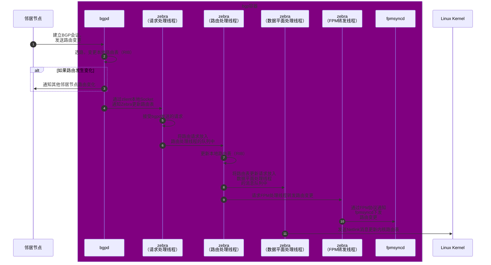
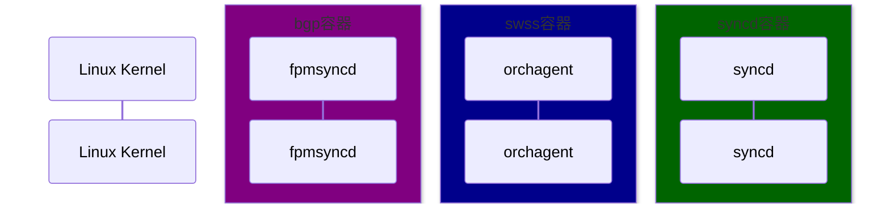

# BGP路由变更下发

路由变更几乎是SONiC中最重要的工作流，它的整个流程从`bgpd`进程开始，到最终通过SAI到达ASIC芯片，中间参与的进程较多，流程也较为复杂，但是弄清楚之后，我们就可以很好的理解SONiC的设计思想，并且举一反三的理解其他配置下发的工作流了。所以这一节，我们就一起来深入的分析一下它的整体流程。

为了方便我们理解和从代码层面来展示，我们把这个流程分成两个大块来介绍，分别是FRR是如何处理路由变化的，和SONiC的路由变更工作流以及它是如何与FRR进行整合的。

## FRR处理路由变更



```admonish note
关于FRR的实现，这里更多的是从代码的角度来阐述其工作流的过程，而不是其对BGP的实现细节，如果想要了解FRR的BGP实现细节，可以参考[官方文档](https://docs.frrouting.org/en/latest/bgp.html)。
```

### bgpd处理路由变更

`bgpd`是FRR中专门用来处理BGP会话的进程，它会开放TCP 179端口与邻居节点建立BGP连接，并处理路由表的更新请求。当路由发生变化后，FRR也会通过它来通知其他邻居节点。

请求来到`bgpd`之后，它会首先来到它的io线程：`bgp_io`。顾名思义，`bgpd`中的网络读写工作都是在这个线程上完成的：

```c
// File: src/sonic-frr/frr/bgpd/bgp_io.c
static int bgp_process_reads(struct thread *thread)
{
    ...

    while (more) {
        // Read packets here
        ...
  
        // If we have more than 1 complete packet, mark it and process it later.
        if (ringbuf_remain(ibw) >= pktsize) {
            ...
            added_pkt = true;
        } else break;
    }
    ...

    if (added_pkt)
        thread_add_event(bm->master, bgp_process_packet, peer, 0, &peer->t_process_packet);

    return 0;
}
```

当数据包读完后，`bgpd`会将其发送到主线程进行路由处理。在这里，`bgpd`会根据数据包的类型进行分发，其中路由更新的请求会交给`bpg_update_receive`来进行解析：

```c
// File: src/sonic-frr/frr/bgpd/bgp_packet.c
int bgp_process_packet(struct thread *thread)
{
    ...
	unsigned int processed = 0;
	while (processed < rpkt_quanta_old) {
		uint8_t type = 0;
		bgp_size_t size;
        ...

		/* read in the packet length and type */
		size = stream_getw(peer->curr);
		type = stream_getc(peer->curr);
		size -= BGP_HEADER_SIZE;

		switch (type) {
		case BGP_MSG_OPEN:
            ...
            break;
		case BGP_MSG_UPDATE:
            ...
			mprc = bgp_update_receive(peer, size);
            ...
			break;
        ...
}

// Process BGP UPDATE message for peer.
static int bgp_update_receive(struct peer *peer, bgp_size_t size)
{
	struct stream *s;
	struct attr attr;
	struct bgp_nlri nlris[NLRI_TYPE_MAX];
    ...

    // Parse attributes and NLRI
	memset(&attr, 0, sizeof(struct attr));
	attr.label_index = BGP_INVALID_LABEL_INDEX;
	attr.label = MPLS_INVALID_LABEL;
    ...

	memset(&nlris, 0, sizeof(nlris));
    ...

	if ((!update_len && !withdraw_len && nlris[NLRI_MP_UPDATE].length == 0)
	    || (attr_parse_ret == BGP_ATTR_PARSE_EOR)) {
        // More parsing here
        ...

		if (afi && peer->afc[afi][safi]) {
			struct vrf *vrf = vrf_lookup_by_id(peer->bgp->vrf_id);

			/* End-of-RIB received */
			if (!CHECK_FLAG(peer->af_sflags[afi][safi], PEER_STATUS_EOR_RECEIVED)) {
                ...
				if (gr_info->eor_required == gr_info->eor_received) {
                    ...
					/* Best path selection */
					if (bgp_best_path_select_defer( peer->bgp, afi, safi) < 0)
						return BGP_Stop;
				}
			}
            ...
		}
	}
    ...

	return Receive_UPDATE_message;
}
```

然后，`bgpd`会开始检查是否出现更优的路径，并更新自己的本地路由表（RIB，Routing Information Base）：

```c
// File: src/sonic-frr/frr/bgpd/bgp_route.c
/* Process the routes with the flag BGP_NODE_SELECT_DEFER set */
int bgp_best_path_select_defer(struct bgp *bgp, afi_t afi, safi_t safi)
{
	struct bgp_dest *dest;
	int cnt = 0;
	struct afi_safi_info *thread_info;
    ...

	/* Process the route list */
	for (dest = bgp_table_top(bgp->rib[afi][safi]);
	     dest && bgp->gr_info[afi][safi].gr_deferred != 0;
	     dest = bgp_route_next(dest))
    {
        ...
		bgp_process_main_one(bgp, dest, afi, safi);
        ...
	}
    ...

	return 0;
}

static void bgp_process_main_one(struct bgp *bgp, struct bgp_dest *dest, afi_t afi, safi_t safi)
{
	struct bgp_path_info *new_select;
	struct bgp_path_info *old_select;
	struct bgp_path_info_pair old_and_new;
    ...

	const struct prefix *p = bgp_dest_get_prefix(dest);
    ...

	/* Best path selection. */
	bgp_best_selection(bgp, dest, &bgp->maxpaths[afi][safi], &old_and_new, afi, safi);
	old_select = old_and_new.old;
	new_select = old_and_new.new;
    ...

	/* FIB update. */
	if (bgp_fibupd_safi(safi) && (bgp->inst_type != BGP_INSTANCE_TYPE_VIEW)
	    && !bgp_option_check(BGP_OPT_NO_FIB)) {

		if (new_select && new_select->type == ZEBRA_ROUTE_BGP
		    && (new_select->sub_type == BGP_ROUTE_NORMAL
			|| new_select->sub_type == BGP_ROUTE_AGGREGATE
			|| new_select->sub_type == BGP_ROUTE_IMPORTED)) {
            ...

			if (old_select && is_route_parent_evpn(old_select))
				bgp_zebra_withdraw(p, old_select, bgp, safi);

			bgp_zebra_announce(dest, p, new_select, bgp, afi, safi);
		} else {
			/* Withdraw the route from the kernel. */
            ...
		}
	}

    /* EVPN route injection and clean up */
    ...

	UNSET_FLAG(dest->flags, BGP_NODE_PROCESS_SCHEDULED);
	return;
}
```

最后，`bgp_zebra_announce`会通过`zclient`通知`zebra`更新内核路由表。

```c
// File: src/sonic-frr/frr/bgpd/bgp_zebra.c
void bgp_zebra_announce(struct bgp_node *rn, struct prefix *p, struct bgp_path_info *info, struct bgp *bgp, afi_t afi, safi_t safi)
{
    ...
    zclient_route_send(valid_nh_count ? ZEBRA_ROUTE_ADD : ZEBRA_ROUTE_DELETE, zclient, &api);
}
```

`zclient`使用本地socket与`zebra`通信，并且提供一系列的回调函数用于接收`zebra`的通知，核心代码如下：

```c
// File: src/sonic-frr/frr/bgpd/bgp_zebra.c
void bgp_zebra_init(struct thread_master *master, unsigned short instance)
{
    zclient_num_connects = 0;

    /* Set default values. */
    zclient = zclient_new(master, &zclient_options_default);
    zclient_init(zclient, ZEBRA_ROUTE_BGP, 0, &bgpd_privs);
    zclient->zebra_connected = bgp_zebra_connected;
    zclient->router_id_update = bgp_router_id_update;
    zclient->interface_add = bgp_interface_add;
    zclient->interface_delete = bgp_interface_delete;
    zclient->interface_address_add = bgp_interface_address_add;
    ...
}

int zclient_socket_connect(struct zclient *zclient)
{
    int sock;
    int ret;

    sock = socket(zclient_addr.ss_family, SOCK_STREAM, 0);
    ...

    /* Connect to zebra. */
    ret = connect(sock, (struct sockaddr *)&zclient_addr, zclient_addr_len);
    ...

    zclient->sock = sock;
    return sock;
}
```

在`bgpd`容器中，我们可以在`/run/frr`目录下找到`zebra`通信使用的socket文件来进行简单的验证：

```bash
root@7260cx3:/run/frr# ls -l
total 12
...
srwx------ 1 frr frr    0 Jun 16 09:16 zserv.api
```

### zebra更新路由表

由于FRR支持的路由协议很多，如果每个路由协议处理进程都单独的对内核进行操作则必然会产生冲突，很难协调合作，所以FRR使用一个单独的进程用于和所有的路由协议处理进程进行沟通，整合好信息之后统一的进行内核的路由表更新，这个进程就是`zebra`。

在`zebra`中，内核的更新发生在一个独立的数据面处理线程中：`dplane_thread`。所有的请求都会通过`zclient`发送给`zebra`，经过处理之后，最后转发给`dplane_thread`来处理，这样路由的处理就是有序的了，也就不会产生冲突了。

`zebra`启动时，会将所有的请求处理函数进行注册，当请求到来时，就可以根据请求的类型调用相应的处理函数了，核心代码如下：

```c
// File: src/sonic-frr/frr/zebra/zapi_msg.c
void (*zserv_handlers[])(ZAPI_HANDLER_ARGS) = {
    [ZEBRA_ROUTER_ID_ADD] = zread_router_id_add,
    [ZEBRA_ROUTER_ID_DELETE] = zread_router_id_delete,
    [ZEBRA_INTERFACE_ADD] = zread_interface_add,
    [ZEBRA_INTERFACE_DELETE] = zread_interface_delete,
    [ZEBRA_ROUTE_ADD] = zread_route_add,
    [ZEBRA_ROUTE_DELETE] = zread_route_del,
    [ZEBRA_REDISTRIBUTE_ADD] = zebra_redistribute_add,
    [ZEBRA_REDISTRIBUTE_DELETE] = zebra_redistribute_delete,
    ...
```

我们这里拿添加路由`zread_route_add`作为例子，来继续分析后续的流程。从以下代码我们可以看到，当新的路由到来后，`zebra`会开始查看并更新自己内部的路由表：

```c
// File: src/sonic-frr/frr/zebra/zapi_msg.c
static void zread_route_add(ZAPI_HANDLER_ARGS)
{
    struct stream *s;
    struct route_entry *re;
    struct nexthop_group *ng = NULL;
    struct nhg_hash_entry nhe;
    ...

    // Decode zclient request
    s = msg;
    if (zapi_route_decode(s, &api) < 0) {
        return;
    }
    ...

    // Allocate new route entry.
    re = XCALLOC(MTYPE_RE, sizeof(struct route_entry));
    re->type = api.type;
    re->instance = api.instance;
    ...
 
    // Init nexthop entry, if we have an id, then add route.
    if (!re->nhe_id) {
        zebra_nhe_init(&nhe, afi, ng->nexthop);
        nhe.nhg.nexthop = ng->nexthop;
        nhe.backup_info = bnhg;
    }
    ret = rib_add_multipath_nhe(afi, api.safi, &api.prefix, src_p, re, &nhe);

    // Update stats. IPv6 is emitted here for simplicity.
    if (ret > 0) client->v4_route_add_cnt++;
    else if (ret < 0) client->v4_route_upd8_cnt++;
}

// File: src/sonic-frr/frr/zebra/zebra_rib.c
int rib_add_multipath_nhe(afi_t afi, safi_t safi, struct prefix *p,
              struct prefix_ipv6 *src_p, struct route_entry *re,
              struct nhg_hash_entry *re_nhe)
{
    struct nhg_hash_entry *nhe = NULL;
    struct route_table *table;
    struct route_node *rn;
    int ret = 0;
    ...

    /* Find table and nexthop entry */
    table = zebra_vrf_get_table_with_table_id(afi, safi, re->vrf_id, re->table);
    if (re->nhe_id > 0) nhe = zebra_nhg_lookup_id(re->nhe_id);
    else nhe = zebra_nhg_rib_find_nhe(re_nhe, afi);

    /* Attach the re to the nhe's nexthop group. */
    route_entry_update_nhe(re, nhe);

    /* Make it sure prefixlen is applied to the prefix. */
    /* Set default distance by route type. */
    ...

    /* Lookup route node.*/
    rn = srcdest_rnode_get(table, p, src_p);
    ...

    /* If this route is kernel/connected route, notify the dataplane to update kernel route table. */
    if (RIB_SYSTEM_ROUTE(re)) {
        dplane_sys_route_add(rn, re);
    }

    /* Link new re to node. */
    SET_FLAG(re->status, ROUTE_ENTRY_CHANGED);
    rib_addnode(rn, re, 1);

    /* Clean up */
    ...
    return ret;
}
```

`rib_addnode`会将这个路由添加请求转发给rib的处理线程，并由它顺序的进行处理：

```cpp
static void rib_addnode(struct route_node *rn, struct route_entry *re, int process)
{
    ...
    rib_link(rn, re, process);
}
static void rib_link(struct route_node *rn, struct route_entry *re, int process)
{
    rib_dest_t *dest = rib_dest_from_rnode(rn);
    if (!dest) dest = zebra_rib_create_dest(rn);
    re_list_add_head(&dest->routes, re);
    ...

    if (process) rib_queue_add(rn);
}
```

请求会来到RIB的处理线程：`rib_process`，并由它来进行进一步的选路，然后将最优的路由添加到`zebra`的内部路由表（RIB）中：

```cpp
/* Core function for processing routing information base. */
static void rib_process(struct route_node *rn)
{
    struct route_entry *re;
    struct route_entry *next;
    struct route_entry *old_selected = NULL;
    struct route_entry *new_selected = NULL;
    struct route_entry *old_fib = NULL;
    struct route_entry *new_fib = NULL;
    struct route_entry *best = NULL;
    rib_dest_t *dest;
    ...

    dest = rib_dest_from_rnode(rn);
    old_fib = dest->selected_fib;
    ...

    /* Check every route entry and select the best route. */
    RNODE_FOREACH_RE_SAFE (rn, re, next) {
        ...

        if (CHECK_FLAG(re->flags, ZEBRA_FLAG_FIB_OVERRIDE)) {
            best = rib_choose_best(new_fib, re);
            if (new_fib && best != new_fib)
                UNSET_FLAG(new_fib->status, ROUTE_ENTRY_CHANGED);
            new_fib = best;
        } else {
            best = rib_choose_best(new_selected, re);
            if (new_selected && best != new_selected)
                UNSET_FLAG(new_selected->status, ROUTE_ENTRY_CHANGED);
            new_selected = best;
        }

        if (best != re)
            UNSET_FLAG(re->status, ROUTE_ENTRY_CHANGED);
    } /* RNODE_FOREACH_RE */
    ...

    /* Update fib according to selection results */
    if (new_fib && old_fib)
        rib_process_update_fib(zvrf, rn, old_fib, new_fib);
    else if (new_fib)
        rib_process_add_fib(zvrf, rn, new_fib);
    else if (old_fib)
        rib_process_del_fib(zvrf, rn, old_fib);

    /* Remove all RE entries queued for removal */
    /* Check if the dest can be deleted now.  */
    ...
}
```

对于新的路由，会调用`rib_process_add_fib`来将其添加到`zebra`的内部路由表中，然后通知dplane进行内核路由表的更新：

```cpp
static void rib_process_add_fib(struct zebra_vrf *zvrf, struct route_node *rn, struct route_entry *new)
{
    hook_call(rib_update, rn, "new route selected");
    ...

    /* If labeled-unicast route, install transit LSP. */
    if (zebra_rib_labeled_unicast(new))
        zebra_mpls_lsp_install(zvrf, rn, new);

    rib_install_kernel(rn, new, NULL);
    UNSET_FLAG(new->status, ROUTE_ENTRY_CHANGED);
}

void rib_install_kernel(struct route_node *rn, struct route_entry *re,
            struct route_entry *old)
{
    struct rib_table_info *info = srcdest_rnode_table_info(rn);
    enum zebra_dplane_result ret;
    rib_dest_t *dest = rib_dest_from_rnode(rn);
    ...

    /* Install the resolved nexthop object first. */
    zebra_nhg_install_kernel(re->nhe);

    /* If this is a replace to a new RE let the originator of the RE know that they've lost */
    if (old && (old != re) && (old->type != re->type))
        zsend_route_notify_owner(rn, old, ZAPI_ROUTE_BETTER_ADMIN_WON, info->afi, info->safi);

    /* Update fib selection */
    dest->selected_fib = re;

    /* Make sure we update the FPM any time we send new information to the kernel. */
    hook_call(rib_update, rn, "installing in kernel");

    /* Send add or update */
    if (old) ret = dplane_route_update(rn, re, old);
    else ret = dplane_route_add(rn, re);
    ...
}
```

这里有两个重要的操作，一个自然是调用`dplane_route_*`函数来进行内核的路由表更新，另一个则是出现了两次的`hook_call`，fpm的钩子函数就是挂在这个地方，用来接收并转发路由表的更新通知。这里我们一个一个来看：

#### dplane更新内核路由表

首先是dplane的`dplane_route_*`函数，它们的做的事情都一样：把请求打包，然后放入`dplane_thread`的消息队列中，并不会做任何实质的操作：

```c
// File: src/sonic-frr/frr/zebra/zebra_dplane.c
enum zebra_dplane_result dplane_route_add(struct route_node *rn, struct route_entry *re) {
    return dplane_route_update_internal(rn, re, NULL, DPLANE_OP_ROUTE_INSTALL);
}

enum zebra_dplane_result dplane_route_update(struct route_node *rn, struct route_entry *re, struct route_entry *old_re) {
    return dplane_route_update_internal(rn, re, old_re, DPLANE_OP_ROUTE_UPDATE);
}

enum zebra_dplane_result dplane_sys_route_add(struct route_node *rn, struct route_entry *re) {
    return dplane_route_update_internal(rn, re, NULL, DPLANE_OP_SYS_ROUTE_ADD);
}

static enum zebra_dplane_result
dplane_route_update_internal(struct route_node *rn, struct route_entry *re, struct route_entry *old_re, enum dplane_op_e op)
{
    enum zebra_dplane_result result = ZEBRA_DPLANE_REQUEST_FAILURE;
    int ret = EINVAL;

    /* Create and init context */
    struct zebra_dplane_ctx *ctx = ...;

    /* Enqueue context for processing */
    ret = dplane_route_enqueue(ctx);

    /* Update counter */
    atomic_fetch_add_explicit(&zdplane_info.dg_routes_in, 1, memory_order_relaxed);

    if (ret == AOK)
        result = ZEBRA_DPLANE_REQUEST_QUEUED;

    return result;
}
```

然后，我们就来到了数据面处理线程`dplane_thread`，其消息循环很简单，就是从队列中一个个取出消息，然后通过调用其处理函数：

```c
// File: src/sonic-frr/frr/zebra/zebra_dplane.c
static int dplane_thread_loop(struct thread *event)
{
    ...

    while (prov) {
        ...

        /* Process work here */
        (*prov->dp_fp)(prov);

        /* Check for zebra shutdown */
        /* Dequeue completed work from the provider */
        ...

        /* Locate next provider */
        DPLANE_LOCK();
        prov = TAILQ_NEXT(prov, dp_prov_link);
        DPLANE_UNLOCK();
    }
}
```

默认情况下，`dplane_thread`会使用`kernel_dplane_process_func`来进行消息的处理，内部会根据请求的类型对内核的操作进行分发：

```c
static int kernel_dplane_process_func(struct zebra_dplane_provider *prov)
{
    enum zebra_dplane_result res;
    struct zebra_dplane_ctx *ctx;
    int counter, limit;
    limit = dplane_provider_get_work_limit(prov);

    for (counter = 0; counter < limit; counter++) {
        ctx = dplane_provider_dequeue_in_ctx(prov);
        if (ctx == NULL) break;

        /* A previous provider plugin may have asked to skip the kernel update.  */
        if (dplane_ctx_is_skip_kernel(ctx)) {
            res = ZEBRA_DPLANE_REQUEST_SUCCESS;
            goto skip_one;
        }

        /* Dispatch to appropriate kernel-facing apis */
        switch (dplane_ctx_get_op(ctx)) {
        case DPLANE_OP_ROUTE_INSTALL:
        case DPLANE_OP_ROUTE_UPDATE:
        case DPLANE_OP_ROUTE_DELETE:
            res = kernel_dplane_route_update(ctx);
            break;
        ...
        }
        ...
    }
    ...
}

static enum zebra_dplane_result
kernel_dplane_route_update(struct zebra_dplane_ctx *ctx)
{
    enum zebra_dplane_result res;
    /* Call into the synchronous kernel-facing code here */
    res = kernel_route_update(ctx);
    return res;
}
```

而`kernel_route_update`则是真正的内核操作了，它会通过netlink来通知内核路由更新：

```c
// File: src/sonic-frr/frr/zebra/rt_netlink.c
// Update or delete a prefix from the kernel, using info from a dataplane context.
enum zebra_dplane_result kernel_route_update(struct zebra_dplane_ctx *ctx)
{
    int cmd, ret;
    const struct prefix *p = dplane_ctx_get_dest(ctx);
    struct nexthop *nexthop;

    if (dplane_ctx_get_op(ctx) == DPLANE_OP_ROUTE_DELETE) {
        cmd = RTM_DELROUTE;
    } else if (dplane_ctx_get_op(ctx) == DPLANE_OP_ROUTE_INSTALL) {
        cmd = RTM_NEWROUTE;
    } else if (dplane_ctx_get_op(ctx) == DPLANE_OP_ROUTE_UPDATE) {
        cmd = RTM_NEWROUTE;
    }

    if (!RSYSTEM_ROUTE(dplane_ctx_get_type(ctx)))
        ret = netlink_route_multipath(cmd, ctx);
    ...

    return (ret == 0 ? ZEBRA_DPLANE_REQUEST_SUCCESS : ZEBRA_DPLANE_REQUEST_FAILURE);
}

// Routing table change via netlink interface, using a dataplane context object
static int netlink_route_multipath(int cmd, struct zebra_dplane_ctx *ctx)
{
    // Build netlink request.
    struct {
        struct nlmsghdr n;
        struct rtmsg r;
        char buf[NL_PKT_BUF_SIZE];
    } req;

    req.n.nlmsg_len = NLMSG_LENGTH(sizeof(struct rtmsg));
    req.n.nlmsg_flags = NLM_F_CREATE | NLM_F_REQUEST;
    ...

    /* Talk to netlink socket. */
    return netlink_talk_info(netlink_talk_filter, &req.n, dplane_ctx_get_ns(ctx), 0);
}
```

#### FPM路由更新转发

FPM（Forwarding Plane Manager）是FRR中用于通知其他进程路由变更的协议，其主要逻辑代码在`src/sonic-frr/frr/zebra/zebra_fpm.c`中。它默认有两套协议实现：protobuf和netlink，SONiC就是使用的是netlink协议。

上面我们已经提到，它通过钩子函数实现，监听RIB中的路由变化，并通过本地Socket转发给其他的进程。这个钩子会在启动的时候就注册好，其中和我们现在看的最相关的就是`rib_update`钩子了，如下所示：

```c
static int zebra_fpm_module_init(void)
{
    hook_register(rib_update, zfpm_trigger_update);
    hook_register(zebra_rmac_update, zfpm_trigger_rmac_update);
    hook_register(frr_late_init, zfpm_init);
    hook_register(frr_early_fini, zfpm_fini);
    return 0;
}

FRR_MODULE_SETUP(.name = "zebra_fpm", .version = FRR_VERSION,
         .description = "zebra FPM (Forwarding Plane Manager) module",
         .init = zebra_fpm_module_init,
);
```

当`rib_update`钩子被调用时，`zfpm_trigger_update`函数会被调用，它会将路由变更信息再次放入fpm的转发队列中，并触发写操作：

```c
static int zfpm_trigger_update(struct route_node *rn, const char *reason)
{
    rib_dest_t *dest;
    ...

    // Queue the update request
    dest = rib_dest_from_rnode(rn);
    SET_FLAG(dest->flags, RIB_DEST_UPDATE_FPM);
    TAILQ_INSERT_TAIL(&zfpm_g->dest_q, dest, fpm_q_entries);
    ...

    zfpm_write_on();
    return 0;
}

static inline void zfpm_write_on(void) {
    thread_add_write(zfpm_g->master, zfpm_write_cb, 0, zfpm_g->sock, &zfpm_g->t_write);
}
```

这个写操作的回调就会将其从队列中取出，并转换成FPM的消息格式，然后通过本地Socket转发给其他进程：

```c
static int zfpm_write_cb(struct thread *thread)
{
    struct stream *s;

    do {
        int bytes_to_write, bytes_written;
        s = zfpm_g->obuf;

        // Convert route info to buffer here.
        if (stream_empty(s)) zfpm_build_updates();

        // Write to socket until we don' have anything to write or cannot write anymore (partial write).
        bytes_to_write = stream_get_endp(s) - stream_get_getp(s);
        bytes_written = write(zfpm_g->sock, stream_pnt(s), bytes_to_write);
        ...
    } while (1);

    if (zfpm_writes_pending()) zfpm_write_on();
    return 0;
}

static void zfpm_build_updates(void)
{
    struct stream *s = zfpm_g->obuf;
    do {
        /* Stop processing the queues if zfpm_g->obuf is full or we do not have more updates to process */
        if (zfpm_build_mac_updates() == FPM_WRITE_STOP) break;
        if (zfpm_build_route_updates() == FPM_WRITE_STOP) break;
    } while (zfpm_updates_pending());
}
```

到此，FRR的工作就完成了。

## SONiC路由变更工作流（WIP）

当FRR通过Netlink变更内核路由配置后，SONiC便会收到Netlink的通知，然后进行一系列操作将其下发给ASIC，其主要流程如下：



### fpmsyncd更新Redis中的路由配置

首先，我们从源头看起。`fpmsyncd`在启动的时候便会开始监听Netlink的事件，用于接收路由变化：

```cpp
// File: src/sonic-swss/fpmsyncd/fpmsyncd.cpp
int main(int argc, char **argv)
{
    ...

    DBConnector db("APPL_DB", 0);
    RedisPipeline pipeline(&db);
    RouteSync sync(&pipeline);
    
    NetLink netlink;
    netlink.registerGroup(RTNLGRP_LINK);

    NetDispatcher::getInstance().registerMessageHandler(RTM_NEWROUTE, &sync);
    NetDispatcher::getInstance().registerMessageHandler(RTM_DELROUTE, &sync);
    NetDispatcher::getInstance().registerMessageHandler(RTM_NEWLINK, &sync);
    NetDispatcher::getInstance().registerMessageHandler(RTM_DELLINK, &sync);

    rtnl_route_read_protocol_names(DefaultRtProtoPath);
    ...
}
```


```cpp
// File: src/sonic-swss/fpmsyncd/routesync.cpp
void RouteSync::onMsgRaw(struct nlmsghdr *h)
{
    if ((h->nlmsg_type != RTM_NEWROUTE) && (h->nlmsg_type != RTM_DELROUTE))
        return;
    ...
    onEvpnRouteMsg(h, len);
}

void RouteSync::onMsg(int nlmsg_type, struct nl_object *obj)
{
    if (nlmsg_type == RTM_NEWLINK || nlmsg_type == RTM_DELLINK) {
        nl_cache_refill(m_nl_sock, m_link_cache);
        return;
    }

    struct rtnl_route *route_obj = (struct rtnl_route *)obj;

    // Validate address family
    ...

    /* Get the index of the master device */
    /* if the table_id is not set in the route obj then route is for default vrf. */
    unsigned int master_index = rtnl_route_get_table(route_obj);
    char master_name[IFNAMSIZ] = {0};
    if (master_index) {
        /* If the master device name starts with VNET_PREFIX, it is a VNET route.
        The VNET name is exactly the name of the associated master device. */
        getIfName(master_index, master_name, IFNAMSIZ);
        if (string(master_name).find(VNET_PREFIX) == 0) {
            onVnetRouteMsg(nlmsg_type, obj, string(master_name));
        }

        /* Otherwise, it is a regular route (include VRF route). */
        else {
            onRouteMsg(nlmsg_type, obj, master_name);
        }
    } else {
        onRouteMsg(nlmsg_type, obj, NULL);
    }
}
```


```cpp
// File: src/sonic-swss/fpmsyncd/routesync.cpp
RouteSync::RouteSync(RedisPipeline *pipeline) :
    m_routeTable(pipeline, APP_ROUTE_TABLE_NAME, true),
    m_label_routeTable(pipeline, APP_LABEL_ROUTE_TABLE_NAME, true),
    m_vnet_routeTable(pipeline, APP_VNET_RT_TABLE_NAME, true),
    m_vnet_tunnelTable(pipeline, APP_VNET_RT_TUNNEL_TABLE_NAME, true),
    m_warmStartHelper(pipeline, &m_routeTable, APP_ROUTE_TABLE_NAME, "bgp", "bgp"),
    m_nl_sock(NULL), m_link_cache(NULL)
{
    m_nl_sock = nl_socket_alloc();
    nl_connect(m_nl_sock, NETLINK_ROUTE);
    rtnl_link_alloc_cache(m_nl_sock, AF_UNSPEC, &m_link_cache);
}
```

### orchagent处理路由配置变化

### syncd更新ASIC

# 参考资料

1. [SONiC Architecture][SONiCArch]
2. [Github repo: sonic-swss][SONiCSWSS]
3. [Github repo: sonic-swss-common][SONiCSWSSCommon]
4. [Github repo: sonic-frr][SONiCFRR]
5. [Github repo: sonic-utilities][SONiCUtil]
6. [RFC 4271: A Border Gateway Protocol 4 (BGP-4)][BGP]
7. [FRRouting][FRRouting]

[SONiCArch]: https://github.com/sonic-net/SONiC/wiki/Architecture
[SONiCSWSS]: https://github.com/sonic-net/sonic-swss
[SONiCSWSSCommon]: https://github.com/sonic-net/sonic-swss-common
[SONiCFRR]: https://github.com/sonic-net/sonic-frr
[SONiCUtil]: https://github.com/sonic-net/sonic-utilities
[BGP]: https://datatracker.ietf.org/doc/html/rfc4271
[FRRouting]: https://frrouting.org/