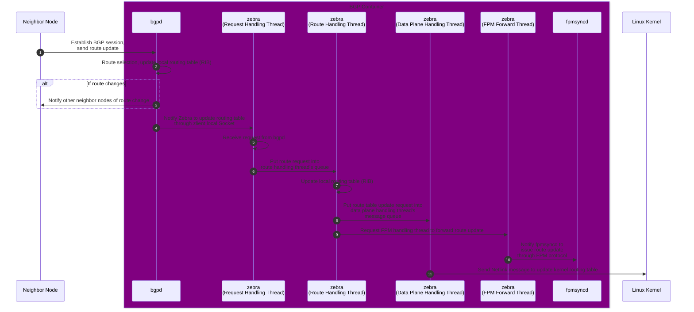

# Route Update in FRR

Route update is almost the most important workflow in SONiC. The entire process starts from the `bgpd` process and eventually reaches the ASIC chip through SAI. Many processes are involved in between, and the workflow is quite complex. However, once we understand it, we can understand the design of SONiC and many other configuration workflows much better. Therefore, in this section, we will deeply dive into its overall process.

To help us understand the workflow on the code level, we divide this workflow into two major parts: how FRR handles route changes in this chapter, and how the SONiC updates the routes and integrates with FRR in the next chapter.

## FRR Handling Route Changes



```admonish note
Regarding the implementation of FRR, this section focuses more on explaining its workflow from the code perspective rather than the details of its BGP implementation. If you want to learn about the details of FRR's BGP implementation, you can refer to the [official documentation](https://docs.frrouting.org/en/latest/bgp.html).
```

## `bgpd` Handling Route Changes

`bgpd` is the process in FRR specifically used to handle BGP sessions. It opens TCP port 179 to establish BGP connections with neighbors and handles routing table update requests. When a route changes, FRR also uses this session to notify other neighbors.

When a request arrives at `bgpd`, it will land on the io thread first: `bgp_io`. As the name suggests, this thread is responsible for network read and write operations in `bgpd`:

```c
// File: src/sonic-frr/frr/bgpd/bgp_io.c
static int bgp_process_reads(struct thread *thread)
{
    ...

    while (more) {
        // Read packets here
        ...

        // If we have more than 1 complete packet, mark it and process it later.
        if (ringbuf_remain(ibw) >= pktsize) {
            ...
            added_pkt = true;
        } else break;
    }
    ...

    if (added_pkt)
        thread_add_event(bm->master, bgp_process_packet, peer, 0, &peer->t_process_packet);

    return 0;
}
```

After the packet is read, `bgpd` sends it to the main thread for processing. Here, `bgpd` dispatches the packet based on its type. And the route update requests will be handed over to `bpg_update_receive` for processing:

```c
// File: src/sonic-frr/frr/bgpd/bgp_packet.c
int bgp_process_packet(struct thread *thread)
{
    ...
    unsigned int processed = 0;
    while (processed < rpkt_quanta_old) {
        uint8_t type = 0;
        bgp_size_t size;
        ...

        /* read in the packet length and type */
        size = stream_getw(peer->curr);
        type = stream_getc(peer->curr);
        size -= BGP_HEADER_SIZE;

        switch (type) {
        case BGP_MSG_OPEN:
            ...
            break;
        case BGP_MSG_UPDATE:
            ...
            mprc = bgp_update_receive(peer, size);
            ...
            break;
        ...
}

// Process BGP UPDATE message for peer.
static int bgp_update_receive(struct peer *peer, bgp_size_t size)
{
    struct stream *s;
    struct attr attr;
    struct bgp_nlri nlris[NLRI_TYPE_MAX];
    ...

    // Parse attributes and NLRI
    memset(&attr, 0, sizeof(struct attr));
    attr.label_index = BGP_INVALID_LABEL_INDEX;
    attr.label = MPLS_INVALID_LABEL;
    ...

    memset(&nlris, 0, sizeof(nlris));
    ...

    if ((!update_len && !withdraw_len && nlris[NLRI_MP_UPDATE].length == 0)
        || (attr_parse_ret == BGP_ATTR_PARSE_EOR)) {
        // More parsing here
        ...

        if (afi && peer->afc[afi][safi]) {
            struct vrf *vrf = vrf_lookup_by_id(peer->bgp->vrf_id);

            /* End-of-RIB received */
            if (!CHECK_FLAG(peer->af_sflags[afi][safi], PEER_STATUS_EOR_RECEIVED)) {
                ...
                if (gr_info->eor_required == gr_info->eor_received) {
                    ...
                    /* Best path selection */
                    if (bgp_best_path_select_defer( peer->bgp, afi, safi) < 0)
                        return BGP_Stop;
                }
            }
            ...
        }
    }
    ...

    return Receive_UPDATE_message;
}
```

Then, `bgpd` starts checking for better paths and updates its local routing table (RIB, Routing Information Base):

```c
// File: src/sonic-frr/frr/bgpd/bgp_route.c
/* Process the routes with the flag BGP_NODE_SELECT_DEFER set */
int bgp_best_path_select_defer(struct bgp *bgp, afi_t afi, safi_t safi)
{
    struct bgp_dest *dest;
    int cnt = 0;
    struct afi_safi_info *thread_info;
    ...

    /* Process the route list */
    for (dest = bgp_table_top(bgp->rib[afi][safi]);
         dest && bgp->gr_info[afi][safi].gr_deferred != 0;
         dest = bgp_route_next(dest))
    {
        ...
        bgp_process_main_one(bgp, dest, afi, safi);
        ...
    }
    ...

    return 0;
}

static void bgp_process_main_one(struct bgp *bgp, struct bgp_dest *dest, afi_t afi, safi_t safi)
{
    struct bgp_path_info *new_select;
    struct bgp_path_info *old_select;
    struct bgp_path_info_pair old_and_new;
    ...

    const struct prefix *p = bgp_dest_get_prefix(dest);
    ...

    /* Best path selection. */
    bgp_best_selection(bgp, dest, &bgp->maxpaths[afi][safi], &old_and_new, afi, safi);
    old_select = old_and_new.old;
    new_select = old_and_new.new;
    ...

    /* FIB update. */
    if (bgp_fibupd_safi(safi) && (bgp->inst_type != BGP_INSTANCE_TYPE_VIEW)
        && !bgp_option_check(BGP_OPT_NO_FIB)) {

        if (new_select && new_select->type == ZEBRA_ROUTE_BGP
            && (new_select->sub_type == BGP_ROUTE_NORMAL
            || new_select->sub_type == BGP_ROUTE_AGGREGATE
            || new_select->sub_type == BGP_ROUTE_IMPORTED)) {
            ...

            if (old_select && is_route_parent_evpn(old_select))
                bgp_zebra_withdraw(p, old_select, bgp, safi);

            bgp_zebra_announce(dest, p, new_select, bgp, afi, safi);
        } else {
            /* Withdraw the route from the kernel. */
            ...
        }
    }

    /* EVPN route injection and clean up */
    ...

    UNSET_FLAG(dest->flags, BGP_NODE_PROCESS_SCHEDULED);
    return;
}
```

Finally, `bgp_zebra_announce` notifies `zebra` to update the kernel routing table through `zclient`.

```c
// File: src/sonic-frr/frr/bgpd/bgp_zebra.c
void bgp_zebra_announce(struct bgp_node *rn, struct prefix *p, struct bgp_path_info *info, struct bgp *bgp, afi_t afi, safi_t safi)
{
    ...
    zclient_route_send(valid_nh_count ? ZEBRA_ROUTE_ADD : ZEBRA_ROUTE_DELETE, zclient, &api);
}
```

`zclient` communicates with `zebra` using a local socket and provides a series of callback functions to receive notifications from `zebra`. The key code is shown as follows:

```c
// File: src/sonic-frr/frr/bgpd/bgp_zebra.c
void bgp_zebra_init(struct thread_master *master, unsigned short instance)
{
    zclient_num_connects = 0;

    /* Set default values. */
    zclient = zclient_new(master, &zclient_options_default);
    zclient_init(zclient, ZEBRA_ROUTE_BGP, 0, &bgpd_privs);
    zclient->zebra_connected = bgp_zebra_connected;
    zclient->router_id_update = bgp_router_id_update;
    zclient->interface_add = bgp_interface_add;
    zclient->interface_delete = bgp_interface_delete;
    zclient->interface_address_add = bgp_interface_address_add;
    ...
}

int zclient_socket_connect(struct zclient *zclient)
{
    int sock;
    int ret;

    sock = socket(zclient_addr.ss_family, SOCK_STREAM, 0);
    ...

    /* Connect to zebra. */
    ret = connect(sock, (struct sockaddr *)&zclient_addr, zclient_addr_len);
    ...

    zclient->sock = sock;
    return sock;
}
```

In the `bgpd` container, we can find the socket file used for `zebra` communication in the `/run/frr` directory for simple verification:

```bash
root@7260cx3:/run/frr# ls -l
total 12
...
srwx------ 1 frr frr    0 Jun 16 09:16 zserv.api
```

## `zebra` Updating Routing Table

Since FRR supports many routing protocols, if each routing protocol updates kernel independently, conflicts will inevitably arise, because it is difficult to coordinate. Therefore, FRR uses a separate process to communicate with all routing protocol handling processes, merges the information, and then update the kernel routing table. This process is `zebra`.

In `zebra`, kernel updates occur in a separate data plane handling thread: `dplane_thread`. All requests are sent to `zebra` through `zclient`, then get processed, and finally get forwarded to `dplane_thread` for handling. In whis way, the route update will always be in order, which avoids any conflicts to happen.

When `zebra` starts, it registers all request handlers. When a request arrives, the corresponding handler will be called based on the request type. And here is the key code:

```c
// File: src/sonic-frr/frr/zebra/zapi_msg.c
void (*zserv_handlers[])(ZAPI_HANDLER_ARGS) = {
    [ZEBRA_ROUTER_ID_ADD] = zread_router_id_add,
    [ZEBRA_ROUTER_ID_DELETE] = zread_router_id_delete,
    [ZEBRA_INTERFACE_ADD] = zread_interface_add,
    [ZEBRA_INTERFACE_DELETE] = zread_interface_delete,
    [ZEBRA_ROUTE_ADD] = zread_route_add,
    [ZEBRA_ROUTE_DELETE] = zread_route_del,
    [ZEBRA_REDISTRIBUTE_ADD] = zebra_redistribute_add,
    [ZEBRA_REDISTRIBUTE_DELETE] = zebra_redistribute_delete,
    ...
```

Take adding a route (`zread_route_add`) as an example to explain the later workflow. From the following code, we can see that when a new route arrives, `zebra` will start checking and updating its internal routing table:

```c
// File: src/sonic-frr/frr/zebra/zapi_msg.c
static void zread_route_add(ZAPI_HANDLER_ARGS)
{
    struct stream *s;
    struct route_entry *re;
    struct nexthop_group *ng = NULL;
    struct nhg_hash_entry nhe;
    ...

    // Decode zclient request
    s = msg;
    if (zapi_route_decode(s, &api) < 0) {
        return;
    }
    ...

    // Allocate new route entry.
    re = XCALLOC(MTYPE_RE, sizeof(struct route_entry));
    re->type = api.type;
    re->instance = api.instance;
    ...

    // Init nexthop entry, if we have an id, then add route.
    if (!re->nhe_id) {
        zebra_nhe_init(&nhe, afi, ng->nexthop);
        nhe.nhg.nexthop = ng->nexthop;
        nhe.backup_info = bnhg;
    }
    ret = rib_add_multipath_nhe(afi, api.safi, &api.prefix, src_p, re, &nhe);

    // Update stats. IPv6 is omitted here for simplicity.
    if (ret > 0) client->v4_route_add_cnt++;
    else if (ret < 0) client->v4_route_upd8_cnt++;
}

// File: src/sonic-frr/frr/zebra/zebra_rib.c
int rib_add_multipath_nhe(afi_t afi, safi_t safi, struct prefix *p,
              struct prefix_ipv6 *src_p, struct route_entry *re,
              struct nhg_hash_entry *re_nhe)
{
    struct nhg_hash_entry *nhe = NULL;
    struct route_table *table;
    struct route_node *rn;
    int ret = 0;
    ...

    /* Find table and nexthop entry */
    table = zebra_vrf_get_table_with_table_id(afi, safi, re->vrf_id, re->table);
    if (re->nhe_id > 0) nhe = zebra_nhg_lookup_id(re->nhe_id);
    else nhe = zebra_nhg_rib_find_nhe(re_nhe, afi);

    /* Attach the re to the nhe's nexthop group. */
    route_entry_update_nhe(re, nhe);

    /* Make it sure prefixlen is applied to the prefix. */
    /* Set default distance by route type. */
    ...

    /* Lookup route node.*/
    rn = srcdest_rnode_get(table, p, src_p);
    ...

    /* If this route is kernel/connected route, notify the dataplane to update kernel route table. */
    if (RIB_SYSTEM_ROUTE(re)) {
        dplane_sys_route_add(rn, re);
    }

    /* Link new re to node. */
    SET_FLAG(re->status, ROUTE_ENTRY_CHANGED);
    rib_addnode(rn, re, 1);

    /* Clean up */
    ...
    return ret;
}
```

Here, `rib_addnode` will forward this route add request to the rib processing thread, where the requests are being processed sequentially:

```cpp
static void rib_addnode(struct route_node *rn, struct route_entry *re, int process)
{
    ...
    rib_link(rn, re, process);
}

static void rib_link(struct route_node *rn, struct route_entry *re, int process)
{
    rib_dest_t *dest = rib_dest_from_rnode(rn);
    if (!dest) dest = zebra_rib_create_dest(rn);
    re_list_add_head(&dest->routes, re);
    ...

    if (process) rib_queue_add(rn);
}
```

Then, the request arrives at the RIB processing thread: `rib_process`, which further selects the best route and adds it to `zebra`'s internal routing table (RIB):

```cpp
/* Core function for processing routing information base. */
static void rib_process(struct route_node *rn)
{
    struct route_entry *re;
    struct route_entry *next;
    struct route_entry *old_selected = NULL;
    struct route_entry *new_selected = NULL;
    struct route_entry *old_fib = NULL;
    struct route_entry *new_fib = NULL;
    struct route_entry *best = NULL;
    rib_dest_t *dest;
    ...

    dest = rib_dest_from_rnode(rn);
    old_fib = dest->selected_fib;
    ...

    /* Check every route entry and select the best route. */
    RNODE_FOREACH_RE_SAFE (rn, re, next) {
        ...

        if (CHECK_FLAG(re->flags, ZEBRA_FLAG_FIB_OVERRIDE)) {
            best = rib_choose_best(new_fib, re);
            if (new_fib && best != new_fib)
                UNSET_FLAG(new_fib->status, ROUTE_ENTRY_CHANGED);
            new_fib = best;
        } else {
            best = rib_choose_best(new_selected, re);
            if (new_selected && best != new_selected)
                UNSET_FLAG(new_selected->status, ROUTE_ENTRY_CHANGED);
            new_selected = best;
        }

        if (best != re)
            UNSET_FLAG(re->status, ROUTE_ENTRY_CHANGED);
    } /* RNODE_FOREACH_RE */
    ...

    /* Update fib according to selection results */
    if (new_fib && old_fib)
        rib_process_update_fib(zvrf, rn, old_fib, new_fib);
    else if (new_fib)
        rib_process_add_fib(zvrf, rn, new_fib);
    else if (old_fib)
        rib_process_del_fib(zvrf, rn, old_fib);

    /* Remove all RE entries queued for removal */
    /* Check if the dest can be deleted now.  */
    ...
}
```

For new routes, `rib_process_add_fib` is called to add them to `zebra`'s internal routing table and notify the dplane to update the kernel routing table:

```cpp
static void rib_process_add_fib(struct zebra_vrf *zvrf, struct route_node *rn, struct route_entry *new)
{
    hook_call(rib_update, rn, "new route selected");
    ...

    /* If labeled-unicast route, install transit LSP. */
    if (zebra_rib_labeled_unicast(new))
        zebra_mpls_lsp_install(zvrf, rn, new);

    rib_install_kernel(rn, new, NULL);
    UNSET_FLAG(new->status, ROUTE_ENTRY_CHANGED);
}

void rib_install_kernel(struct route_node *rn, struct route_entry *re,
            struct route_entry *old)
{
    struct rib_table_info *info = srcdest_rnode_table_info(rn);
    enum zebra_dplane_result ret;
    rib_dest_t *dest = rib_dest_from_rnode(rn);
    ...

    /* Install the resolved nexthop object first. */
    zebra_nhg_install_kernel(re->nhe);

    /* If this is a replace to a new RE let the originator of the RE know that they've lost */
    if (old && (old != re) && (old->type != re->type))
        zsend_route_notify_owner(rn, old, ZAPI_ROUTE_BETTER_ADMIN_WON, info->afi, info->safi);

    /* Update fib selection */
    dest->selected_fib = re;

    /* Make sure we update the FPM any time we send new information to the kernel. */
    hook_call(rib_update, rn, "installing in kernel");

    /* Send add or update */
    if (old) ret = dplane_route_update(rn, re, old);
    else ret = dplane_route_add(rn, re);
    ...
}
```

There are two important operations here: one is to call the `dplane_route_*` functions to update the kernel routing table, and the other is the `hook_call` that appears twice here. The FPM hook function is hooked here to receive and forward routing table update notifications.

Here, let's look at them one by one:

### `dplane` Updating Kernel Routing Table

Let's look at the dplane `dplane_route_*` functions first. They are essentially do the same thing: simply pack the request and put it into the `dplane_thread` message queue:

```c
// File: src/sonic-frr/frr/zebra/zebra_dplane.c
enum zebra_dplane_result dplane_route_add(struct route_node *rn, struct route_entry *re) {
    return dplane_route_update_internal(rn, re, NULL, DPLANE_OP_ROUTE_INSTALL);
}

enum zebra_dplane_result dplane_route_update(struct route_node *rn, struct route_entry *re, struct route_entry *old_re) {
    return dplane_route_update_internal(rn, re, old_re, DPLANE_OP_ROUTE_UPDATE);
}

enum zebra_dplane_result dplane_sys_route_add(struct route_node *rn, struct route_entry *re) {
    return dplane_route_update_internal(rn, re, NULL, DPLANE_OP_SYS_ROUTE_ADD);
}

static enum zebra_dplane_result
dplane_route_update_internal(struct route_node *rn, struct route_entry *re, struct route_entry *old_re, enum dplane_op_e op)
{
    enum zebra_dplane_result result = ZEBRA_DPLANE_REQUEST_FAILURE;
    int ret = EINVAL;

    /* Create and init context */
    struct zebra_dplane_ctx *ctx = ...;

    /* Enqueue context for processing */
    ret = dplane_route_enqueue(ctx);

    /* Update counter */
    atomic_fetch_add_explicit(&zdplane_info.dg_routes_in, 1, memory_order_relaxed);

    if (ret == AOK)
        result = ZEBRA_DPLANE_REQUEST_QUEUED;

    return result;
}
```

Then, on the data plane handling thread `dplane_thread`, in its message loop, it take messages from the queue one by one and call their handling functions:

```c
// File: src/sonic-frr/frr/zebra/zebra_dplane.c
static int dplane_thread_loop(struct thread *event)
{
    ...

    while (prov) {
        ...

        /* Process work here */
        (*prov->dp_fp)(prov);

        /* Check for zebra shutdown */
        /* Dequeue completed work from the provider */
        ...

        /* Locate next provider */
        DPLANE_LOCK();
        prov = TAILQ_NEXT(prov, dp_prov_link);
        DPLANE_UNLOCK();
    }
}
```

By default, `dplane_thread` uses `kernel_dplane_process_func` to process the messages. Inside this function, different kernel operations will be invoked based on the request type:

```c
static int kernel_dplane_process_func(struct zebra_dplane_provider *prov)
{
    enum zebra_dplane_result res;
    struct zebra_dplane_ctx *ctx;
    int counter, limit;
    limit = dplane_provider_get_work_limit(prov);

    for (counter = 0; counter < limit; counter++) {
        ctx = dplane_provider_dequeue_in_ctx(prov);
        if (ctx == NULL) break;

        /* A previous provider plugin may have asked to skip the kernel update.  */
        if (dplane_ctx_is_skip_kernel(ctx)) {
            res = ZEBRA_DPLANE_REQUEST_SUCCESS;
            goto skip_one;
        }

        /* Dispatch to appropriate kernel-facing apis */
        switch (dplane_ctx_get_op(ctx)) {
        case DPLANE_OP_ROUTE_INSTALL:
        case DPLANE_OP_ROUTE_UPDATE:
        case DPLANE_OP_ROUTE_DELETE:
            res = kernel_dplane_route_update(ctx);
            break;
        ...
        }
        ...
    }
    ...
}

static enum zebra_dplane_result
kernel_dplane_route_update(struct zebra_dplane_ctx *ctx)
{
    enum zebra_dplane_result res;
    /* Call into the synchronous kernel-facing code here */
    res = kernel_route_update(ctx);
    return res;
}
```

And `kernel_route_update` is the real kernel operation. It notifies the kernel of route updates through netlink:

```c
// File: src/sonic-frr/frr/zebra/rt_netlink.c
// Update or delete a prefix from the kernel, using info from a dataplane context.
enum zebra_dplane_result kernel_route_update(struct zebra_dplane_ctx *ctx)
{
    int cmd, ret;
    const struct prefix *p = dplane_ctx_get_dest(ctx);
    struct nexthop *nexthop;

    if (dplane_ctx_get_op(ctx) == DPLANE_OP_ROUTE_DELETE) {
        cmd = RTM_DELROUTE;
    } else if (dplane_ctx_get_op(ctx) == DPLANE_OP_ROUTE_INSTALL) {
        cmd = RTM_NEWROUTE;
    } else if (dplane_ctx_get_op(ctx) == DPLANE_OP_ROUTE_UPDATE) {
        cmd = RTM_NEWROUTE;
    }

    if (!RSYSTEM_ROUTE(dplane_ctx_get_type(ctx)))
        ret = netlink_route_multipath(cmd, ctx);
    ...

    return (ret == 0 ? ZEBRA_DPLANE_REQUEST_SUCCESS : ZEBRA_DPLANE_REQUEST_FAILURE);
}

// Routing table change via netlink interface, using a dataplane context object
static int netlink_route_multipath(int cmd, struct zebra_dplane_ctx *ctx)
{
    // Build netlink request.
    struct {
        struct nlmsghdr n;
        struct rtmsg r;
        char buf[NL_PKT_BUF_SIZE];
    } req;

    req.n.nlmsg_len = NLMSG_LENGTH(sizeof(struct rtmsg));
    req.n.nlmsg_flags = NLM_F_CREATE | NLM_F_REQUEST;
    ...

    /* Talk to netlink socket. */
    return netlink_talk_info(netlink_talk_filter, &req.n, dplane_ctx_get_ns(ctx), 0);
}
```

### FPM Route Update Forwarding

FPM (Forwarding Plane Manager) is the protocol in FRR used to notify other processes of route changes. Its main logic code is in `src/sonic-frr/frr/zebra/zebra_fpm.c`. It supports two protocols by default: `protobuf` and `netlink`. The one used in SONiC is the `netlink` protocol.

As mentioned earlier, it is implemented through hook functions. By listening for route changes in the RIB, the updates are forwarded to other processes through a local socket. This hook is registered at startup. And the most relevant one to us is the `rib_update` hook, as shown below:

```c
static int zebra_fpm_module_init(void)
{
    hook_register(rib_update, zfpm_trigger_update);
    hook_register(zebra_rmac_update, zfpm_trigger_rmac_update);
    hook_register(frr_late_init, zfpm_init);
    hook_register(frr_early_fini, zfpm_fini);
    return 0;
}

FRR_MODULE_SETUP(.name = "zebra_fpm", .version = FRR_VERSION,
         .description = "zebra FPM (Forwarding Plane Manager) module",
         .init = zebra_fpm_module_init,
);
```

When the `rib_update` hook is called, the `zfpm_trigger_update` function will be called, which puts the route update info into the fpm forwarding queue and triggers a write operation:

```c
static int zfpm_trigger_update(struct route_node *rn, const char *reason)
{
    rib_dest_t *dest;
    ...

    // Queue the update request
    dest = rib_dest_from_rnode(rn);
    SET_FLAG(dest->flags, RIB_DEST_UPDATE_FPM);
    TAILQ_INSERT_TAIL(&zfpm_g->dest_q, dest, fpm_q_entries);
    ...

    zfpm_write_on();
    return 0;
}

static inline void zfpm_write_on(void) {
    thread_add_write(zfpm_g->master, zfpm_write_cb, 0, zfpm_g->sock, &zfpm_g->t_write);
}
```

The write callback takes the update from the queue, converts it into the FPM message format, and forwards it to other processes through a local socket:

```c
static int zfpm_write_cb(struct thread *thread)
{
    struct stream *s;

    do {
        int bytes_to_write, bytes_written;
        s = zfpm_g->obuf;

        // Convert route info to buffer here.
        if (stream_empty(s)) zfpm_build_updates();

        // Write to socket until we don' have anything to write or cannot write anymore (partial write).
        bytes_to_write = stream_get_endp(s) - stream_get_getp(s);
        bytes_written = write(zfpm_g->sock, stream_pnt(s), bytes_to_write);
        ...
    } while (1);

    if (zfpm_writes_pending()) zfpm_write_on();
    return 0;
}

static void zfpm_build_updates(void)
{
    struct stream *s = zfpm_g->obuf;
    do {
        /* Stop processing the queues if zfpm_g->obuf is full or we do not have more updates to process */
        if (zfpm_build_mac_updates() == FPM_WRITE_STOP) break;
        if (zfpm_build_route_updates() == FPM_WRITE_STOP) break;
    } while (zfpm_updates_pending());
}
```

At this point, FRR's work is done.

# References

1. [SONiC Architecture][SONiCArch]
2. [Github repo: sonic-swss][SONiCSWSS]
3. [Github repo: sonic-swss-common][SONiCSWSSCommon]
4. [Github repo: sonic-frr][SONiCFRR]
5. [Github repo: sonic-utilities][SONiCUtil]
6. [Github repo: sonic-sairedis][SONiCSAIRedis]
7. [RFC 4271: A Border Gateway Protocol 4 (BGP-4)][BGP]
8. [FRRouting][FRRouting]
9. [FRRouting - BGP][BGP]
10. [FRRouting - FPM][FPM]
11. [Understanding EVPN Pure Type 5 Routes][EVPN]

[SONiCArch]: https://github.com/sonic-net/SONiC/wiki/Architecture
[SONiCSWSS]: https://github.com/sonic-net/sonic-swss
[SONiCSWSSCommon]: https://github.com/sonic-net/sonic-swss-common
[SONiCFRR]: https://github.com/sonic-net/sonic-frr
[SONiCUtil]: https://github.com/sonic-net/sonic-utilities
[SONiCSAIRedis]: https://github.com/sonic-net/sonic-sairedis/
[BGP]: https://datatracker.ietf.org/doc/html/rfc4271
[FRRouting]: https://frrouting.org/
[FPM]: https://docs.frrouting.org/projects/dev-guide/en/latest/fpm.html
[EVPN]: https://www.juniper.net/documentation/us/en/software/junos/evpn-vxlan/topics/concept/evpn-route-type5-understanding.html
