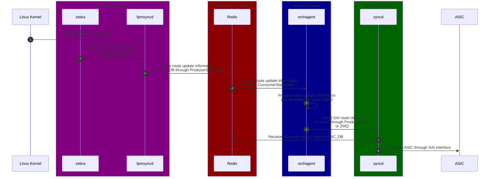

# SONiC Route Update Workflow

After the work of FRR is done, the route update information is forwarded to SONiC, either via Netlink or FPM. This causes a series of operations in SONiC, and eventually updates the route table in the ASIC.

The main workflow is shown as below:



## `fpmsyncd` Updating Route Configuration in Redis

First, let's start from the source. When `fpmsyncd` launches, it starts listening for FPM and Netlink events to receive route change messages and forward to `RouteSync` for processing:

```cpp
// File: src/sonic-swss/fpmsyncd/fpmsyncd.cpp
int main(int argc, char **argv)
{
    ...

    DBConnector db("APPL_DB", 0);
    RedisPipeline pipeline(&db);
    RouteSync sync(&pipeline);

    // Register netlink message handler
    NetLink netlink;
    netlink.registerGroup(RTNLGRP_LINK);

    NetDispatcher::getInstance().registerMessageHandler(RTM_NEWROUTE, &sync);
    NetDispatcher::getInstance().registerMessageHandler(RTM_DELROUTE, &sync);
    NetDispatcher::getInstance().registerMessageHandler(RTM_NEWLINK, &sync);
    NetDispatcher::getInstance().registerMessageHandler(RTM_DELLINK, &sync);

    rtnl_route_read_protocol_names(DefaultRtProtoPath);
    ...

    while (true) {
        try {
            // Launching FPM server and wait for zebra to connect.
            FpmLink fpm(&sync);
            ...

            fpm.accept();
            ...
        } catch (FpmLink::FpmConnectionClosedException &e) {
            // If connection is closed, keep retrying until it succeeds, before handling any other events.
            cout << "Connection lost, reconnecting..." << endl;
        }
        ...
    }
}
```

In `FpmLink`, the FPM events will be converted into Netlink messages. This unifies the message that being sent to `RouteSync` to Netlink. And `RouteSync::onMsg` will be called for processing them (for how Netlink receives and processes messages, please refer to [4.1.2 Netlink](./4-1-2-netlink.html)):

One small thing to notice is that - EVPN Type 5 messages must be processed in raw message form, so `RouteSync::onMsgRaw` will be called.

```cpp
// File: src/sonic-swss/fpmsyncd/fpmlink.cpp
// Called from: FpmLink::readData()
void FpmLink::processFpmMessage(fpm_msg_hdr_t* hdr)
{
    size_t msg_len = fpm_msg_len(hdr);
    nlmsghdr *nl_hdr = (nlmsghdr *)fpm_msg_data(hdr);
    ...

    /* Read all netlink messages inside FPM message */
    for (; NLMSG_OK (nl_hdr, msg_len); nl_hdr = NLMSG_NEXT(nl_hdr, msg_len))
    {
        /*
         * EVPN Type5 Add Routes need to be process in Raw mode as they contain
         * RMAC, VLAN and L3VNI information.
         * Where as all other route will be using rtnl api to extract information
         * from the netlink msg.
         */
        bool isRaw = isRawProcessing(nl_hdr);

        nl_msg *msg = nlmsg_convert(nl_hdr);
        ...
        nlmsg_set_proto(msg, NETLINK_ROUTE);

        if (isRaw) {
            /* EVPN Type5 Add route processing */
            /* This will call into onRawMsg() */
            processRawMsg(nl_hdr);
        } else {
            /* This will call into onMsg() */
            NetDispatcher::getInstance().onNetlinkMessage(msg);
        }

        nlmsg_free(msg);
    }
}

void FpmLink::processRawMsg(struct nlmsghdr *h)
{
    m_routesync->onMsgRaw(h);
};
```

Next, when `RouteSync` receives a route change message, it makes judgments and dispatches in `onMsg` and `onMsgRaw`:

```cpp
// File: src/sonic-swss/fpmsyncd/routesync.cpp
void RouteSync::onMsgRaw(struct nlmsghdr *h)
{
    if ((h->nlmsg_type != RTM_NEWROUTE) && (h->nlmsg_type != RTM_DELROUTE))
        return;
    ...
    onEvpnRouteMsg(h, len);
}

void RouteSync::onMsg(int nlmsg_type, struct nl_object *obj)
{
    // Refill Netlink cache here
    ...

    struct rtnl_route *route_obj = (struct rtnl_route *)obj;
    auto family = rtnl_route_get_family(route_obj);
    if (family == AF_MPLS) {
        onLabelRouteMsg(nlmsg_type, obj);
        return;
    }
    ...

    unsigned int master_index = rtnl_route_get_table(route_obj);
    char master_name[IFNAMSIZ] = {0};
    if (master_index) {
        /* If the master device name starts with VNET_PREFIX, it is a VNET route.
        The VNET name is exactly the name of the associated master device. */
        getIfName(master_index, master_name, IFNAMSIZ);
        if (string(master_name).find(VNET_PREFIX) == 0) {
            onVnetRouteMsg(nlmsg_type, obj, string(master_name));
        }

        /* Otherwise, it is a regular route (include VRF route). */
        else {
            onRouteMsg(nlmsg_type, obj, master_name);
        }
    } else {
        onRouteMsg(nlmsg_type, obj, NULL);
    }
}
```

From the code above, we can see that there are four different route processing entry points. These different routes will be finally written to different tables in `APPL_DB` through their respective [ProducerStateTable](./4-2-5-producer-consumer-state-table.md):

| Route Type | Entry Point | Table |
| --- | --- | --- |
| MPLS | `onLabelRouteMsg` | LABLE_ROUTE_TABLE |
| Vnet VxLan Tunnel Route | `onVnetRouteMsg` | VNET_ROUTE_TUNNEL_TABLE |
| Other Vnet Routes | `onVnetRouteMsg` | VNET_ROUTE_TABLE |
| EVPN Type 5 | `onEvpnRouteMsg` | ROUTE_TABLE |
| Regular Routes | `onRouteMsg` | ROUTE_TABLE |

Here we take regular routes as an example. The implementation of other functions is different, but the basic idea is the same:

```cpp
// File: src/sonic-swss/fpmsyncd/routesync.cpp
void RouteSync::onRouteMsg(int nlmsg_type, struct nl_object *obj, char *vrf)
{
    // Parse route info from nl_object here.
    ...

    // Get nexthop lists
    string gw_list;
    string intf_list;
    string mpls_list;
    getNextHopList(route_obj, gw_list, mpls_list, intf_list);
    ...

    // Build route info here, including protocol, interface, next hops, MPLS, weights etc.
    vector<FieldValueTuple> fvVector;
    FieldValueTuple proto("protocol", proto_str);
    FieldValueTuple gw("nexthop", gw_list);
    ...

    fvVector.push_back(proto);
    fvVector.push_back(gw);
    ...

    // Push to ROUTE_TABLE via ProducerStateTable.
    m_routeTable.set(destipprefix, fvVector);
    SWSS_LOG_DEBUG("RouteTable set msg: %s %s %s %s", destipprefix, gw_list.c_str(), intf_list.c_str(), mpls_list.c_str());
    ...
}
```

## `orchagent` Processing Route Configuration Changes

Next, these route information will come to `orchagent`. When `orchagent` starts, it creates `VNetRouteOrch` and `RouteOrch` objects, which are used to listen and process Vnet-related routes and EVPN/regular routes respectively:

```cpp
// File: src/sonic-swss/orchagent/orchdaemon.cpp
bool OrchDaemon::init()
{
    ...

    vector<string> vnet_tables = { APP_VNET_RT_TABLE_NAME, APP_VNET_RT_TUNNEL_TABLE_NAME };
    VNetRouteOrch *vnet_rt_orch = new VNetRouteOrch(m_applDb, vnet_tables, vnet_orch);
    ...

    const int routeorch_pri = 5;
    vector<table_name_with_pri_t> route_tables = {
        { APP_ROUTE_TABLE_NAME,        routeorch_pri },
        { APP_LABEL_ROUTE_TABLE_NAME,  routeorch_pri }
    };
    gRouteOrch = new RouteOrch(m_applDb, route_tables, gSwitchOrch, gNeighOrch, gIntfsOrch, vrf_orch, gFgNhgOrch, gSrv6Orch);
    ...
}
```

The entry function that process the incoming messages for all Orch objects is `doTask`. `RouteOrch` and `VNetRouteOrch` are the same. Here we take `RouteOrch` as an example to see how it handles route changes.

```admonish note
From `RouteOrch`, we can truly feel why these classes are named `Orch`. `RouteOrch` has more than 2500 lines, involving interactions with many other Orch objects and tons of details... The code is relatively difficult to read, so please be patient when reading.
```

Before we dive into the code, we have a few things to note for `RouteOrch`:

- From the above `init` function, we can see that `RouteOrch` not only manages regular routes but also manages MPLS routes. The logic for handling these two types of routes is different. Therefore, in the following code, to simplify, we only show the logic for handling the regular routes.
- Since `ProducerStateTable` transmits and receives messages in batches, `RouteOrch` also processes the route updates in batches. To support batch processing, `RouteOrch` uses `EntityBulker<sai_route_api_t> gRouteBulker` to cache the SAI route objects that need to be changed, and then applies these route object changes to SAI at the end of the `doTask()` function.
- Route operations require a lot of other information, such as the status of each port, the status of each neighbor, the status of each VRF, etc. To obtain this information, `RouteOrch` interacts with other Orch objects, such as `PortOrch`, `NeighOrch`, `VRFOrch`, etc.

Let's start with the `RouteOrch::doTask` function. It parses the incoming route operation messages, then calls the `addRoute` or `removeRoute` function to create or delete routes.

```cpp
// File: src/sonic-swss/orchagent/routeorch.cpp
void RouteOrch::doTask(Consumer& consumer)
{
    // Calling PortOrch to make sure all ports are ready before processing route messages.
    if (!gPortsOrch->allPortsReady()) { return; }

    // Call doLabelTask() instead, if the incoming messages are from MPLS messages. Otherwise, move on as regular routes.
    ...

    /* Default handling is for ROUTE_TABLE (regular routes) */
    auto it = consumer.m_toSync.begin();
    while (it != consumer.m_toSync.end()) {
        // Add or remove routes with a route bulker
        while (it != consumer.m_toSync.end())
        {
            KeyOpFieldsValuesTuple t = it->second;

            // Parse route operation from the incoming message here.
            string key = kfvKey(t);
            string op = kfvOp(t);
            ...

            // resync application:
            // - When routeorch receives 'resync' message (key = "resync", op = "SET"), it marks all current routes as dirty
            //   and waits for 'resync complete' message. For all newly received routes, if they match current dirty routes,
            //   it unmarks them dirty.
            // - After receiving 'resync complete' (key = "resync", op != "SET") message, it creates all newly added routes
            //   and removes all dirty routes.
            ...

            // Parsing VRF and IP prefix from the incoming message here.
            ...

            // Process regular route operations.
            if (op == SET_COMMAND)
            {
                // Parse and validate route attributes from the incoming message here.
                string ips;
                string aliases;
                ...

                // If the nexthop_group is empty, create the next hop group key based on the IPs and aliases.
                // Otherwise, get the key from the NhgOrch. The result will be stored in the "nhg" variable below.
                NextHopGroupKey& nhg = ctx.nhg;
                ...
                if (nhg_index.empty())
                {
                    // Here the nexthop_group is empty, so we create the next hop group key based on the IPs and aliases.
                    ...

                    string nhg_str = "";
                    if (blackhole) {
                        nhg = NextHopGroupKey();
                    } else if (srv6_nh == true) {
                        ...
                        nhg = NextHopGroupKey(nhg_str, overlay_nh, srv6_nh);
                    } else if (overlay_nh == false) {
                        ...
                        nhg = NextHopGroupKey(nhg_str, weights);
                    } else {
                        ...
                        nhg = NextHopGroupKey(nhg_str, overlay_nh, srv6_nh);
                    }
                }
                else
                {
                    // Here we have a nexthop_group, so we get the key from the NhgOrch.
                    const NhgBase& nh_group = getNhg(nhg_index);
                    nhg = nh_group.getNhgKey();
                    ...
                }
                ...

                // Now we start to create the SAI route entry.
                if (nhg.getSize() == 1 && nhg.hasIntfNextHop())
                {
                    // Skip certain routes, such as not valid, directly routes to tun0, linklocal or multicast routes, etc.
                    ...

                    // Create SAI route entry in addRoute function.
                    if (addRoute(ctx, nhg)) it = consumer.m_toSync.erase(it);
                    else it++;
                }

                /*
                 * Check if the route does not exist or needs to be updated or
                 * if the route is using a temporary next hop group owned by
                 * NhgOrch.
                 */
                else if (m_syncdRoutes.find(vrf_id) == m_syncdRoutes.end() ||
                    m_syncdRoutes.at(vrf_id).find(ip_prefix) == m_syncdRoutes.at(vrf_id).end() ||
                    m_syncdRoutes.at(vrf_id).at(ip_prefix) != RouteNhg(nhg, ctx.nhg_index) ||
                    gRouteBulker.bulk_entry_pending_removal(route_entry) ||
                    ctx.using_temp_nhg)
                {
                    if (addRoute(ctx, nhg)) it = consumer.m_toSync.erase(it);
                    else it++;
                }
                ...
            }
            // Handle other ops, like DEL_COMMAND for route deletion, etc.
            ...
        }

        // Flush the route bulker, so routes will be written to syncd and ASIC
        gRouteBulker.flush();

        // Go through the bulker results.
        // Handle SAI failures, update neighbors, counters, send notifications in add/removeRoutePost functions.
        ...

        /* Remove next hop group if the reference count decreases to zero */
        ...
    }
}
```

Here we take `addRoute` as an example. It mainly does a few things below:

1. Get next hop information from `NeighOrch` and check if the next hop is really available.
2. If the route is a new or re-added back while waiting to be deleted, a new SAI route object will be created.
3. If it is an existing route, the existing SAI route object is updated.

```cpp
// File: src/sonic-swss/orchagent/routeorch.cpp
bool RouteOrch::addRoute(RouteBulkContext& ctx, const NextHopGroupKey &nextHops)
{
    // Get nexthop information from NeighOrch.
    // We also need to check PortOrch for inband port, IntfsOrch to ensure the related interface is created and etc.
    ...

    // Start to sync the SAI route entry.
    sai_route_entry_t route_entry;
    route_entry.vr_id = vrf_id;
    route_entry.switch_id = gSwitchId;
    copy(route_entry.destination, ipPrefix);

    sai_attribute_t route_attr;
    auto& object_statuses = ctx.object_statuses;

    // Create a new route entry in this case.
    //
    // In case the entry is already pending removal in the bulk, it would be removed from m_syncdRoutes during the bulk call.
    // Therefore, such entries need to be re-created rather than set attribute.
    if (it_route == m_syncdRoutes.at(vrf_id).end() || gRouteBulker.bulk_entry_pending_removal(route_entry)) {
        if (blackhole) {
            route_attr.id = SAI_ROUTE_ENTRY_ATTR_PACKET_ACTION;
            route_attr.value.s32 = SAI_PACKET_ACTION_DROP;
        } else {
            route_attr.id = SAI_ROUTE_ENTRY_ATTR_NEXT_HOP_ID;
            route_attr.value.oid = next_hop_id;
        }

        /* Default SAI_ROUTE_ATTR_PACKET_ACTION is SAI_PACKET_ACTION_FORWARD */
        object_statuses.emplace_back();
        sai_status_t status = gRouteBulker.create_entry(&object_statuses.back(), &route_entry, 1, &route_attr);
        if (status == SAI_STATUS_ITEM_ALREADY_EXISTS) {
            return false;
        }
    }

    // Update existing route entry in this case.
    else {
        // Set the packet action to forward when there was no next hop (dropped) and not pointing to blackhole.
        if (it_route->second.nhg_key.getSize() == 0 && !blackhole) {
            route_attr.id = SAI_ROUTE_ENTRY_ATTR_PACKET_ACTION;
            route_attr.value.s32 = SAI_PACKET_ACTION_FORWARD;

            object_statuses.emplace_back();
            gRouteBulker.set_entry_attribute(&object_statuses.back(), &route_entry, &route_attr);
        }

        // Only 1 case is listed here as an example. Other cases are handled with similar logic by calling set_entry_attributes as well.
        ...
    }
    ...
}
```

After creating and setting up all the routes, `RouteOrch` calls `gRouteBulker.flush()` to write all the routes to `ASIC_DB`. The `flush()` function is straightforward: it processes all requests in batches, with each batch being 1000 by default, defined in `OrchDaemon` and passed through the constructor:

```cpp
// File: src/sonic-swss/orchagent/orchdaemon.cpp
#define DEFAULT_MAX_BULK_SIZE 1000
size_t gMaxBulkSize = DEFAULT_MAX_BULK_SIZE;

// File: src/sonic-swss/orchagent/bulker.h
template <typename T>
class EntityBulker
{
public:
    using Ts = SaiBulkerTraits<T>;
    using Te = typename Ts::entry_t;
    ...

    void flush()
    {
        // Bulk remove entries
        if (!removing_entries.empty()) {
            // Split into batches of max_bulk_size, then call flush. Similar to creating_entries, so details are omitted.
            std::vector<Te> rs;
            ...
            flush_removing_entries(rs);
            removing_entries.clear();
        }

        // Bulk create entries
        if (!creating_entries.empty()) {
            // Split into batches of max_bulk_size, then call flush_creating_entries to call SAI batch create API to create
            // the objects in batch.
            std::vector<Te> rs;
            std::vector<sai_attribute_t const*> tss;
            std::vector<uint32_t> cs;

            for (auto const& i: creating_entries) {
                sai_object_id_t *pid = std::get<0>(i);
                auto const& attrs = std::get<1>(i);
                if (*pid == SAI_NULL_OBJECT_ID) {
                    rs.push_back(pid);
                    tss.push_back(attrs.data());
                    cs.push_back((uint32_t)attrs.size());

                    // Batch create here.
                    if (rs.size() >= max_bulk_size) {
                        flush_creating_entries(rs, tss, cs);
                    }
                }
            }

            flush_creating_entries(rs, tss, cs);
            creating_entries.clear();
        }

        // Bulk update existing entries
        if (!setting_entries.empty()) {
            // Split into batches of max_bulk_size, then call flush. Similar to creating_entries, so details are omitted.
            std::vector<Te> rs;
            std::vector<sai_attribute_t> ts;
            std::vector<sai_status_t*> status_vector;
            ...
            flush_setting_entries(rs, ts, status_vector);
            setting_entries.clear();
        }
    }

    sai_status_t flush_creating_entries(
        _Inout_ std::vector<Te> &rs,
        _Inout_ std::vector<sai_attribute_t const*> &tss,
        _Inout_ std::vector<uint32_t> &cs)
    {
        ...

        // Call SAI bulk create API
        size_t count = rs.size();
        std::vector<sai_status_t> statuses(count);
        sai_status_t status = (*create_entries)((uint32_t)count, rs.data(), cs.data(), tss.data()
            , SAI_BULK_OP_ERROR_MODE_IGNORE_ERROR, statuses.data());

        // Set results back to input entries and clean up the batch below.
        for (size_t ir = 0; ir < count; ir++) {
            auto& entry = rs[ir];
            sai_status_t *object_status = creating_entries[entry].second;
            if (object_status) {
                *object_status = statuses[ir];
            }
        }

        rs.clear(); tss.clear(); cs.clear();
        return status;
    }

    // flush_removing_entries and flush_setting_entries are similar to flush_creating_entries, so we omit them here.
    ...
};
```

## SAI Object Forwarding in `orchagent`

At this point, you might have noticed something strange - The `EntityBulker` seems to be directly calling the SAI API. Shouldn't they be called in `syncd`? If we follow the SAI API objects passed to `EntityBulker`, we will even find that `sai_route_api_t` is indeed the SAI interface, and there is SAI initialization code in `orchagent`, as follows:

```cpp
// File: src/sonic-sairedis/debian/libsaivs-dev/usr/include/sai/sairoute.h
/**
 * @brief Router entry methods table retrieved with sai_api_query()
 */
typedef struct _sai_route_api_t
{
    sai_create_route_entry_fn                   create_route_entry;
    sai_remove_route_entry_fn                   remove_route_entry;
    sai_set_route_entry_attribute_fn            set_route_entry_attribute;
    sai_get_route_entry_attribute_fn            get_route_entry_attribute;

    sai_bulk_create_route_entry_fn              create_route_entries;
    sai_bulk_remove_route_entry_fn              remove_route_entries;
    sai_bulk_set_route_entry_attribute_fn       set_route_entries_attribute;
    sai_bulk_get_route_entry_attribute_fn       get_route_entries_attribute;
} sai_route_api_t;

// File: src/sonic-swss/orchagent/saihelper.cpp
void initSaiApi()
{
    SWSS_LOG_ENTER();

    if (ifstream(CONTEXT_CFG_FILE))
    {
        SWSS_LOG_NOTICE("Context config file %s exists", CONTEXT_CFG_FILE);
        gProfileMap[SAI_REDIS_KEY_CONTEXT_CONFIG] = CONTEXT_CFG_FILE;
    }

    sai_api_initialize(0, (const sai_service_method_table_t *)&test_services);
    sai_api_query(SAI_API_SWITCH,               (void **)&sai_switch_api);
    ...
    sai_api_query(SAI_API_NEIGHBOR,             (void **)&sai_neighbor_api);
    sai_api_query(SAI_API_NEXT_HOP,             (void **)&sai_next_hop_api);
    sai_api_query(SAI_API_NEXT_HOP_GROUP,       (void **)&sai_next_hop_group_api);
    sai_api_query(SAI_API_ROUTE,                (void **)&sai_route_api);
    ...

    sai_log_set(SAI_API_SWITCH,                 SAI_LOG_LEVEL_NOTICE);
    ...
    sai_log_set(SAI_API_NEIGHBOR,               SAI_LOG_LEVEL_NOTICE);
    sai_log_set(SAI_API_NEXT_HOP,               SAI_LOG_LEVEL_NOTICE);
    sai_log_set(SAI_API_NEXT_HOP_GROUP,         SAI_LOG_LEVEL_NOTICE);
    sai_log_set(SAI_API_ROUTE,                  SAI_LOG_LEVEL_NOTICE);
    ...
}
```

I believe whoever saw this code for the first time will definitely feel confused. But don't worry, this is actually the SAI object forwarding mechanism in `orchagent`.

If you are familiar with RPC, the `proxy-stub` pattern might sounds very familar to you - using a unified way to define the interfaces called by both parties in communication, implementing message serialization and sending on the client side, and implementing message receiving, deserialization, and dispatching on the server side. Here, SONiC does something similar: using the SAI API itself as a unified interface, implementing message serialization and sending for `orchagent` to call, and implementing message receiving, deserialization, and dispatch functions in `syncd`.

Here, the sending end is called `ClientSai`, implemented in `src/sonic-sairedis/lib/ClientSai.*`. Serialization and deserialization are implemented in SAI metadata: `src/sonic-sairedis/meta/sai_serialize.h`:

```cpp
// File: src/sonic-sairedis/lib/ClientSai.h
namespace sairedis
{
    class ClientSai:
        public sairedis::SaiInterface
    {
        ...
    };
}

// File: src/sonic-sairedis/meta/sai_serialize.h
// Serialize
std::string sai_serialize_route_entry(_In_ const sai_route_entry_t &route_entry);
...

// Deserialize
void sai_deserialize_route_entry(_In_ const std::string& s, _In_ sai_route_entry_t &route_entry);
...
```

When `orchagent` is compiled, it links to `libsairedis`, which implements the SAI client and handles the serialization and message sending:

```makefile
# File: src/sonic-swss/orchagent/Makefile.am
orchagent_LDADD = $(LDFLAGS_ASAN) -lnl-3 -lnl-route-3 -lpthread -lsairedis -lsaimeta -lsaimetadata -lswsscommon -lzmq
```

Here, we use Bulk Create as an example to see how `ClientSai` serializes and sends the SAI API call:

```cpp
// File: src/sonic-sairedis/lib/ClientSai.cpp
sai_status_t ClientSai::bulkCreate(
        _In_ sai_object_type_t object_type,
        _In_ sai_object_id_t switch_id,
        _In_ uint32_t object_count,
        _In_ const uint32_t *attr_count,
        _In_ const sai_attribute_t **attr_list,
        _In_ sai_bulk_op_error_mode_t mode,
        _Out_ sai_object_id_t *object_id,
        _Out_ sai_status_t *object_statuses)
{
    MUTEX();
    REDIS_CHECK_API_INITIALIZED();

    std::vector<std::string> serialized_object_ids;

    // Server is responsible for generate new OID but for that we need switch ID
    // to be sent to server as well, so instead of sending empty oids we will
    // send switch IDs
    for (uint32_t idx = 0; idx < object_count; idx++) {
        serialized_object_ids.emplace_back(sai_serialize_object_id(switch_id));
    }
    auto status = bulkCreate(object_type, serialized_object_ids, attr_count, attr_list, mode, object_statuses);

    // Since user requested create, OID value was created remotely and it was returned in m_lastCreateOids
    for (uint32_t idx = 0; idx < object_count; idx++) {
        if (object_statuses[idx] == SAI_STATUS_SUCCESS) {
            object_id[idx] = m_lastCreateOids.at(idx);
        } else {
            object_id[idx] = SAI_NULL_OBJECT_ID;
        }
    }

    return status;
}

sai_status_t ClientSai::bulkCreate(
        _In_ sai_object_type_t object_type,
        _In_ const std::vector<std::string> &serialized_object_ids,
        _In_ const uint32_t *attr_count,
        _In_ const sai_attribute_t **attr_list,
        _In_ sai_bulk_op_error_mode_t mode,
        _Inout_ sai_status_t *object_statuses)
{
    ...

    // Calling SAI serialize APIs to serialize all objects
    std::string str_object_type = sai_serialize_object_type(object_type);
    std::vector<swss::FieldValueTuple> entries;
    for (size_t idx = 0; idx < serialized_object_ids.size(); ++idx) {
        auto entry = SaiAttributeList::serialize_attr_list(object_type, attr_count[idx], attr_list[idx], false);
        if (entry.empty()) {
            swss::FieldValueTuple null("NULL", "NULL");
            entry.push_back(null);
        }

        std::string str_attr = Globals::joinFieldValues(entry);
        swss::FieldValueTuple fvtNoStatus(serialized_object_ids[idx] , str_attr);
        entries.push_back(fvtNoStatus);
    }
    std::string key = str_object_type + ":" + std::to_string(entries.size());

    // Send to syncd via the communication channel.
    m_communicationChannel->set(key, entries, REDIS_ASIC_STATE_COMMAND_BULK_CREATE);

    // Wait for response from syncd.
    return waitForBulkResponse(SAI_COMMON_API_BULK_CREATE, (uint32_t)serialized_object_ids.size(), object_statuses);
}
```

Finally, `ClientSai` calls `m_communicationChannel->set()` to send the serialized SAI objects to `syncd`. This channel, before the 202106 version, was the [ProducerTable based on Redis](https://github.com/sonic-net/sonic-sairedis/blob/202106/lib/inc/RedisChannel.h). Possibly for efficiency reasons, starting from the 202111 version, this channel has been changed to [ZMQ](https://github.com/sonic-net/sonic-sairedis/blob/202111/lib/ZeroMQChannel.h).

```cpp
// File: https://github.com/sonic-net/sonic-sairedis/blob/202106/lib/inc/RedisChannel.h
class RedisChannel: public Channel
{
    ...

    /**
      * @brief Asic state channel.
      *
      * Used to sent commands like create/remove/set/get to syncd.
      */
    std::shared_ptr<swss::ProducerTable>  m_asicState;

    ...
};

// File: src/sonic-sairedis/lib/ClientSai.cpp
sai_status_t ClientSai::initialize(
        _In_ uint64_t flags,
        _In_ const sai_service_method_table_t *service_method_table)
{
    ...

    m_communicationChannel = std::make_shared<ZeroMQChannel>(
            cc->m_zmqEndpoint,
            cc->m_zmqNtfEndpoint,
            std::bind(&ClientSai::handleNotification, this, _1, _2, _3));

    m_apiInitialized = true;

    return SAI_STATUS_SUCCESS;
}
```

For the inter-process communication, we are going to skip the details here. Please feel free to refer to the [Redis-based channels](./4-2-redis-based-channels.md) described in Chapter 4.

## `syncd` Updating ASIC

Finally, when the SAI objects are generated and sent to `syncd`, `syncd` will receive, processa and updates `ASIC_DB`, then finally updates the ASIC. We have already described this workflow in detail in the [Syncd-SAI Workflow](./5-1-syncd-and-sai.md), so we will skip them here. For more details, please refer to the [Syncd-SAI Workflow chapter](./5-1-syncd-and-sai.md).

# References

1. [SONiC Architecture][SONiCArch]
2. [Github repo: sonic-swss][SONiCSWSS]
3. [Github repo: sonic-swss-common][SONiCSWSSCommon]
4. [Github repo: sonic-frr][SONiCFRR]
5. [Github repo: sonic-utilities][SONiCUtil]
6. [Github repo: sonic-sairedis][SONiCSAIRedis]
7. [RFC 4271: A Border Gateway Protocol 4 (BGP-4)][BGP]
8. [FRRouting][FRRouting]
9. [FRRouting - BGP][BGP]
10. [FRRouting - FPM][FPM]
11. [Understanding EVPN Pure Type 5 Routes][EVPN]

[SONiCArch]: https://github.com/sonic-net/SONiC/wiki/Architecture
[SONiCSWSS]: https://github.com/sonic-net/sonic-swss
[SONiCSWSSCommon]: https://github.com/sonic-net/sonic-swss-common
[SONiCFRR]: https://github.com/sonic-net/sonic-frr
[SONiCUtil]: https://github.com/sonic-net/sonic-utilities
[SONiCSAIRedis]: https://github.com/sonic-net/sonic-sairedis/
[BGP]: https://datatracker.ietf.org/doc/html/rfc4271
[FRRouting]: https://frrouting.org/
[FPM]: https://docs.frrouting.org/projects/dev-guide/en/latest/fpm.html
[EVPN]: https://www.juniper.net/documentation/us/en/software/junos/evpn-vxlan/topics/concept/evpn-route-type5-understanding.html
