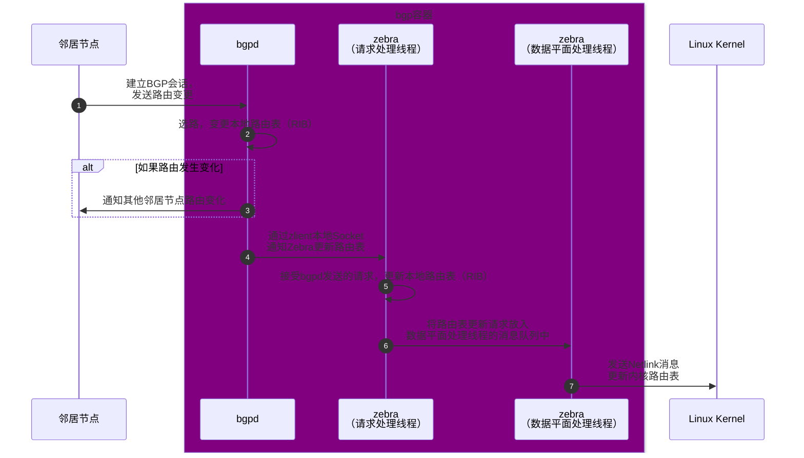
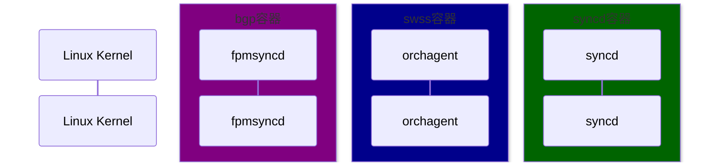

# BGP工作流

[BGP][BGP]可能是交换机里面最常用，最重要，或者线上使用的最多的功能了。这一节，我们就来深入的看一下BGP相关的工作流。

## BGP相关进程

SONiC使用[FRRouting][FRRouting]作为BGP的实现，用于负责BGP的协议处理。FRRouting是一个开源的路由软件，支持多种路由协议，包括BGP，OSPF，IS-IS，RIP，PIM，LDP等等。当FRR发布新版本后，SONiC会将其同步到[SONiC的FRR实现仓库：sonic-frr][SONiCFRR]中，每一个版本都对应这一个分支，比如`frr/8.2`。

FRR主要由两个大部分组成，第一个部分是各个协议的实现，这些进程的名字都叫做`*d`，而当它们收到路由更新的通知的时候，就会告诉第二个部分，也就是`zebra`进程，然后`zebra`进程会进行选路，并将最优的路由信息同步到kernel中，其主体结构如下图所示：

```
+----+  +----+  +-----+  +----+  +----+  +----+  +-----+
|bgpd|  |ripd|  |ospfd|  |ldpd|  |pbrd|  |pimd|  |.....|
+----+  +----+  +-----+  +----+  +----+  +----+  +-----+
     |       |        |       |       |       |        |
+----v-------v--------v-------v-------v-------v--------v
|                                                      |
|                         Zebra                        |
|                                                      |
+------------------------------------------------------+
       |                    |                   |
       |                    |                   |
+------v------+   +---------v--------+   +------v------+
|             |   |                  |   |             |
| *NIX Kernel |   | Remote dataplane |   | ........... |
|             |   |                  |   |             |
+-------------+   +------------------+   +-------------+
```

在SONiC中，这些FRR的进程都跑在`bgp`的容器中。另外，为了将FRR和Redis连接起来，SONiC在`bgp`容器中还会运行一个叫做`fpgsyncd`的进程（Forwarding Plane Manager syncd），它的主要功能是监听kernel的路由更新，然后将其同步到APP_DB中。但是因为这个进程不是FRR的一部分，所以它的实现被放在了[sonic-swss][SONiCSWSS]仓库中。

## BGP命令实现

由于BGP是使用FRR来实现的，所以自然而然的，`show`命令会将直接请求转发给FRR的`vtysh`，核心代码如下：

```python
# file: src/sonic-utilities/show/bgp_frr_v4.py
# 'summary' subcommand ("show ip bgp summary")
@bgp.command()
@multi_asic_util.multi_asic_click_options
def summary(namespace, display):
    bgp_summary = bgp_util.get_bgp_summary_from_all_bgp_instances(
        constants.IPV4, namespace, display)
    bgp_util.display_bgp_summary(bgp_summary=bgp_summary, af=constants.IPV4)

# file: src/sonic-utilities/utilities_common/bgp_util.py
def get_bgp_summary_from_all_bgp_instances(af, namespace, display):
    # IPv6 case is emitted here for simplicity
    vtysh_cmd = "show ip bgp summary json"
    
    for ns in device.get_ns_list_based_on_options():
        cmd_output = run_bgp_show_command(vtysh_cmd, ns)

def run_bgp_command(vtysh_cmd, bgp_namespace=multi_asic.DEFAULT_NAMESPACE, vtysh_shell_cmd=constants.VTYSH_COMMAND):
    cmd = ['sudo', vtysh_shell_cmd] + bgp_instance_id + ['-c', vtysh_cmd]
    output, ret = clicommon.run_command(cmd, return_cmd=True)
```

这里，我们也可以通过直接运行`vtysh`来进行验证：

```bash
root@7260cx3:/etc/sonic/frr# which vtysh
/usr/bin/vtysh

root@7260cx3:/etc/sonic/frr# vtysh

Hello, this is FRRouting (version 7.5.1-sonic).
Copyright 1996-2005 Kunihiro Ishiguro, et al.

7260cx3# show ip bgp summary

IPv4 Unicast Summary:
BGP router identifier 10.1.0.32, local AS number 65100 vrf-id 0
BGP table version 6410
RIB entries 12809, using 2402 KiB of memory
Peers 4, using 85 KiB of memory
Peer groups 4, using 256 bytes of memory

Neighbor        V         AS   MsgRcvd   MsgSent   TblVer  InQ OutQ  Up/Down State/PfxRcd   PfxSnt
10.0.0.57       4      64600      3702      3704        0    0    0 08:15:03         6401     6406
10.0.0.59       4      64600      3702      3704        0    0    0 08:15:03         6401     6406
10.0.0.61       4      64600      3705      3702        0    0    0 08:15:03         6401     6406
10.0.0.63       4      64600      3702      3702        0    0    0 08:15:03         6401     6406

Total number of neighbors 4
```

而`config`命令则是通过直接操作CONFIG_DB来实现的，核心代码如下：

```python
# file: src/sonic-utilities/config/main.py

@bgp.group(cls=clicommon.AbbreviationGroup)
def remove():
    "Remove BGP neighbor configuration from the device"
    pass

@remove.command('neighbor')
@click.argument('neighbor_ip_or_hostname', metavar='<neighbor_ip_or_hostname>', required=True)
def remove_neighbor(neighbor_ip_or_hostname):
    """Deletes BGP neighbor configuration of given hostname or ip from devices
       User can specify either internal or external BGP neighbor to remove
    """
    namespaces = [DEFAULT_NAMESPACE]
    removed_neighbor = False
    ...

    # Connect to CONFIG_DB in linux host (in case of single ASIC) or CONFIG_DB in all the
    # namespaces (in case of multi ASIC) and do the sepcified "action" on the BGP neighbor(s)
    for namespace in namespaces:
        config_db = ConfigDBConnector(use_unix_socket_path=True, namespace=namespace)
        config_db.connect()
        if _remove_bgp_neighbor_config(config_db, neighbor_ip_or_hostname):
            removed_neighbor = True
    ...
```

## BGP路由变更下发

路由变更几乎是SONiC中最重要的工作流，它的整个流程从`bgpd`进程开始，到最终通过SAI到达ASIC芯片，中间参与的进程较多，流程也较为复杂，但是弄清楚之后，我们就可以很好的理解SONiC的设计思想，并且举一反三的理解其他配置下发的工作流了。所以这一节，我们就一起来深入的分析一下它的整体流程。

为了方便我们理解和从代码层面来展示，我们把这个流程分成两个大块来介绍，分别是FRR是如何处理路由变化的，和SONiC的路由变更工作流以及它是如何与FRR进行整合的。

### FRR处理路由变更



#### bgpd处理路由变更

`bgpd`是FRR中专门用来处理BGP会话的进程，它会开放TCP 179端口与邻居节点建立BGP连接，并处理路由表的更新请求。当路由发生变化后，FRR也会通过它来通知其他邻居节点。

请求来到`bgpd`之后，它会首先来到

然后`bgpd`会开始检查是否出现更优的路径，并更新自己的本地路由表（RIB，Routing Information Base），并通过`zclient`通知`zebra`更新内核路由表。

```c
// File: src/sonic-frr/frr/bgpd/bgp_zebra.c
void bgp_zebra_announce(struct bgp_node *rn, struct prefix *p, struct bgp_path_info *info, struct bgp *bgp, afi_t afi, safi_t safi)
{
    ...

	zclient_route_send(valid_nh_count ? ZEBRA_ROUTE_ADD : ZEBRA_ROUTE_DELETE, zclient, &api);
}
```

`zclient`使用本地socket与`zebra`通信，并且提供一系列的回调函数用于接收`zebra`的通知，核心代码如下：

```c
// File: src/sonic-frr/frr/bgpd/bgp_zebra.c
void bgp_zebra_init(struct thread_master *master, unsigned short instance)
{
	zclient_num_connects = 0;

	/* Set default values. */
	zclient = zclient_new(master, &zclient_options_default);
	zclient_init(zclient, ZEBRA_ROUTE_BGP, 0, &bgpd_privs);
	zclient->zebra_connected = bgp_zebra_connected;
	zclient->router_id_update = bgp_router_id_update;
	zclient->interface_add = bgp_interface_add;
	zclient->interface_delete = bgp_interface_delete;
	zclient->interface_address_add = bgp_interface_address_add;
    ...
}

int zclient_socket_connect(struct zclient *zclient)
{
	int sock;
	int ret;

	sock = socket(zclient_addr.ss_family, SOCK_STREAM, 0);
    ...

	/* Connect to zebra. */
	ret = connect(sock, (struct sockaddr *)&zclient_addr, zclient_addr_len);
	...

	zclient->sock = sock;
	return sock;
}
```

我们在`bgpd`容器中可以在`/run/frr`目录下找到`zebra`通信使用的socket文件来进行简单的验证：

```bash
root@7260cx3:/run/frr# ls -l
total 12
...
srwx------ 1 frr frr    0 Jun 16 09:16 zserv.api
```

#### zebra更新路由表

由于FRR支持的路由协议很多，如果每个路由协议处理进程都单独的对内核进行操作则必然会产生冲突，很难协调合作，所以FRR使用一个单独的进程用于和所有的路由协议处理进程进行沟通，整合好信息之后统一的进行内核的路由表更新，这个进程就是`zebra`。

在`zebra`中，内核的更新发生在一个独立的数据面处理线程中：`dplane_thread`。所有的请求都会通过`zclient`发送给`zebra`，然后转发给`dplane_thread`来处理，这样路由的处理就是有序的了，也就不会产生冲突了。

`zebra`启动时，会将所有的请求处理函数进行注册，当请求到来时，就可以根据请求的类型调用相应的处理函数了，核心代码如下：

```c
// File: src/sonic-frr/frr/zebra/zapi_msg.c
void (*zserv_handlers[])(ZAPI_HANDLER_ARGS) = {
	[ZEBRA_ROUTER_ID_ADD] = zread_router_id_add,
	[ZEBRA_ROUTER_ID_DELETE] = zread_router_id_delete,
	[ZEBRA_INTERFACE_ADD] = zread_interface_add,
	[ZEBRA_INTERFACE_DELETE] = zread_interface_delete,
	[ZEBRA_ROUTE_ADD] = zread_route_add,
	[ZEBRA_ROUTE_DELETE] = zread_route_del,
	[ZEBRA_REDISTRIBUTE_ADD] = zebra_redistribute_add,
	[ZEBRA_REDISTRIBUTE_DELETE] = zebra_redistribute_delete,
    ...
```

我们这里拿添加路由`zread_route_add`作为例子，来继续分析后续的流程。从以下代码我们可以看到，当新的路由到来后，`zebra`会开始查看自己内部的路由表，然后调用`dplane_sys_route_add`来进行内核的路由表更新：

```c
static void zread_route_add(ZAPI_HANDLER_ARGS)
{
    ...

    // Decode zclient request
	s = msg;
	if (zapi_route_decode(s, &api) < 0) {
		return;
	}
	...
 
    // Add route
    ret = rib_add_multipath(afi, api.safi, &api.prefix, src_p, re);

	// Update stats. IPv6 is emitted here for simplicity
    if (ret > 0) client->v4_route_add_cnt++;
    else if (ret < 0) client->v4_route_upd8_cnt++;
}

// File: src/sonic-frr/frr/zebra/zebra_rib.c
int rib_add_multipath(afi_t afi, safi_t safi, struct prefix *p, struct prefix_ipv6 *src_p, struct route_entry *re)
{
	struct route_table *table;
	struct route_node *rn;
    ...
	
	/* Lookup table.  */
	table = zebra_vrf_table_with_table_id(afi, safi, re->vrf_id, re->table);

	/* Lookup route node.*/
	rn = srcdest_rnode_get(table, p, src_p);

	/* If this route is kernel/connected route, notify the dataplane. */
	if (RIB_SYSTEM_ROUTE(re)) {
		/* Notify dataplane */
		dplane_sys_route_add(rn, re);
	}
    ...
}
```

而`dplane_sys_route_add`其实只是将其放入`dplane_thread`的消息队列中而已，并不会做任何的操作：

```c
// File: src/sonic-frr/frr/zebra/zebra_dplane.c
enum zebra_dplane_result dplane_sys_route_add(struct route_node *rn, struct route_entry *re)
{
	return dplane_route_update_internal(rn, re, NULL, DPLANE_OP_SYS_ROUTE_ADD);
}

static enum zebra_dplane_result
dplane_route_update_internal(struct route_node *rn, struct route_entry *re, struct route_entry *old_re, enum dplane_op_e op)
{
	enum zebra_dplane_result result = ZEBRA_DPLANE_REQUEST_FAILURE;
	int ret = EINVAL;

    /* Create and init context */
	struct zebra_dplane_ctx *ctx = ...;

    /* Enqueue context for processing */
    ret = dplane_route_enqueue(ctx);

	/* Update counter */
	atomic_fetch_add_explicit(&zdplane_info.dg_routes_in, 1, memory_order_relaxed);

	if (ret == AOK)
		result = ZEBRA_DPLANE_REQUEST_QUEUED;

	return result;
}
```

然后，我们就来到了数据面处理线程`dplane_thread`，其消息循环很简单，就是从队列中一个个取出消息，然后通过调用其处理函数：

```c
// File: src/sonic-frr/frr/zebra/zebra_dplane.c
static int dplane_thread_loop(struct thread *event)
{
    ...

    while (prov) {
        ...

        /* Process work here */
		(*prov->dp_fp)(prov);

		/* Check for zebra shutdown */
		/* Dequeue completed work from the provider */
        ...

		/* Locate next provider */
		DPLANE_LOCK();
		prov = TAILQ_NEXT(prov, dp_prov_link);
		DPLANE_UNLOCK();
	}
}
```

默认情况下，`dplane_thread`会使用`kernel_dplane_process_func`来进行消息的处理，内部会根据请求的类型对内核的操作进行分发：

```c
static int kernel_dplane_process_func(struct zebra_dplane_provider *prov)
{
	enum zebra_dplane_result res;
	struct zebra_dplane_ctx *ctx;
	int counter, limit;
	limit = dplane_provider_get_work_limit(prov);

	for (counter = 0; counter < limit; counter++) {
		ctx = dplane_provider_dequeue_in_ctx(prov);
		if (ctx == NULL) break;

		/* A previous provider plugin may have asked to skip the kernel update.  */
		if (dplane_ctx_is_skip_kernel(ctx)) {
			res = ZEBRA_DPLANE_REQUEST_SUCCESS;
			goto skip_one;
		}

		/* Dispatch to appropriate kernel-facing apis */
		switch (dplane_ctx_get_op(ctx)) {
		case DPLANE_OP_ROUTE_INSTALL:
		case DPLANE_OP_ROUTE_UPDATE:
		case DPLANE_OP_ROUTE_DELETE:
			res = kernel_dplane_route_update(ctx);
			break;
        ...
        }
        ...
    }
    ...
}

static enum zebra_dplane_result
kernel_dplane_route_update(struct zebra_dplane_ctx *ctx)
{
	enum zebra_dplane_result res;
	/* Call into the synchronous kernel-facing code here */
	res = kernel_route_update(ctx);
    return res;
}
```

而`kernel_route_update`则是真正的内核操作了，它会通过netlink来通知内核路由更新：

```c
// File: src/sonic-frr/frr/zebra/rt_netlink.c
// Update or delete a prefix from the kernel, using info from a dataplane context.
enum zebra_dplane_result kernel_route_update(struct zebra_dplane_ctx *ctx)
{
	int cmd, ret;
	const struct prefix *p = dplane_ctx_get_dest(ctx);
	struct nexthop *nexthop;

	if (dplane_ctx_get_op(ctx) == DPLANE_OP_ROUTE_DELETE) {
		cmd = RTM_DELROUTE;
	} else if (dplane_ctx_get_op(ctx) == DPLANE_OP_ROUTE_INSTALL) {
		cmd = RTM_NEWROUTE;
	} else if (dplane_ctx_get_op(ctx) == DPLANE_OP_ROUTE_UPDATE) {
        cmd = RTM_NEWROUTE;
    }

    if (!RSYSTEM_ROUTE(dplane_ctx_get_type(ctx)))
		ret = netlink_route_multipath(cmd, ctx);
    ...

    return (ret == 0 ? ZEBRA_DPLANE_REQUEST_SUCCESS : ZEBRA_DPLANE_REQUEST_FAILURE);
}

// Routing table change via netlink interface, using a dataplane context object
static int netlink_route_multipath(int cmd, struct zebra_dplane_ctx *ctx)
{
    // Build netlink request.
	struct {
		struct nlmsghdr n;
		struct rtmsg r;
		char buf[NL_PKT_BUF_SIZE];
	} req;

    req.n.nlmsg_len = NLMSG_LENGTH(sizeof(struct rtmsg));
    req.n.nlmsg_flags = NLM_F_CREATE | NLM_F_REQUEST;
    ...

	/* Talk to netlink socket. */
	return netlink_talk_info(netlink_talk_filter, &req.n, dplane_ctx_get_ns(ctx), 0);
}
```

到此，FRR的工作就完成了。

### SONiC路由变更工作流



#### fpmsyncd更新Redis中的路由配置

#### orchagent处理路由配置变化

#### syncd更新ASIC

# 参考资料

1. [SONiC Architecture][SONiCArch]
2. [Github repo: sonic-swss][SONiCSWSS]
3. [Github repo: sonic-swss-common][SONiCSWSSCommon]
4. [Github repo: sonic-frr][SONiCFRR]
5. [Github repo: sonic-utilities][SONiCUtil]
6. [RFC 4271: A Border Gateway Protocol 4 (BGP-4)][BGP]
7. [FRRouting][FRRouting]

[SONiCArch]: https://github.com/sonic-net/SONiC/wiki/Architecture
[SONiCSWSS]: https://github.com/sonic-net/sonic-swss
[SONiCSWSSCommon]: https://github.com/sonic-net/sonic-swss-common
[SONiCFRR]: https://github.com/sonic-net/sonic-frr
[SONiCUtil]: https://github.com/sonic-net/sonic-utilities
[BGP]: https://datatracker.ietf.org/doc/html/rfc4271
[FRRouting]: https://frrouting.org/